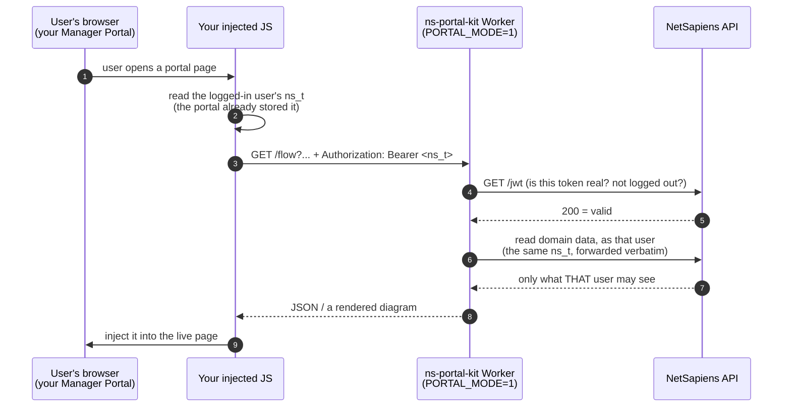

# Setup

Every setting, what it means, and what a valid value looks like.

**Start here:** most of the list below is optional. A working deployment needs **three** things, and the
rest only matter if you want the feature they turn on.

---

## 1. Pick a mode

This decides which settings you need. Everything else follows from it.

| | **Standalone mode** | **Portal backend mode** |
|---|---|---|
| What you get | **call-flow diagrams, and only those** — a standalone viewer you open | the diagrams **embedded in your Manager Portal**, plus the other add-on features |
| Who authenticates | a token you store | the calling user's own `ns_t` |
| Set | `NS_API_TOKEN` | `PORTAL_MODE=1` |
| Reads run as | that token — its NetSapiens scope is the boundary | that user — NetSapiens enforces their scope |
| Stored NetSapiens credential | **yes** | **none** |
| Needs injected JavaScript | no | **yes — and it isn't published yet** |
| Ready to use today | **yes** | only if you write that JS yourself |

**Standalone mode gives you the diagram viewer and nothing else.** No Ringotel banner, no per-user app
column, no domain-list column — those live *inside* the Manager Portal, so they only exist in portal
backend mode. (The diagrams themselves can still be *enriched*: set `RINGOTEL_API_KEY` and app presence appears
inline on agent lines, `NS_DEVICE_DETAILS=1` adds phone models. That's decoration on a diagram, not the
separate features.)

**Portal backend mode is where the rest lives** — the diagrams show up in the portal your users already use,
alongside the other add-ons, because injected JS can change any page it runs on.

**Standalone mode is the default** and the simpler place to start. A stored token answers *any* request
that reaches the Worker, so put it behind a gate — see `ACCESS_AUD` + `ACCESS_TEAM_DOMAIN` (you need both).
Until you do, the Worker refuses to use the token at all rather than answer an unauthenticated caller.

**Portal backend mode is the advanced path today** — it needs an injection script that isn't published yet (see
[section 4](#4-portal-backend-mode-what-it-actually-is)). **Portal backend mode holds no NetSapiens credential at all.** Each request carries the caller's `ns_t`, which
is passed through to NetSapiens as-is; the platform validates it and enforces that user's own scope.
There's no SPA — it's a backend for JS **you** inject into the Manager Portal. **[How that actually
works, with a diagram →](#4-portal-backend-mode-what-it-actually-is)**

**You can run both**, and that's the usual end state — they're two Workers, not two phases. See
[Running both](#5-running-both-the-usual-end-state).

## 2. The three you actually need

| Setting | Where | Example |
|---|---|---|
| **`NS_SERVER`** | `vars` in `wrangler.jsonc` | `api.yourprovider.com` |
| **`NS_PORTAL_ISS`** | `vars` in `wrangler.jsonc` | `manage.yourcompany.com` |
| **`NS_API_TOKEN`** *(standalone mode)* | secret | a NetSapiens API token |

`NS_SERVER` — your NetSapiens API host, no scheme, no path. Requests go to
`https://{NS_SERVER}/ns-api/v2`. Ships as `api.example.com`, which is a placeholder, not a default.

`NS_PORTAL_ISS` — the Manager Portal hostname that issues your `ns_t` tokens (the `iss` claim in them).
**Required whenever a request might carry a Bearer `ns_t`** — always in portal backend mode, and in standalone mode
if anyone sends one. It has **no default on purpose**: a default would mean accepting tokens minted by
a portal you don't control. Comma-separate if several portal hostnames front the same backend —
`manage.a.com,manage.b.com` — matched **exactly**, no wildcards (`*.a.com` is a literal that matches
nothing).

`NS_API_TOKEN` — standalone mode only. **Leave blank in portal backend mode.**

**Not sure if you're done?** Open `/`. If anything required is missing it lists exactly what, with the
fix. `GET /health` reports `{"ok":true,"configured":false}`. Both say only *whether* a value is set,
never what it is.

## 3. Optional — each turns on one thing

Everything below is off unless set. Blank/absent is always a safe answer.

### Protect a stored token

| Setting | Value | Meaning |
|---|---|---|
| `ACCESS_AUD` | Access application AUD tag | Half of the Access switch — **needs `ACCESS_TEAM_DOMAIN` too**. On its own it turns nothing on. |
| `ACCESS_TEAM_DOMAIN` | `yourteam.cloudflareaccess.com` | Your Zero Trust team domain. **Both** vars together turn on the in-Worker Access check (it fails closed). Setting only one is refused, not served: with a stored `NS_API_TOKEN` and nothing verifiable in front of it, the Worker declines to use the token and tells you which var is missing. |

Strongly recommended for standalone mode. Without it, anyone who reaches the Worker gets whatever the
stored token can read. Both values are public identifiers — safe in `vars`.

### Limit which domains are visible

| Setting | Value | Meaning |
|---|---|---|
| `ALLOWED_DOMAINS` | `acme,demo.12345.service` | Allowlist. Set ⇒ only these are listed, and any other is refused (403) **even if the token could read it**. Blank ⇒ no app-layer limit. |
| `BLOCKED_DOMAINS` | `0000.12345.service` | Hide specific domains (e.g. a DID-holding domain with nothing to show). |

Comma-separated NetSapiens domain names, exactly as NetSapiens has them. A domain may be bare (`acme`)
or carry a territory suffix (`acme.12345.service`) — use whichever form is real for you. These are an
app-layer bound *on top of* the token's own scope, not a replacement for it.

### Portal backend mode

| Setting | Value | Meaning |
|---|---|---|
| `PORTAL_MODE` | `1` | Delegated only — no stored-token fallback, every request must carry an `ns_t`. |
| `ALLOWED_ORIGINS` | `https://manage.yourcompany.com` | Browser origins allowed to call it (CORS). Comma-separated, scheme included. |

`ALLOWED_ORIGINS` is the origin the injected JS runs on — normally your Manager Portal.

### Branding

Branding is configuration, never code, so a fork ships unbranded and yours never enters the source.

| Setting | Value | Meaning |
|---|---|---|
| `BRAND_NAME` | `Acme Voice` | Your company name. Produces `"Acme Voice Portal Kit v<version>"` and an `"Acme Voice portal"` theme. Unset ⇒ `"NS Portal Kit"` and the neutral theme. |
| `BRAND_ACCENT` | `#1a6bb0` | Accent colour. **Must be hex** (`#rgb`/`#rrggbb`); anything else is ignored. |
| `BRAND_LABEL` | `Acme Portal` | Override the theme's picker label. Defaults to `"<BRAND_NAME> portal"`. |

### Ringotel app status

Optional integration. **`RINGOTEL_API_KEY` is the gate**: absent ⇒ no Ringotel calls, no enrichment, its
routes return 404, and the deployment behaves exactly as if the integration didn't exist.

| Setting | Value | Meaning |
|---|---|---|
| `RINGOTEL_API_KEY` | your Ringotel AdminAPI key | Turns the integration on. |
| `RINGOTEL_LABEL` | `Acme App` | Long display name. Default `Ringotel`. |
| `RINGOTEL_LABEL_SHORT` | `A App` | Short name for tight spots (a column header). Falls back to `RINGOTEL_LABEL`. |
| `RINGOTEL_PRESENCE` | `1` | Show 🟢/🔴 online circles. Off by default: presence is a point-in-time snapshot (cached ≤10 min) while the rest of a diagram is static config. |
| `RINGOTEL_BASE_URL` | `https://shell.ringotel.co` | Only if you're not on the default Ringotel endpoint. |
| `RINGOTEL_OVERRIDES` | `{"weird.domain":"actual-branch-address"}` | JSON. Only for the rare domain whose Ringotel branch address doesn't equal its NetSapiens domain. |

A Ringotel branch's `address` must equal the NetSapiens domain **exactly** — that's what binds them. If
yours match (they normally do), you need no overrides.

### NetSapiens device details

| Setting | Value | Meaning |
|---|---|---|
| `NS_DEVICE_DETAILS` | `1` | Adds desk-phone model + registration status. Costs extra API reads per render. |

Truthy values anywhere above are `1`, `true`, `yes`, `on`.

---

## 4. Portal backend mode: what it actually is

Standalone mode is a tool **you** open. Portal backend mode has no UI of its own — it's a **backend for JavaScript
injected into your Manager Portal**, so your users get extra features inside the portal they already
use, without logging in anywhere else.

The flow, per call:



The parts worth understanding:

- **You must supply the JavaScript, and that's real work today.** This repo is the backend half. Portal backend
  mode does nothing on its own — nothing calls it until JS you inject into your portal does. **A
  reference injection script is planned but is not published yet**, so right now this means writing it
  yourself: reading the `ns_t` the portal stored, calling the Worker, and updating the page. How you
  inject it depends on your NetSapiens portal. If that's more than you want to take on, use standalone
  mode — it's complete and needs nothing extra.
- **The `ns_t` is the logged-in user's own session token**, which the portal has already issued and
  stored in the browser. Your JS reads it and forwards it; it doesn't create or manage logins.
- **The Worker stores no NetSapiens credential.** It forwards that same `ns_t` to NetSapiens verbatim,
  so every read runs *as that user* and NetSapiens enforces their scope. Two users hitting the same
  Worker see different data because the platform says so — not because we filtered it.
- **A token is checked before it's trusted.** Structure, expiry, audience and issuer are checked locally
  (free), then a cached `GET /jwt` confirms it's real and not logged out. Only a literal 200 counts.
- **It's per-call.** Nothing is stored between requests except a short-lived cache of "was this token
  valid".

## 5. Running both (the usual end state)

**One Worker is one mode.** `PORTAL_MODE=1` turns the service path *off* on that Worker: no stored-token
fallback, and `/` returns 404 rather than serving an internal tool surface on a user-facing endpoint.

So the normal setup is **two deployments** — an internal viewer for your team, and a portal backend for
your users. Pick whichever path suits you; none of them requires you to have both from day one.

### A. Click the deploy button twice (no terminal)

The simplest way, and entirely in the browser.

| | First deploy | Second deploy |
|---|---|---|
| Project name | `portal-kit-internal` | `portal-kit-svc` |
| `NS_API_TOKEN` | your token | *(blank)* |
| `PORTAL_MODE` | *(blank)* | `1` |
| `ALLOWED_ORIGINS` | *(blank)* | `https://manage.yourcompany.com` |
| `NS_SERVER` / `NS_PORTAL_ISS` | yours | the same |

You get two Workers. The button clones the repo into **your** account each time, so you end up with two
copies there — the project itself stays one repo. The cost is keeping both copies current; if that
bothers you, use B or C below, which run both Workers from a single repo.

### B. One repo, two Workers, from the dashboard (no terminal)

Deploy once with the button, then in the dashboard: **Workers & Pages → Create → connect the same
repository**, and set that Worker's **deploy command** to `npx wrangler deploy --env portal`. Add an
`env.portal` block to `wrangler.jsonc` (below) by editing the file **on github.com** — no local tooling
needed; committing triggers a build.

### C. One repo, two environments, using wrangler

More setup, but one codebase and one place to update. You'll need [Node.js](https://nodejs.org) and a
terminal. Nothing here is Worker-specific knowledge — it's clone, edit a file, run two commands.

```bash
# 1. Get the code. If you used the deploy button, clone the repo IT made in your account
#    (that's the one already wired to auto-deploy); otherwise clone this one.
git clone https://github.com/<your-account>/ns-portal-kit
cd ns-portal-kit
pnpm install                 # or: npm install

# 2. Log in to Cloudflare. Opens a browser; no API token to create.
npx wrangler login
```

Then add an `env` block to `wrangler.jsonc` — one entry per Worker you want. Each becomes its **own**
Worker script with its own name, URL, secrets and rollback:

```jsonc
"env": {
  "internal": {
    "name": "portal-kit-internal",
    "vars": {
      "NS_SERVER": "api.yourprovider.com",
      "NS_PORTAL_ISS": "manage.yourcompany.com",
      "ACCESS_AUD": "<your Access AUD tag>",
      "ACCESS_TEAM_DOMAIN": "yourteam.cloudflareaccess.com"
    }
  },
  "portal": {
    "name": "portal-kit-svc",
    "vars": {
      "NS_SERVER": "api.yourprovider.com",
      "NS_PORTAL_ISS": "manage.yourcompany.com",
      "PORTAL_MODE": "1",
      "ALLOWED_ORIGINS": "https://manage.yourcompany.com"
    }
  }
}
```

**See it locally first.** Before deploying anything, you can run the real thing on your own machine —
no Cloudflare Access, no Zero Trust setup, nothing to provision:

```bash
cp .dev.vars.example .dev.vars     # put your NS_API_TOKEN in it
npx wrangler dev                   # -> http://localhost:8787
```

Open that URL and you get the viewer, against your live NetSapiens data. The service-token gate exempts
localhost (it isn't internet-reachable, so there's nothing to expose) — which makes this the fastest way
to see whether this project is useful to you before committing to any of it.

```bash
# 3. Give the internal one a token (secrets are PER ENVIRONMENT — this is the usual trip-up)
npx wrangler secret put NS_API_TOKEN --env internal

# 4. Deploy each. Two Workers, two URLs, from one repo.
npx wrangler deploy --env internal
npx wrangler deploy --env portal
```

The portal Worker gets no token at all — that's the point of portal backend mode.

**Two gotchas that bite everyone:**

- **Environments do NOT inherit top-level `vars`.** Every env needs its own full `vars` block — repeat
  `NS_SERVER` in each. A missing one doesn't warn; it's just absent at runtime.
- **Secrets are per-environment**: `wrangler secret put NS_API_TOKEN --env internal`.
- **If your repo is connected to Workers Builds, editing variables in the dashboard won't stick** —
  the next build overwrites `vars` from `wrangler.jsonc`. Edit the file, not the dashboard. (Secrets are
  not overwritten.)

## 6. The service-token gate

If `NS_API_TOKEN` is set and **nothing verifiable is in front of it**, the Worker refuses to use it and
serves setup instructions instead. That's enforced, not advice.

A stored token answers *any* request that reaches the Worker, with that token's full NetSapiens scope —
a reseller-scoped token means every domain it covers. A public URL plus a stored token equals your fleet
for anyone who finds it, so the token stays unused until one of these is true:

| | How |
|---|---|
| **Cloudflare Access in front** (recommended) | set `ACCESS_AUD` + `ACCESS_TEAM_DOMAIN`. The Worker verifies the Access JWT itself, so a request that skipped Access is refused too. |
| **No stored token at all** | `PORTAL_MODE=1` — each caller brings their own `ns_t`, so there's no ambient authority to protect. |
| **You protect it yourself** | `ALLOW_UNGATED_SERVICE_TOKEN=1` — a deliberate opt-out for mTLS, a WAF, or an authenticating proxy. You own the consequences. |

Local `wrangler dev` is exempt: it isn't internet-reachable.

## 7. Getting updates later

The deploy button **clones** this repo into your account rather than forking it, so your copy has no
link back here — there's no "Sync fork" button, and that's true whether you ticked *Create private Git
repository* or not. (A private copy couldn't sync from a public upstream through the fork UI anyway.)

Point your copy at this one once, and pulling updates is two commands forever after:

```bash
git remote add upstream https://github.com/dszp/ns-portal-kit   # once
git fetch upstream
git merge upstream/main
git push        # if the repo is wired to Workers Builds, this deploys
```

Conflicts should be rare and boring: `wrangler.jsonc` is the file you edited, and it's the file most
likely to move here. Your `vars` are yours — keep them.

If you'd rather not track this repo at all, that's fine too; nothing here phones home, and a deployment
that works will keep working.


## 8. Where each value goes

**`vars` in `wrangler.jsonc`** — non-secret, committed, visible in your repo:
`NS_SERVER`, `NS_PORTAL_ISS`, `ALLOWED_DOMAINS`, `BLOCKED_DOMAINS`, `ALLOWED_ORIGINS`, `PORTAL_MODE`,
`ACCESS_AUD`, `ACCESS_TEAM_DOMAIN`, `BRAND_ACCENT`, `RINGOTEL_PRESENCE`, `NS_DEVICE_DETAILS`,
`RINGOTEL_BASE_URL`, `RINGOTEL_OVERRIDES`.

**Secrets** — `wrangler secret put <NAME>`, never committed:
`NS_API_TOKEN`, `RINGOTEL_API_KEY`, and — by convention rather than necessity — `BRAND_NAME` /
`RINGOTEL_LABEL` / `RINGOTEL_LABEL_SHORT`, so a white-label name stays out of a committed file.

**Put each key in exactly one place.** A key in both `vars` and `.dev.vars` is shadowed by the
`wrangler.jsonc` value, which silently ignores the other — this is the classic way to "set"
`ALLOWED_DOMAINS` and have it do nothing.

**Locally:** `cp .dev.vars.example .dev.vars` and fill it in. That file is also what the *Deploy to
Cloudflare* button reads to build its prompt form, which is why it's kept short — everything else is
here.
