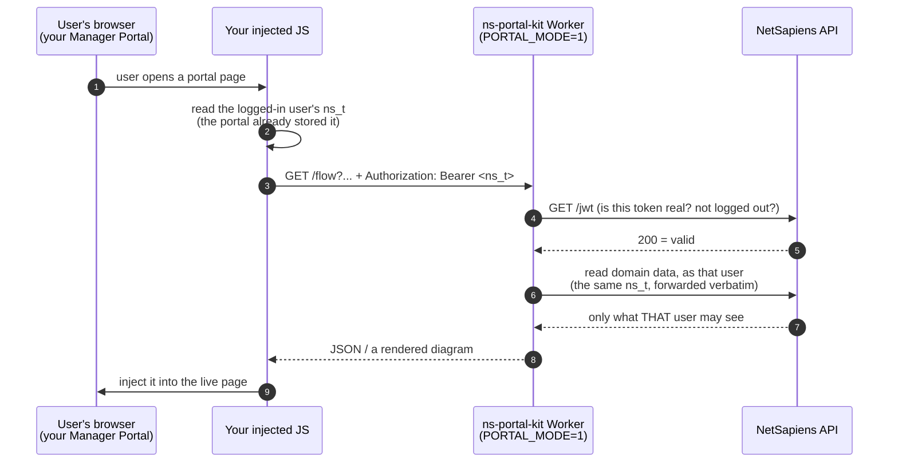

# Setup

Every setting, what it means, and what a valid value looks like.

**Start here:** most of the list below is optional. A working deployment needs **three** things, and the
rest only matter if you want the feature they turn on.

---

## 1. Pick a mode

This decides which settings you need. Everything else follows from it.

| | **Standalone mode** | **Portal backend mode** |
|---|---|---|
| What you get | **call-flow diagrams, and only those** — a standalone viewer you open | the diagrams **embedded in your Manager Portal**, plus the other add-on features |
| Who authenticates | a token you store | the calling user's own `ns_t` |
| Set | `NS_API_TOKEN` | `PORTAL_MODE=1` |
| Reads run as | that token — its NetSapiens scope is the boundary | that user — NetSapiens enforces their scope |
| Stored NetSapiens credential | **yes** | **none** |
| Needs injected JavaScript | no | **yes — but it's Worker-served now** |
| Ready to use today | **yes** | **yes** — point your portal at the Worker's primary (or compose it into a script you already inject) |

**Standalone mode gives you the diagram viewer and nothing else.** No Ringotel banner, no per-user app
column, no domain-list column — those live *inside* the Manager Portal, so they only exist in portal
backend mode. (The diagrams themselves can still be *enriched*: set `RINGOTEL_API_KEY` and app presence appears
inline on agent lines, `NS_DEVICE_DETAILS=1` adds phone models. That's decoration on a diagram, not the
separate features.)

**Portal backend mode is where the rest lives** — the diagrams show up in the portal your users already use,
alongside the other add-ons, because injected JS can change any page it runs on.

**Standalone mode is the default** and the simpler place to start. A stored token answers *any* request
that reaches the Worker, so put it behind a gate — see `ACCESS_AUD` + `ACCESS_TEAM_DOMAIN` (you need both).
Until you do, the Worker refuses to use the token at all rather than answer an unauthenticated caller.

**Portal backend mode used to be the advanced path** — but the injection is now **Worker-served**. At its
simplest you point your Manager Portal's injected-script slot at the Worker's primary and the built-in
features appear, no hand-written script needed. That's not the only way in, though: you can also **compose**
the primary into a script you already inject, or **add your own gated scripts** (`PORTAL_SECONDARIES` —
external or served privately from R2). See [section 4](#4-portal-backend-mode-what-it-actually-is) for all
three ways to wire it. **Portal backend mode holds no NetSapiens credential at all.** Each request carries the caller's `ns_t`, which
is passed through to NetSapiens as-is; the platform validates it and enforces that user's own scope.
There's no SPA — it's a backend for JS **you** inject into the Manager Portal. **[How that actually
works, with a diagram →](#4-portal-backend-mode-what-it-actually-is)**

**You can run both**, and that's the usual end state — they're two Workers, not two phases. See
[Running both](#5-running-both-the-usual-end-state).

## 2. The three you actually need

| Setting | Where | Example |
|---|---|---|
| **`NS_SERVER`** | `vars` in `wrangler.jsonc` | `api.yourprovider.com` |
| **`NS_PORTAL_ISS`** | `vars` in `wrangler.jsonc` | `manage.yourcompany.com` |
| **`NS_API_TOKEN`** *(standalone mode)* | secret | a NetSapiens API token |

`NS_SERVER` — your NetSapiens API host, no scheme, no path. Requests go to
`https://{NS_SERVER}/ns-api/v2`. Ships as `api.example.com`, which is a placeholder, not a default.

`NS_PORTAL_ISS` — the Manager Portal hostname that issues your `ns_t` tokens (the `iss` claim in them).
**Required whenever a request might carry a Bearer `ns_t`** — always in portal backend mode, and in standalone mode
if anyone sends one. It has **no default on purpose**: a default would mean accepting tokens minted by
a portal you don't control. Comma-separate if several portal hostnames front the same backend —
`manage.a.com,manage.b.com` — matched **exactly**, no wildcards (`*.a.com` is a literal that matches
nothing).

`NS_API_TOKEN` — standalone mode only. **Leave blank in portal backend mode.**

**Not sure if you're done?** Open `/`. If anything required is missing it lists exactly what, with the
fix. `GET /health` reports `{"ok":true,"configured":false}`. Both say only *whether* a value is set,
never what it is.

## 3. Optional — each turns on one thing

Everything below is off unless set. Blank/absent is always a safe answer.

### Protect a stored token

| Setting | Value | Meaning |
|---|---|---|
| `ACCESS_AUD` | Access application AUD tag | Half of the Access switch — **needs `ACCESS_TEAM_DOMAIN` too**. On its own it turns nothing on. |
| `ACCESS_TEAM_DOMAIN` | `yourteam.cloudflareaccess.com` | Your Zero Trust team domain. **Both** vars together turn on the in-Worker Access check (it fails closed). Setting only one is refused, not served: with a stored `NS_API_TOKEN` and nothing verifiable in front of it, the Worker declines to use the token and tells you which var is missing. |

Strongly recommended for standalone mode. Without it, anyone who reaches the Worker gets whatever the
stored token can read. Both values are public identifiers — safe in `vars`.

### Limit which domains are visible

| Setting | Value | Meaning |
|---|---|---|
| `ALLOWED_DOMAINS` | `acme,demo.12345.service` | Allowlist. Set ⇒ only these are listed, and any other is refused (403) **even if the token could read it**. Blank ⇒ no app-layer limit. |
| `BLOCKED_DOMAINS` | `0000.12345.service` | Hide specific domains (e.g. a DID-holding domain with nothing to show). |

Comma-separated NetSapiens domain names, exactly as NetSapiens has them. A domain may be bare (`acme`)
or carry a territory suffix (`acme.12345.service`) — use whichever form is real for you. These are an
app-layer bound *on top of* the token's own scope, not a replacement for it.

### Portal backend mode

| Setting | Value | Meaning |
|---|---|---|
| `PORTAL_MODE` | `1` | Delegated only — no stored-token fallback, every request must carry an `ns_t`. |
| `ALLOWED_ORIGINS` | `https://manage.yourcompany.com` | Browser origins allowed to call it (CORS). Comma-separated, scheme included. |

`ALLOWED_ORIGINS` is the origin the injected JS runs on — normally your Manager Portal.

### Branding

Branding is configuration, never code, so a fork ships unbranded and yours never enters the source.

| Setting | Value | Meaning |
|---|---|---|
| `BRAND_NAME` | `Acme Voice` | Your company name. Produces `"Acme Voice Portal Kit v<version>"` and an `"Acme Voice portal"` theme. Unset ⇒ `"NS Portal Kit"` and the neutral theme. |
| `BRAND_ACCENT` | `#1a6bb0` | Accent colour. **Must be hex** (`#rgb`/`#rrggbb`); anything else is ignored. |
| `BRAND_LABEL` | `Acme Portal` | Override the theme's picker label. Defaults to `"<BRAND_NAME> portal"`. |

### Ringotel app status

Optional integration. **`RINGOTEL_API_KEY` is the gate**: absent ⇒ no Ringotel calls, no enrichment, its
routes return 404, and the deployment behaves exactly as if the integration didn't exist.

| Setting | Value | Meaning |
|---|---|---|
| `RINGOTEL_API_KEY` | your Ringotel AdminAPI key | Turns the integration on. |
| `RINGOTEL_LABEL` | `Acme App` | Long display name. Default `Ringotel`. |
| `RINGOTEL_LABEL_SHORT` | `A App` | Short name for tight spots (a column header). Falls back to `RINGOTEL_LABEL`. |
| `RINGOTEL_PRESENCE` | `1` | Show 🟢/🔴 online circles. Off by default: presence is a point-in-time snapshot (cached ≤10 min) while the rest of a diagram is static config. |
| `RINGOTEL_BASE_URL` | `https://shell.ringotel.co` | Only if you're not on the default Ringotel endpoint. |
| `RINGOTEL_OVERRIDES` | `{"weird.domain":"actual-branch-address"}` | JSON. Only for the rare domain whose Ringotel branch address doesn't equal its NetSapiens domain. |

A Ringotel branch's `address` must equal the NetSapiens domain **exactly** — that's what binds them. If
yours match (they normally do), you need no overrides.

### App activation (writes)

Lets authorized roles activate/deactivate a user's app and reset its password **from the NetSapiens user
profile**. These are *writes*, so they're gated harder than the read features above. Four independently-
gated features — `ringotel.profileStatus` (read indicator), `ringotel.activate`, `ringotel.resetPassword`,
and `ringotel.profileAppAccess` (read-only: shows the operator the **user-visible app sign-in message** —
the same domain/username/password instructions and download links that user sees, so you can walk them
through sign-in or see why they can't yet) — all default level `office_manager`; re-level via
`PORTAL_FEATURES`. Requires `RINGOTEL_API_KEY`.

| Variable | Example | What it does |
|---|---|---|
| **`RINGOTEL_WRITE_DOMAINS`** | `acme.12345.service` (CSV), or `*` | **Safety rail. Empty ⇒ ALL writes refused (fail-closed).** Only listed domains may be mutated; `*` = every in-scope domain. Set it deliberately. |
| `RINGOTEL_ACTIVATION_SUFFIX` | `r` | NetSapiens softphone device suffix (`ext` → `<ext><suffix>`). Default `r`. |
| `RINGOTEL_EXCLUDE_NAMES` | `SHARED,FAX` | Name-contains matchers to soft-exclude. Default `SHARED,SHARED VOICEMAIL,FAX`. |
| `RINGOTEL_EXCLUDE_EXTS` | `900,8*` | Extension patterns to soft-exclude (trailing `*` = prefix). Default empty. |
| `RINGOTEL_EXCLUDE_EXTS_BY_DOMAIN` | `{"acme.x":{"remove":["900"]}}` | JSON per-domain add/remove of the exclude-exts. |
| `RINGOTEL_EXCLUDE_NO_DEVICES` | `1` | Tightens the name matcher: a name-matched user is excluded only if it *also* has no devices. **Never excludes a no-device user on its own** — a normal-named user with no devices stays activatable (activation creates the device). Off by default. |
| `RINGOTEL_RESELLER_OVERRIDE` | `names,exts` or `all` | Which soft categories a reseller may override. A reseller can also force-activate one user at runtime. |

**System/service users** (a non-blank `srv_code`) and non-3-4-digit extensions are **HARD**-excluded and
can never be activated — not even by a reseller force. Writes require a delegated `ns_t` (never a stored
service token) and force a fresh token re-validation before mutating.

**The email requirement applies to the *emailed* activation path, not to SSO.** Activating a user from the
profile page emails them their credentials, so it needs an address on the NS user. An SSO sign-in creates
the account from the user's own portal login and mails nothing, so on an SSO-bound domain
(`RINGOTEL_SSO_SERVICE`) a user with no email address is still treated as eligible and is shown how to
sign in. Soft and HARD exclusions are unaffected either way — only the address requirement is waived, and
only where nothing would have been mailed.

**Soft exclusions are creation-only.** They decide whether an account may be *created*; they never block a
user who already has a working one from being shown how to sign in.

> The eligibility decision itself lives in `@dszp/netsapiens-lib` (`evaluateEligibility`) so that every
> consumer of that library — this portal backend and any SSO integration you run beside it — reaches the
> same verdict from the same inputs. Only the configuration above is read here.

### App sign-in details

A self-service feature (`me.appAccess`, default `all`): the Apps menu and the user's own home-page card
show **how** they sign in to their app — SSO with their portal password, a dedicated app password, or
"not set up yet" — instead of a bare status dot. All four settings below are optional and fail closed:
leave any of them unset and the deployment behaves as if the feature weren't configured (no SSO claimed,
no create-on-login assumed, nothing hidden, no download links shown).

| Setting | Value | Meaning |
|---|---|---|
| `RINGOTEL_SSO_SERVICE` | `netsapiens_sso` | The NAME half of the SSO service your app fleet is bound to, when you also run the matching SSO integration. **Unset ⇒ never claim SSO** — a binding could point at a third-party identity provider, and claiming SSO wrongly tells a user to try a password that will not work. |
| `SSO_AUTO_ACTIVATE` | domain CSV, or `*` | Whether your SSO integration creates an app account on first login for an eligible user who doesn't have one yet — this is a setting on that integration, not something derivable here. **Unset ⇒ assume off**, so such a user is told to contact an admin instead of being invited to a sign-in that would fail. `*` = every domain. |
| `PORTAL_APPS_HIDE` | `SNAPmobile Web` (CSV), or a JSON object keyed per domain (`"*"` = default, `[]` = hide nothing there) | Stock Apps-menu entries to hide (e.g. one you don't offer). Not conditioned on whether the domain runs your app — a domain served by another white-label app is a normal outcome. |
| `PORTAL_APP_DOWNLOADS` | `[{"label":"Get the App","url":"https://example.com/app","title":"...","showUrl":false}]` | JSON array of download links shown in menu order. `label` and an `https://` `url` are required; `title` is an optional tooltip. A small copyable URL line is shown under each link by default; set `"showUrl": false` on an entry to hide it (e.g. a long link that won't fit). Unset ⇒ no links. |

### Customizing portal menus (`PORTAL_MENUS`)

Add and hide entries in the portal's stock menus — optionally **only where your app is active**. Gated by
`me.menuConfig` (default `all`). Unset ⇒ nothing changes.

> Hiding a menu entry is **cosmetic, not a security control.** It removes a link, not access to whatever
> the link pointed at. Never use it to "lock" a feature.

**Which menus you can target.** Menus are referenced by name — you never supply a CSS selector, which
would break on portal updates and would be a DOM-injection surface for anyone who can set an environment
variable:

| Name | Menu | Where entries are added |
|---|---|---|
| `apps` | the portal's **Apps** dropdown | appended after the stock entries |
| `account` | the signed-in user's **own name** dropdown (My Account / Profile / Messages / sign out) | into the first group, **above** the divider and the sign-out entry |

An unknown name is a startup error. The `account` menu carries no id and shares a generic class with other
dropdowns, so it is located by its sign-out entry — the one item present in every variant of it.

This does **not** require the Ringotel integration: with no `RINGOTEL_API_KEY` set, the app state is
`none`, so static add/hide works on any deployment.

Most people want one line, and that is still the answer:

**1. Hide a stock entry everywhere.** (`PORTAL_APPS_HIDE` — unchanged, still supported.)

```
PORTAL_APPS_HIDE = SNAPmobile Web
```

**2. Hide it only where your app is active** — and leave the stock menu alone on domains that have no app,
so those users keep their only softphone entry. *This is the case the simple form above cannot express.*

```json
{ "apps": { "hide": { "app": { "ringotel": ["SNAPmobile Web"], "none": [] } } } }
```

**3. The same, but not on one domain.** A domain entry wins outright, so `[]` means "change nothing here":

```json
{ "apps": { "hide": { "app":     { "ringotel": ["SNAPmobile Web"], "none": [] },
                      "domains": { "acme.example": [] } } } }
```

**4. Add a static link for everyone.**

```json
{ "apps": { "add": [ { "label": "Support", "url": "https://support.example.com", "title": "Get help" } ] } }
```

**5. Put a help link on the user's own menu instead**, where it sits with their other personal actions
rather than among the apps:

```json
{ "account": { "add": [ { "label": "Email Support",
                          "url": "mailto:support@example.com?subject=Help%20for%20{name}%20({ext}@{domain})",
                          "title": "Opens your mail client" } ] } }
```

**6. Show it to office managers and their users, but not to resellers** — the support desk belongs to the
customer, not to the partner who administers them:

```json
{ "account": { "add": { "scopes": { "Reseller": [], "Super User": [] },
                        "*": [ { "label": "Email Support", "url": "mailto:support@example.com" } ] } } }
```

Both menus take the same `hide` / `add` shapes and the same targeting rules, so anything below applies to
either.

#### How targeting works

Anywhere a list of entries is accepted you may instead give an object, and **one rule covers every case: a
default plus specific overrides.** There is no separate "include" and "exclude" syntax because you don't
need one:

| You want | Write |
|---|---|
| change everywhere | `["A"]` — or `{"*": ["A"]}` |
| change everywhere **except** some | `{"*": ["A"], "acme.example": []}` |
| change **only** some | `{"*": [], "acme.example": ["A"]}` |

The same works on the **app** axis (`{"app": {"ringotel": [...], "none": []}}`) and the **scope** axis
(`{"scopes": {"Reseller": [...]}}`), and they can be combined.
**Precedence, most specific first: `domains` → `scopes` → `app` → `"*"`.** A matching `domains` entry wins
outright — it is *not* merged with the app list — because otherwise "turn it off just here" would be
inexpressible. A `"*"` **inside** an axis is a default, so an exact match on any axis still beats it.

App keys are `ringotel` (an app organization is active for the domain), `none` (none is), and `*` (either).
A misspelled app or menu name is a **startup error**, not a silently-never-matching rule.

**Scope keys** are NetSapiens user scopes — `Super User`, `Reseller`, `Office Manager`, `Site Manager`,
`Advanced User`, `Basic User`, `Simple User`, `Call Center Agent`, `Call Center Supervisor` — plus `*`.
Spelling is forgiving (`Office Manager`, `office_manager` and `officeManager` are the same key); a scope
this deployment doesn't know is a startup error.

> **The `scopes` axis matches one scope exactly — it does not nest**, unlike the feature levels below,
> where `office_manager` means "Office Manager *and everyone above*". That difference is the point: it is
> what lets you write "office managers and their users, but not resellers", which no feature level can say.

While a user is being **masqueraded**, the scope that matches is the *masqueraded* user's — an
administrator viewing a session sees the menu that user sees.

`add` entries take `label`, a `url`, and an optional `title`. Added links open in a new tab.

**URL schemes:** `https://` and `mailto:` only. Anything else — notably `javascript:` and `data:` — is
refused at startup, so a dangerous scheme can never reach the page.

**Variables.** `label`, `url` and `title` may contain placeholders, filled in per signed-in user:

| Variable | Value |
|---|---|
| `{ext}` | their extension |
| `{domain}` | their PBX domain |
| `{email}` | their email address |
| `{fname}` / `{lname}` | first / last name |
| `{name}` | display name (falls back to first + last) |
| `{page}` | the portal page they are on **when they click** |

```json
{ "apps": { "add": [
  { "label": "Get help",
    "url": "https://support.example.com/new?ext={ext}&domain={domain}&from={page}" },
  { "label": "Email support",
    "url": "mailto:support@example.com?subject=Help%20for%20{name}%20({ext})" } ] } }
```

Values are percent-encoded in the URL, so a name containing a space or `&` cannot inject an extra query
parameter. A variable may **not** appear in the host — `https://{fname}.example.com/x` is refused at
startup — because the destination has to be a decision you made, not one a user's own profile field can
change. In a `label` or `title` the value is shown as-is (no encoding), since those are read by a person.
Everything except `{page}` is substituted on the server from the signed-in user's **own** record — one user
can never interpolate another's details. `{page}` is filled in the browser and is the **path only**, never
the query string, since a portal URL's query can carry identifiers and the link may leave for a third party.
A variable with no value becomes empty rather than leaving a literal `{email}` in a live link, and a
misspelled one (`{emial}`) is a startup error.

**Do not set both** `PORTAL_APPS_HIDE` and `PORTAL_MENUS.apps.hide` — that is a loud error rather than a
precedence rule, since two places to look for one answer is how a menu ends up wrong with nobody able to
say why. Use `PORTAL_MENUS` when you outgrow the one-liner.

### Call-flow diagrams (portal side)

The flagship portal-backend feature. When `callflow.view` is enabled (default `reseller`), a **"Call Flow"
button is injected** on the Manager-Portal pages where a routable entity lives:

| Portal page | Entity you get a diagram for |
|---|---|
| **Inventory / phone numbers** | a DID |
| **Call Queues** (list) | a queue |
| **Auto Attendants** (list + the AA edit page) | an auto attendant |
| **Users** (list + a user's profile / answer-rules / phones) | a user |

Clicking it opens a diagram that resolves *that* entity's **live** routing — DID → time-of-day →
auto-attendant menu → queue → agents → voicemail/external — rendered from the API (not a stored picture),
with a theme picker, pan/zoom, and PNG export. (Standalone mode renders the same diagrams as a tool you open
directly, no injection.) Gate it elsewhere with `PORTAL_FEATURES` — e.g. `{"callflow.view":"office_manager"}`
to widen it, or `"off"` to hide the button entirely.

### NetSapiens device details

**Enriches the call-flow diagrams above.** With this on, each agent line on a diagram also shows that user's
desk-phone **model + registration status** (read live per render). Independent of it, `RINGOTEL_PRESENCE`
(under *Ringotel app status*) adds the 🟢/🔴 app-presence dot on the same lines.

| Setting | Value | Meaning |
|---|---|---|
| `NS_DEVICE_DETAILS` | `1` | Show desk-phone model + registration on the diagram agent lines. Costs extra API reads per render. |

Truthy values anywhere above are `1`, `true`, `yes`, `on`.

---

## 4. Portal backend mode: what it actually is

Standalone mode is a tool **you** open. Portal backend mode has no UI of its own — it's a **backend for JavaScript
injected into your Manager Portal**, so your users get extra features inside the portal they already
use, without logging in anywhere else.

**Three ways to wire the injection** (details below):

1. **New deployment — primary as the entry point.** Point your Manager Portal's injected-script slot
   straight at `https://<your-worker>/<PRIMARY_BASENAME>.js`.
2. **Compose with a script you already inject.** Keep your current injected file and load the primary from
   *inside* it (one `<script>` line) — for when an existing file (other automation) already owns the slot,
   or you front a vendor/portal bundle via `PORTAL_HANDOFF_URL`.
3. **Add your own gated scripts.** List extra scripts in `PORTAL_SECONDARIES` — loaded externally (`url:`)
   or served privately from your R2 bucket and gated by role (`r2:`).

The flow, per call:



The parts worth understanding:

- **The injection is Worker-served — point your portal at the primary.** This repo serves a neutral
  **primary** script (`https://<your-worker>/<PRIMARY_BASENAME>.js`) plus two per-tier gated **bundles**: the
  **admin bundle** (`/kit/portal.js` — the call-flow diagram, status banner, and user/domain columns, gated
  to admin tiers) and the **self-service bundle** (`/kit/self.js` — own-account features, e.g. the home
  app-status indicator). Set your Manager Portal's single injected-script slot to the primary URL; it reads
  the `ns_t` the portal already stored, then fetches whichever of the two bundles the caller is entitled to
  and injects the built-in features. A basic/simple user gets only the tiny self bundle; an admin gets both.
  (Earlier versions required hand-writing all of this; no longer.) If injecting JS into your portal is more
  than you want, use standalone mode — it needs nothing extra.

  **Compose with your own injected script.** Already inject your own static file (n8n glue, other automation)
  and don't want to change that path? Load the kit's primary from *inside* it — one line — and keep your
  injected-script slot as-is:

  ```html
  <script src="https://<your-worker>/<PRIMARY_BASENAME>.js"></script>
  ```

  The primary derives its base from its own URL, so it runs against your Worker wherever your file is hosted —
  the same handoff pattern the kit uses for a vendor bundle, in reverse. Set `PORTAL_HANDOFF_URL=""` if you
  don't front a vendor bundle; ensure the Worker's `ALLOWED_ORIGINS` includes your portal origin and the
  portal CSP `script-src` allows the Worker origin.
- **The `ns_t` is the logged-in user's own session token**, which the portal has already issued and
  stored in the browser. Your JS reads it and forwards it; it doesn't create or manage logins.
- **The Worker stores no NetSapiens credential.** It forwards that same `ns_t` to NetSapiens verbatim,
  so every read runs *as that user* and NetSapiens enforces their scope. Two users hitting the same
  Worker see different data because the platform says so — not because we filtered it.
- **A token is checked before it's trusted.** Structure, expiry, audience and issuer are checked locally
  (free), then a cached `GET /jwt` confirms it's real and not logged out. Only a literal 200 counts.
- **It's per-call.** Nothing is stored between requests except a short-lived cache of "was this token
  valid".

### Your primary URL — and who injects it

The one value NetSapiens needs is the **full URL of your primary script**:

```
https://<your-worker-host>/<PRIMARY_BASENAME>.js
```

- **`<your-worker-host>`** — the hostname your Worker answers on: your **custom domain** (e.g.
  `svc.example.com`) if you set a route, or the `*.workers.dev` URL otherwise.
- **`<PRIMARY_BASENAME>`** — the `PRIMARY_BASENAME` var (default **`p`**, so the default URL ends in `/p.js`).

**Confirm it before you hand it over.** Open that URL in a browser — a **200** returning JavaScript (and
`https://<your-worker-host>/health` → `{"ok":true, …}`) means the primary is live at that exact path. Two
related settings live on the *portal* side, not this URL: the Worker's `ALLOWED_ORIGINS` must include your
Manager Portal's origin, and the portal's Content-Security-Policy `script-src` must allow your Worker host.

**Who actually sets the injection depends on whether you run NetSapiens.**

- **You operate the NetSapiens platform** (or have Manager-Portal admin access to the injected-/custom-JS
  setting): point that slot at the URL above yourself.
- **You're a reseller or partner under another provider/carrier** (you don't run the NetSapiens core): the
  portal-wide injected-script setting is a platform/upstream control you most likely **can't** change — so
  **give your provider the exact URL** and ask them to add it as the Manager Portal custom JavaScript for
  your reseller/domain(s). The URL is all they need; nothing about it is secret, and the Worker still only
  ever acts as the logged-in user (their `ns_t`, their scope).

### Add your own injected scripts (`PORTAL_SECONDARIES`)

Beyond the built-in bundles, the primary can load **additional** scripts you list in `PORTAL_SECONDARIES` —
a JSON array where each entry is `{ "name": "...", "from": "...", "auth": "..." }`:

```jsonc
[
  { "name": "my-feature",     "from": "url:https://cdn.example.com/my-feature.js", "auth": "public" },
  { "name": "reseller-tools", "from": "r2:reseller-tools",                          "auth": "reseller" }
]
```

- **`from`** picks the source:
  - **`url:<absolute-url>`** — an external script the browser loads **directly** from that URL. The Worker
    doesn't touch it, so it's effectively public — don't put anything domain-scoped in it (see the
    round-trip rule below).
  - **`r2:<key>`** — a file (`<key>.js`) in a **private R2 bucket** you bind to the Worker as `ASSETS`. The
    Worker **serves and gates** it at `/kit/asset/<name>.js`, so its bytes never leave the Worker except to
    an entitled caller. This is how you ship a script that must stay private, or be gated per role.
- **`auth`** is the gate: **`public`** (no token) or any **level** from the feature-gating vocabulary below
  (`all`, `office_manager`, `reseller`, …). For an `r2:` entry a non-`public` level means the Worker requires
  a valid `ns_t` of that tier before serving the bytes (per-tier cached). For a `url:` entry the browser
  loads it directly, so its `auth` is advisory — **real gating needs `r2:`**.

**Binding the private bucket (the one extra step for `r2:`).** `r2:` sources need an `ASSETS` R2 binding in
`wrangler.jsonc` pointing at your bucket; upload each `<key>.js` there and it ships with `wrangler deploy` +
a cache purge. Deployments with **no** `r2:` entries need no binding — `PORTAL_SECONDARIES` can stay `"[]"`.
This is the advanced path: most deployments start with the built-in bundles and add secondaries later.

> **The round-trip rule (why `r2:` exists).** The browser can't do per-domain authorization, so anything
> domain-scoped — a customer's names, a per-tenant option — must **not** ship in client JS. Resolve it in a
> Worker round-trip that returns only the current user's data (every built-in feature already does this). A
> `url:` script is public bytes; a gated `r2:` script keeps the *code* private but is still not a substitute
> for server-side scoping of *data*.

## Features & gating

Portal-backend mode ships a set of features (a call-flow diagram, app-status columns, a status banner),
each gated to a role by default. You **do not** have to touch source to change who sees what: two env
vars, `PORTAL_FEATURES` and `PORTAL_SUPERADMINS`, override the built-in defaults over a documented
registry. Leave them unset and behavior is exactly the defaults below.

### The level vocabulary

A *level* is an allow-set of NetSapiens scopes (matched case-insensitively). The admin ladder nests;
call-center is exact and orthogonal.

| Level | Admits |
|---|---|
| `off` | **nobody** — a kill-switch (see the rules below) |
| `all` | any authenticated user (any valid `ns_t`, any scope) |
| `call_center_agent` | `Call Center Agent` only |
| `call_center_supervisor` | `Call Center Supervisor` only |
| `super_user` | `Super User` only (the apex scope, exactly) |
| `reseller` | `Reseller`, `Super User` |
| `office_manager` | `Office Manager`, `Reseller`, `Super User` |
| `site_manager` | `Site Manager`, `Office Manager`, `Reseller`, `Super User` |
| `advanced_user` | `Advanced User` + all admins above |
| `basic_user` | `Basic User`, `Advanced User` + all admins above |
| `superadmin` | only the accounts in `PORTAL_SUPERADMINS` |

- The ladder nests: `basic_user` ⊇ `advanced_user` ⊇ `site_manager` ⊇ `office_manager` ⊇ `reseller` ⊇
  `super_user` (a lower rung as a level name is the *broader* set — "this scope and everyone above").
  `Super User` is in every admin set; `super_user` targets it *exactly*.
- **`super_user` (the NS scope) is not the same as `superadmin`** (the account list in `PORTAL_SUPERADMINS`).
  Use `super_user` to gate to the platform's top *role*; use `superadmin` to gate to *specific accounts*.
- Call-center levels admit only their own scope — never each other, never an admin role. They compose
  *onto* a gate (`["call_center_supervisor", "reseller"]`) but never cascade upward.
- **`Simple User`** (a rare end-user tier below Basic) has no dedicated level — reach it with **`all`**.
- Scope word-forms are matched exactly (case-insensitively). `reseller`, `office_manager`, `site_manager`,
  `basic_user`, `call_center_agent`, and `call_center_supervisor` are confirmed against live tokens.
  **`advanced_user`** (`Advanced User`) and **`super_user`** (`Super User`) use the standard NetSapiens
  forms (the engine also canonicalizes `superuser`/`super-user`) — verify against your own `ns_t` if you
  gate to them, as `Advanced User` in particular isn't present on every deployment.

### The feature registry (defaults)

| Key | Feature | Default level |
|---|---|---|
| `portal.access` | Receive the injected bundle at all | `office_manager` |
| `callflow.view` | The call-flow diagram button + viewer | `reseller` |
| `ringotel.orgStatus` | Toolbar app-status banner | `reseller` |
| `ringotel.userStatus` | Per-user app column (Users page) | `office_manager` |
| `ringotel.orgList` | Per-domain app column (Domains page) | `reseller` |
| `ringotel.refresh` | Force a fleet-wide app-directory rebuild | `reseller` |
| `ringotel.profileStatus` | App active/inactive indicator on the user-profile page | `office_manager` |
| `ringotel.activate` | Activate/deactivate the app for a user from the profile page (**write**) | `office_manager` |
| `ringotel.resetPassword` | Reset a user's app password from the profile page (**write**) | `office_manager` |
| `ringotel.profileAppAccess` | The user-visible app sign-in message on the user-profile page | `office_manager` |
| `portal.self` | Receive the **self-service** bundle (own-account features) | `all` |
| `me.appStatus` | App-status indicator on the user's **own** home page | `all` |
| `me.devices` | The user's **own** device list/status | `off` |
| `me.resetPassword` | Reset the user's **own** app password (write) | `off` |
| `me.appAccess` | App sign-in details (mode, username, downloads) on the Apps menu and home card | `all` |
| `me.menuConfig` | Portal menu customization (static add/hide, optionally app-conditional) | `all` |

**Self-service is its own tier.** `portal.access` gates the admin bundle (admin ladder); `portal.self`
gates a separate, minimal bundle of **own-account** features that even a Basic/Simple user receives.
A self-service caller can reach **only** the `me.*` routes, and each derives identity from the caller's
signed token (via the NetSapiens `~` self-wildcard) — never from client input, so a user only ever sees
or changes their own account. `me.devices` and `me.resetPassword` ship **off**; enable them with
`PORTAL_FEATURES` (and, for the reset write, the domain must also be on `RINGOTEL_WRITE_DOMAINS`). Set
`portal.self` to `off` to disable the whole self-service tier.

### `PORTAL_FEATURES` — override a feature's gate

A JSON object mapping a registry key to a gate. Four shapes:

```jsonc
{
  "ringotel.orgStatus":  "reseller",                                      // 1. single level
  "ringotel.userStatus": ["office_manager", "call_center_agent"],          // 2. list of levels (union)
  "callflow.view":       { "levels": ["reseller"], "users": ["x@y.example"] }, // 3. levels + forced users
  "ringotel.orgList":    "off"                                            // 4. off — kill-switch
}
```

Disambiguation is by type: `"x"` → a level · `["x","y"]` (strings) → a union of levels · `{...}` → levels
+ forced users. An unknown key or unknown level is a **loud config error** (a `500` on every route after
`/health`) — it never silently allows.

### `PORTAL_SUPERADMINS` — an account-based top tier

Comma-separated `user@domain` accounts (e.g. `x@y.example,z@y.example`). These accounts:

- are unioned into **every** gate, so they see everything the admin tiers do — **except** a gate that
  targets *only* call-center levels (superadmins don't auto-get CC features);
- can be **targeted** directly by the `superadmin` level (e.g. a future admin-only screen).

### Resolution rules

- **`off` is absolute:** denied to everyone — no roles, no forced users, no superadmins. To peek at an
  off feature, flip it to `superadmin` or add your account to its `users`.
- For any other gate, a principal is granted if **any** of these match: the resolved level role-sets, the
  gate's forced `users`, **or** a `PORTAL_SUPERADMINS` account (unless the gate is call-center-only).
- **Forced users win over roles:** an account in `users` is granted even with no qualifying role.
- **`{ "users": ["x@y.example"] }`** (no `levels`) = "off for roles, on for these accounts" (+ superadmins) —
  distinct from `off`.

Secondary injected scripts (`PORTAL_SECONDARIES`, below) use the **same** level vocabulary in their
`auth` field, plus the special value `public` (no token needed).

## 5. Running both (the usual end state)

**One Worker is one mode.** `PORTAL_MODE=1` turns the service path *off* on that Worker: no stored-token
fallback, and `/` returns 404 rather than serving an internal tool surface on a user-facing endpoint.

So the normal setup is **two deployments** — an internal viewer for your team, and a portal backend for
your users. Pick whichever path suits you; none of them requires you to have both from day one.

### A. Click the deploy button twice (no terminal)

The simplest way, and entirely in the browser.

| | First deploy | Second deploy |
|---|---|---|
| Project name | `portal-kit-internal` | `portal-kit-svc` |
| `NS_API_TOKEN` | your token | *(blank)* |
| `PORTAL_MODE` | *(blank)* | `1` |
| `ALLOWED_ORIGINS` | *(blank)* | `https://manage.yourcompany.com` |
| `NS_SERVER` / `NS_PORTAL_ISS` | yours | the same |

You get two Workers. The button clones the repo into **your** account each time, so you end up with two
copies there — the project itself stays one repo. The cost is keeping both copies current; if that
bothers you, use B or C below, which run both Workers from a single repo.

### B. One repo, two Workers, from the dashboard (no terminal)

Deploy once with the button, then in the dashboard: **Workers & Pages → Create → connect the same
repository**, and set that Worker's **deploy command** to `npx wrangler deploy --env portal`. Add an
`env.portal` block to `wrangler.jsonc` (below) by editing the file **on github.com** — no local tooling
needed; committing triggers a build.

### C. One repo, two environments, using wrangler

More setup, but one codebase and one place to update. You'll need [Node.js](https://nodejs.org) and a
terminal. Nothing here is Worker-specific knowledge — it's clone, edit a file, run two commands.

```bash
# 1. Get the code. If you used the deploy button, clone the repo IT made in your account
#    (that's the one already wired to auto-deploy); otherwise clone this one.
git clone https://github.com/<your-account>/ns-portal-kit
cd ns-portal-kit
pnpm install                 # or: npm install

# 2. Log in to Cloudflare. Opens a browser; no API token to create.
npx wrangler login
```

Then add an `env` block to `wrangler.jsonc` — one entry per Worker you want. Each becomes its **own**
Worker script with its own name, URL, secrets and rollback:

```jsonc
"env": {
  "internal": {
    "name": "portal-kit-internal",
    "vars": {
      "NS_SERVER": "api.yourprovider.com",
      "NS_PORTAL_ISS": "manage.yourcompany.com",
      "ACCESS_AUD": "<your Access AUD tag>",
      "ACCESS_TEAM_DOMAIN": "yourteam.cloudflareaccess.com"
    }
  },
  "portal": {
    "name": "portal-kit-svc",
    "vars": {
      "NS_SERVER": "api.yourprovider.com",
      "NS_PORTAL_ISS": "manage.yourcompany.com",
      "PORTAL_MODE": "1",
      "ALLOWED_ORIGINS": "https://manage.yourcompany.com"
    }
  }
}
```

**See it locally first.** Before deploying anything, you can run the real thing on your own machine —
no Cloudflare Access, no Zero Trust setup, nothing to provision:

```bash
cp .dev.vars.example .dev.vars     # put your NS_API_TOKEN in it
npx wrangler dev                   # -> http://localhost:8787
```

Open that URL and you get the viewer, against your live NetSapiens data. The service-token gate exempts
localhost (it isn't internet-reachable, so there's nothing to expose) — which makes this the fastest way
to see whether this project is useful to you before committing to any of it.

```bash
# 3. Give the internal one a token (secrets are PER ENVIRONMENT — this is the usual trip-up)
npx wrangler secret put NS_API_TOKEN --env internal

# 4. Deploy each. Two Workers, two URLs, from one repo.
npx wrangler deploy --env internal
npx wrangler deploy --env portal
```

The portal Worker gets no token at all — that's the point of portal backend mode.

**Two gotchas that bite everyone:**

- **Environments do NOT inherit top-level `vars`.** Every env needs its own full `vars` block — repeat
  `NS_SERVER` in each. A missing one doesn't warn; it's just absent at runtime.
- **Secrets are per-environment**: `wrangler secret put NS_API_TOKEN --env internal`.
- **If your repo is connected to Workers Builds, editing variables in the dashboard won't stick** —
  the next build overwrites `vars` from `wrangler.jsonc`. Edit the file, not the dashboard. (Secrets are
  not overwritten.)

### Cloudflare plan: free or paid ($5)?

Most small deployments run fine on the **Workers Free** plan. Whether you'll want **Workers Paid** ($5/mo)
comes down to **how busy your portal is and how many Worker calls it makes** — two limits decide it:

- **Requests — Free is 100,000/day.** Every portal page load makes *several* Worker calls (the primary, the
  gated bundle(s), and each feature's data fetch). A handful of admins browsing stays well under; a busy
  portal with many active users can cross 100k/day → Paid (**10 million requests/month included**, then
  $0.30 per additional million).
- **Subrequests — Free caps 50 per request, Paid 10,000.** Resolving a **large** domain's call-flow diagram
  fans out into many NetSapiens API calls (users, queues, attendants, dial-plans, per-user answer rules…),
  and a big domain can exceed **50 subrequests** on Free and fail to render. That's the single clearest
  reason to move to Paid. (CPU time is capped tighter on Free too — 10 ms/request vs 30 s — which a large
  diagram render can also exceed.)

**Overages on Paid are minor:** past the (generous) included amounts it's $0.30 per million requests and
$0.02 per million CPU-ms — cents, not dollars, for a moderately busy portal. Rule of thumb: **start on Free;
move to the $5 plan once the portal gets busy or you diagram large domains.**

## 6. The service-token gate

If `NS_API_TOKEN` is set and **nothing verifiable is in front of it**, the Worker refuses to use it and
serves setup instructions instead. That's enforced, not advice.

A stored token answers *any* request that reaches the Worker, with that token's full NetSapiens scope —
a reseller-scoped token means every domain it covers. A public URL plus a stored token equals your fleet
for anyone who finds it, so the token stays unused until one of these is true:

| | How |
|---|---|
| **Cloudflare Access in front** (recommended) | set `ACCESS_AUD` + `ACCESS_TEAM_DOMAIN`. The Worker verifies the Access JWT itself, so a request that skipped Access is refused too. |
| **No stored token at all** | `PORTAL_MODE=1` — each caller brings their own `ns_t`, so there's no ambient authority to protect. |
| **You protect it yourself** | `ALLOW_UNGATED_SERVICE_TOKEN=1` — a deliberate opt-out for mTLS, a WAF, or an authenticating proxy. You own the consequences. |

Local `wrangler dev` is exempt: it isn't internet-reachable.

## 7. Getting updates later

The deploy button **clones** this repo into your account rather than forking it, so your copy has no
link back here — there's no "Sync fork" button, and that's true whether you ticked *Create private Git
repository* or not. (A private copy couldn't sync from a public upstream through the fork UI anyway.)

Point your copy at this one once, and pulling updates is two commands forever after:

```bash
git remote add upstream https://github.com/dszp/ns-portal-kit   # once
git fetch upstream
git merge upstream/main
git push        # if the repo is wired to Workers Builds, this deploys
```

Conflicts should be rare and boring: `wrangler.jsonc` is the file you edited, and it's the file most
likely to move here. Your `vars` are yours — keep them.

If you'd rather not track this repo at all, that's fine too; nothing here phones home, and a deployment
that works will keep working.


## 8. Where each value goes

**`vars` in `wrangler.jsonc`** — non-secret, committed, visible in your repo:
`NS_SERVER`, `NS_PORTAL_ISS`, `ALLOWED_DOMAINS`, `BLOCKED_DOMAINS`, `ALLOWED_ORIGINS`, `PORTAL_MODE`,
`ACCESS_AUD`, `ACCESS_TEAM_DOMAIN`, `BRAND_ACCENT`, `RINGOTEL_PRESENCE`, `NS_DEVICE_DETAILS`,
`RINGOTEL_BASE_URL`, `RINGOTEL_OVERRIDES`, `RINGOTEL_ACTIVATION_SUFFIX`, `RINGOTEL_EXCLUDE_*`,
`RINGOTEL_RESELLER_OVERRIDE`, `RINGOTEL_SSO_SERVICE`, `SSO_AUTO_ACTIVATE`, `PORTAL_APPS_HIDE`, `PORTAL_MENUS`,
`PORTAL_APP_DOWNLOADS`. **`RINGOTEL_WRITE_DOMAINS`** and any exclusion values that name a real
domain or reseller are deployment-specific — prefer a **secret** (or a private, non-mirrored config) so a
customer domain never lands in a committed file.

**Secrets** — `wrangler secret put <NAME>`, never committed:
`NS_API_TOKEN`, `RINGOTEL_API_KEY`, and — by convention rather than necessity — `BRAND_NAME` /
`RINGOTEL_LABEL` / `RINGOTEL_LABEL_SHORT`, so a white-label name stays out of a committed file.

**Put each key in exactly one place.** A key in both `vars` and `.dev.vars` is shadowed by the
`wrangler.jsonc` value, which silently ignores the other — this is the classic way to "set"
`ALLOWED_DOMAINS` and have it do nothing.

**Locally:** `cp .dev.vars.example .dev.vars` and fill it in. That file is also what the *Deploy to
Cloudflare* button reads to build its prompt form, which is why it's kept short — everything else is
here.
