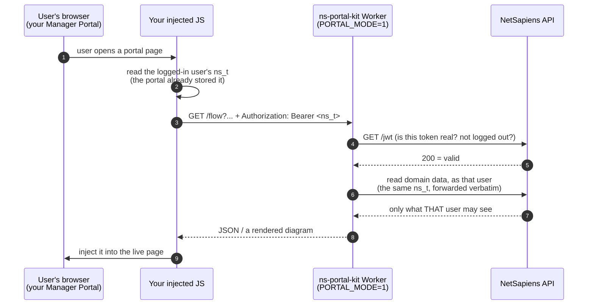

# Setup

Every setting, what it means, and what a valid value looks like.

> ### 🤖 Recommended: let a coding agent drive this
>
> If you use Claude Code, Codex, Cursor, Copilot or similar, **point it at [AGENTS.md](./AGENTS.md)** and
> have it deploy this for you. That file is this reference turned into an **ordered procedure**: it decides
> nothing on your behalf, asks you the handful of questions that actually need your answer (which mode,
> which domains, whether writes are on, who sees what), and refuses the mistakes that cost money or expose
> data. Something like:
>
> ```
> Read AGENTS.md in this repo and deploy this project for me. Ask me the questions it says to ask.
> ```
>
> It is faster and safer than working through the settings by hand, because the ordering is the part that
> bites: a secret pasted into the wrong place, or a stored token deployed with nothing in front of it.
> **This file stays the reference** — AGENTS.md links into it rather than repeating it, so you are never
> reading two versions of the same fact. Prefer to do it yourself? Everything is here; carry on below.

**Start here:** most of the list below is optional. A working deployment needs **three** things, and the
rest only matter if you want the feature they turn on.

---

<a id="pick-a-mode"></a>
<a id="PORTAL_MODE"></a>

## 1. Pick a mode

This decides which settings you need. Everything else follows from it.

| | **Standalone mode** | **Portal backend mode** |
|---|---|---|
| What you get | **call-flow diagrams, and only those** — a standalone viewer you open | the diagrams **embedded in your Manager Portal**, plus the other add-on features |
| Who authenticates | a token you store | the calling user's own `ns_t` |
| Set | `NS_API_TOKEN` | `PORTAL_MODE=1` |
| Reads run as | that token — its NetSapiens scope is the boundary | that user — NetSapiens enforces their scope |
| Stored NetSapiens credential | **yes** | **none**, unless you enable [event subscriptions](#event-subscriptions) |
| Needs injected JavaScript | no | **yes — but it's Worker-served now** |
| Ready to use today | **yes** | **yes** — point your portal at the Worker's primary (or compose it into a script you already inject) |

**Standalone mode gives you the diagram viewer and nothing else.** No Ringotel banner, no per-user app
column, no domain-list column — those live *inside* the Manager Portal, so they only exist in portal
backend mode. (The diagrams themselves can still be *enriched*: set `RINGOTEL_API_KEY` and app presence appears
inline on agent lines, `NS_DEVICE_DETAILS=1` adds phone models. That's decoration on a diagram, not the
separate features.)

**Portal backend mode is where the rest lives** — the diagrams show up in the portal your users already use,
alongside the other add-ons, because injected JS can change any page it runs on.

**Standalone mode is the default** and the simpler place to start. A stored token answers *any* request
that reaches the Worker, so put it behind a gate — see `ACCESS_AUD` + `ACCESS_TEAM_DOMAIN` (you need both).
Until you do, the Worker refuses to use the token at all rather than answer an unauthenticated caller.

**Portal backend mode used to be the advanced path** — but the injection is now **Worker-served**. At its
simplest you point your Manager Portal's injected-script slot at the Worker's primary and the built-in
features appear, no hand-written script needed. That's not the only way in, though: you can also **compose**
the primary into a script you already inject, or **add your own gated scripts** (`PORTAL_SECONDARIES` —
external or served privately from R2). See [section 4](#portal-backend-mode) for all
three ways to wire it. **Portal backend mode holds no NetSapiens credential for user traffic.** Each request carries the caller's `ns_t`, which
is passed through to NetSapiens as-is; the platform validates it and enforces that user's own scope.
(The single exception is [event subscriptions](#event-subscriptions), which are off unless
configured: an event arrives with no caller, so that path — and only that path — uses a stored service
credential.)
There's no SPA — it's a backend for JS **you** inject into the Manager Portal. **[How that actually
works, with a diagram →](#portal-backend-mode)**

**You can run both**, and that's the usual end state — they're two Workers, not two phases. See
[Running both](#running-both).

<a id="required-settings"></a>
<a id="NS_API_TOKEN"></a>
<a id="NS_PORTAL_ISS"></a>
<a id="NS_SERVER"></a>

## 2. The three you actually need

| Setting | Where | Example |
|---|---|---|
| **`NS_SERVER`** | `vars` in `wrangler.jsonc` | `api.yourprovider.com` |
| **`NS_PORTAL_ISS`** | `vars` in `wrangler.jsonc` | `manage.yourcompany.com` |
| **`NS_API_TOKEN`** *(standalone mode)* | secret | a NetSapiens API token |
| **`PORTAL_SUPERADMINS`** *(portal backend mode)* | secret | `you@yourdomain.example` |

`NS_SERVER` — your NetSapiens API host, no scheme, no path. Requests go to
`https://{NS_SERVER}/ns-api/v2`. Ships as `api.example.com`, which is a placeholder, not a default.

`NS_PORTAL_ISS` — the Manager Portal hostname that issues your `ns_t` tokens (the `iss` claim in them).
**Required whenever a request might carry a Bearer `ns_t`** — always in portal backend mode, and in standalone mode
if anyone sends one. It has **no default on purpose**: a default would mean accepting tokens minted by
a portal you don't control. Comma-separate if several portal hostnames front the same backend —
`manage.a.com,manage.b.com` — matched **exactly**, no wildcards (`*.a.com` is a literal that matches
nothing).

`NS_API_TOKEN` — standalone mode only. **Leave blank in portal backend mode.**

`PORTAL_SUPERADMINS` — portal backend mode. Comma-separated `user@domain` accounts that pass every gate
regardless of their NetSapiens scope. Listed here rather than under optional settings because of one
consequence people hit: the **integration console defaults to superadmin-only**, and with nobody named it admits
nobody — including you. It refuses with a message that says so, but you will have deployed a console you
cannot open. Set it before you deploy.

**Not sure if you're done?** `GET /health` reports `{"ok":true,"configured":false}` in either mode. In
**standalone** mode, opening `/` also lists exactly what is missing, with the fix. In **portal backend**
mode `/` is deliberately a 404 — there is no UI there — so use `/health`, and once you are deployed use the
integration console (below), which is the fuller answer. All of them say only *whether* a value is set, never
what it is.

<a id="optional-settings"></a>

## 3. Optional — each turns on one thing

Everything below is off unless set. Blank/absent is always a safe answer.

<a id="protect-a-stored-token"></a>
<a id="ACCESS_AUD"></a>
<a id="ACCESS_TEAM_DOMAIN"></a>

### Protect a stored token

| Setting | Value | Meaning |
|---|---|---|
| `ACCESS_AUD` | Access application AUD tag | Half of the Access switch — **needs `ACCESS_TEAM_DOMAIN` too**. On its own it turns nothing on. **Standalone only** — see the note below. |
| `ACCESS_TEAM_DOMAIN` | `yourteam.cloudflareaccess.com` | Your Zero Trust team domain. **Both** vars together turn on the in-Worker Access check (it fails closed). Setting only one is refused, not served: with a stored `NS_API_TOKEN` and nothing verifiable in front of it, the Worker declines to use the token and tells you which var is missing. |

Strongly recommended for standalone mode. Without it, anyone who reaches the Worker gets whatever the
stored token can read. Both values are public identifiers — safe in `vars`.

> **These two settings apply to standalone deployments only, and are IGNORED when `PORTAL_MODE=1`.**
> Not a limitation — putting an Access gate in front of a portal backend cannot work. The Manager Portal
> loads the injected primary with a plain `<script src="…">`, and a script tag cannot complete an Access
> login: there is no redirect for it to follow and no cookie for it to present. The injection would die at
> step one, and every gated route behind it with it. Nor is there anything for Access to protect there:
> portal mode never uses a stored `NS_API_TOKEN` at all — every caller supplies their own `ns_t`, and that
> verification *is* the gate. So setting these on a portal deployment is harmless and does nothing; the
> integration console reports them as configured-but-ignored, with this reason.

<a id="limit-domains"></a>
<a id="ALLOWED_DOMAINS"></a>
<a id="BLOCKED_DOMAINS"></a>

### Limit which domains are visible

| Setting | Value | Meaning |
|---|---|---|
| `ALLOWED_DOMAINS` | `acme,demo.12345.service` | Allowlist. Set ⇒ only these are listed, and any other is refused (403) **even if the token could read it**. Blank ⇒ no app-layer limit. |
| `BLOCKED_DOMAINS` | `0000.12345.service` | Hide specific domains (e.g. a DID-holding domain with nothing to show). |

Comma-separated NetSapiens domain names, exactly as NetSapiens has them. A domain may be bare (`acme`)
or carry a territory suffix (`acme.12345.service`) — use whichever form is real for you. These are an
app-layer bound *on top of* the token's own scope, not a replacement for it.

<a id="portal-backend-mode-settings"></a>
<a id="ALLOWED_ORIGINS"></a>

### Portal backend mode

⚠️ **`PORTAL_HANDOFF_URL` has no safe default, and leaving it out blocks the deployment.** In portal mode
an *absent* value is treated as a misconfiguration: `GET /health` reports `configured:false` until you set
it, which is the first thing this document tells you to check. It has three states and the difference
matters:

| Value | Meaning |
|---|---|
| **absent** | ⚠️ unconfigured — `/health` reports `configured:false` |
| **`""`** (present, empty) | deliberate "no hand-off", and the right answer when you are **not** running a vendor add-on alongside this kit |
| a URL | the vendor bundle-router your primary should chain-load, so the add-on keeps working |

If you have no vendor add-on, set it to `""` rather than leaving it out. Absent and empty look the same
in a config file and mean opposite things here — that is deliberate, so that "I have not decided yet" is
never silently treated as "I decided no".

| Setting | Value | Meaning |
|---|---|---|
| `PORTAL_MODE` | `1` | Delegated only — no stored-token fallback, every request must carry an `ns_t`. |
| `ALLOWED_ORIGINS` | `https://manage.yourcompany.com` | Browser origins allowed to call it (CORS). Comma-separated, scheme included. |

`ALLOWED_ORIGINS` is the origin the injected JS runs on — normally your Manager Portal.

<a id="multiple-workers-one-zone"></a>
<a id="CACHE_SCOPE"></a>

### Running more than one Worker on one zone

| Setting | Value | Meaning |
|---|---|---|
| `CACHE_SCOPE` | `default` | Namespace for every cache entry this deployment writes. **One Worker: leave it alone.** More than one on the same zone: give each a distinct value. |

Cloudflare's `caches.default` is shared **zone-wide**, not per Worker, so two deployments with the same
scope read and write one set of cached app-provider and device entries — each serving the other's data, and
each suppressing the other's forced refresh. `GET /health` reports the value in use, which is the cheapest
way to check: compare the `scope` field across your deployments and make sure they differ. One deployment
missing the setting degrades safely to its own namespace; *two* missing it quietly share one again.

⚠️ `env` blocks do **not** inherit top-level `vars`, so each environment needs its own `CACHE_SCOPE`
alongside its own `NS_SERVER` and the rest.

<a id="branding"></a>
<a id="BRAND_ACCENT"></a>
<a id="BRAND_LABEL"></a>
<a id="BRAND_NAME"></a>

### Branding

Branding is configuration, never code, so a fork ships unbranded and yours never enters the source.

| Setting | Value | Meaning |
|---|---|---|
| `BRAND_NAME` | `Acme Voice` | Your company name. Produces `"Acme Voice Portal Kit v<version>"` and an `"Acme Voice portal"` theme. Unset ⇒ `"NS Portal Kit"` and the neutral theme. |
| `BRAND_ACCENT` | `#1a6bb0` | Accent colour. **Must be hex** (`#rgb`/`#rrggbb`); anything else is ignored. |
| `BRAND_LABEL` | `Acme Portal` | Override the theme's picker label. Defaults to `"<BRAND_NAME> portal"`. |

<a id="app-status"></a>
<a id="RINGOTEL_APP_BASE_URL"></a>
<a id="RINGOTEL_API_KEY"></a>
<a id="RINGOTEL_BASE_URL"></a>
<a id="RINGOTEL_LABEL"></a>
<a id="RINGOTEL_LABEL_SHORT"></a>
<a id="RINGOTEL_OVERRIDES"></a>
<a id="RINGOTEL_PRESENCE"></a>

### Ringotel app status

Optional integration. **`RINGOTEL_API_KEY` is the gate**: absent ⇒ no Ringotel calls, no enrichment, its
routes return 404, and the deployment behaves exactly as if the integration didn't exist.

| Setting | Value | Meaning |
|---|---|---|
| `RINGOTEL_API_KEY` | your Ringotel AdminAPI key | Turns the integration on. |
| `RINGOTEL_LABEL` | `Acme App` | Long display name. Default `Ringotel`. |
| `RINGOTEL_LABEL_SHORT` | `A App` | Short name for tight spots (a column header). Falls back to `RINGOTEL_LABEL`. |
| `RINGOTEL_PRESENCE` | `1` | Show 🟢/🔴 online circles. Off by default: presence is a point-in-time snapshot (cached ≤10 min) while the rest of a diagram is static config. |
| `RINGOTEL_BASE_URL` | `https://shell.ringotel.co` | Only if you're not on the default Ringotel endpoint. |
| `RINGOTEL_OVERRIDES` | `{"weird.domain":"actual-branch-address"}` | JSON. Only for the rare domain whose Ringotel branch address doesn't equal its NetSapiens domain. |
| `RINGOTEL_APP_BASE_URL` | `https://app.example.com` | Base URL for a deep link to the app dashboard, shown on the gated feature surfaces. Unset ⇒ a plain text label instead of a link. |

A Ringotel branch's `address` must equal the NetSapiens domain **exactly** — that's what binds them. If
yours match (they normally do), you need no overrides.

**More than one branch may share a domain.** An organization can serve one NetSapiens domain from
several branches — per site, per white-label app, or a pilot beside production. That is supported: the
user list spans every bound branch and each row names the branch it belongs to, so you can see at a
glance where someone lives.

Two rules follow, and both fail safe:

- **Two *different organizations* claiming one domain is refused everywhere.** Several branches under
  one organization is a topology; two organizations is a misconfiguration, and nothing can tell which
  one's users belong to that domain.
- **An extension with records on more than one branch is reported, never resolved.** The portal shows a
  conflict and refuses writes to that extension until a human fixes it, rather than picking a record
  and possibly changing the wrong seat.

Activating a user who has **no** record yet is also refused on such a domain, because nothing here
knows which branch a new user belongs to. Create the user on the intended branch first.

<a id="app-activation"></a>
<a id="RINGOTEL_ACTIVATION_SUFFIX"></a>
<a id="RINGOTEL_EXCLUDE_EXTS"></a>
<a id="RINGOTEL_EXCLUDE_EXTS_BY_DOMAIN"></a>
<a id="RINGOTEL_EXCLUDE_NAMES"></a>
<a id="RINGOTEL_EXCLUDE_NO_DEVICES"></a>
<a id="RINGOTEL_RESELLER_OVERRIDE"></a>
<a id="RINGOTEL_ROTATE_SIP_ON_ACTIVATE"></a>
<a id="RINGOTEL_SSO_SERVICE"></a>
<a id="RINGOTEL_WRITE_DOMAINS"></a>

### App activation (writes)

Lets authorized roles activate/deactivate a user's app and reset its password **from the NetSapiens user
profile**. These are *writes*, so they're gated harder than the read features above. Four independently-
gated features — `ringotel.profileStatus` (read indicator), `ringotel.activate`, `ringotel.resetPassword`,
and `ringotel.profileAppAccess` (read-only: shows the operator the **user-visible app sign-in message** —
the same domain/username/password instructions and download links that user sees, so you can walk them
through sign-in or see why they can't yet) — all default level `office_manager`; re-level via
`PORTAL_FEATURES`. Requires `RINGOTEL_API_KEY`.

| Variable | Example | What it does |
|---|---|---|
| **`RINGOTEL_WRITE_DOMAINS`** | `acme.12345.service` (CSV), or `*` | **Safety rail. Empty ⇒ ALL writes refused (fail-closed).** Only listed domains may be mutated; `*` = every in-scope domain. Set it deliberately. |
| `RINGOTEL_ACTIVATION_SUFFIX` | `r` | NetSapiens softphone device suffix (`ext` → `<ext><suffix>`). Default `r`. |
| `RINGOTEL_ROTATE_SIP_ON_ACTIVATE` | `0` to disable | **Default ON.** When activating a user whose `<ext><suffix>` device *already existed*, replace its SIP password instead of reusing the stored one. See the note below. |
| `RINGOTEL_EXCLUDE_NAMES` | `SHARED,FAX` | Name-contains matchers to soft-exclude, matched case-insensitively as **substrings**. Setting it REPLACES the default list — which is ten entries, not three: `SHARED`, `SHARED VOICEMAIL`, `VOICEMAIL`, `FAX`, `GENERAL VOICEMAIL`, `GENERAL MAILBOX`, `CONFERENCE`, `CONF RM`, `CONF ROOM`, `ROUTING`. Worth reading before you rely on it: bare `VOICEMAIL` and `ROUTING` match any name containing them. |
| `RINGOTEL_EXCLUDE_EXTS` | `900,8*` | Extension patterns to soft-exclude (trailing `*` = prefix). Default empty. |
| `RINGOTEL_EXCLUDE_EXTS_BY_DOMAIN` | `{"acme.x":{"remove":["900"]}}` | JSON per-domain add/remove of the exclude-exts. |
| `RINGOTEL_EXCLUDE_NO_DEVICES` | `1` | Tightens the name matcher: a name-matched user is excluded only if it *also* has no devices. **Never excludes a no-device user on its own** — a normal-named user with no devices stays activatable (activation creates the device). Off by default. |
| `RINGOTEL_RESELLER_OVERRIDE` | `names,exts` or `all` | Which soft categories a reseller may override. A reseller can also force-activate one user at runtime. |

**System/service users** (a non-blank `srv_code`) and non-3-4-digit extensions are **HARD**-excluded and
can never be activated — not even by a reseller force. Writes require a delegated `ns_t` (never a stored
service token) and force a fresh token re-validation before mutating.

**The email requirement applies to the *emailed* activation path, not to SSO.** Activating a user from the
profile page emails them their credentials, so it needs an address on the NS user. An SSO sign-in creates
the account from the user's own portal login and mails nothing, so on an SSO-bound domain
(`RINGOTEL_SSO_SERVICE`) a user with no email address is still treated as eligible and is shown how to
sign in. Soft and HARD exclusions are unaffected either way — only the address requirement is waived, and
only where nothing would have been mailed.

**Activation rotates the SIP password of a device it did not create.** Reusing the stored password
leaves *any other endpoint still holding it* with valid credentials for the same address-of-record. Both
then register, the most recent wins, and they trade the registration back and forth — intermittent call
failures with nothing obviously wrong in either system. Rotating at activation invalidates the stranger.

A device this activation *creates* is not rotated (it is already exclusive), and per-login paths never
rotate — doing so on every sign-in would churn the credential and could race a re-registration. Rotation
is best-effort: if it fails (including on a NetSapiens release without the device `PUT`) activation still
succeeds using the existing password. Set `RINGOTEL_ROTATE_SIP_ON_ACTIVATE=0` for the old reuse behaviour.

**Soft exclusions are creation-only.** They decide whether an account may be *created*; they never block a
user who already has a working one from being shown how to sign in.

> The eligibility decision itself lives in `@dszp/netsapiens-lib` (`evaluateEligibility`) so that every
> consumer of that library — this portal backend and any SSO integration you run beside it — reaches the
> same verdict from the same inputs. Only the configuration above is read here.

<a id="event-subscriptions"></a>
<a id="NS_EVENTS_PREFERRED_SERVER"></a>
<a id="NS_OAUTH_SERVER"></a>
<a id="NS_ADMIN_PASS"></a>
<a id="NS_ADMIN_USER"></a>
<a id="NS_API_KEY"></a>
<a id="NS_EVENTS"></a>
<a id="NS_EVENTS_ALLOW_IPS"></a>
<a id="NS_EVENTS_BASE_URL"></a>
<a id="NS_EVENTS_DEVICE_REPAIR"></a>
<a id="NS_EVENTS_DIAG_RAW"></a>
<a id="NS_EVENTS_DOMAINS"></a>
<a id="NS_EVENTS_GEO_SUPPORT"></a>
<a id="NS_EVENTS_MAX_EVENTS"></a>
<a id="NS_EVENTS_MODELS"></a>
<a id="NS_EVENTS_OFFBOARD"></a>
<a id="NS_EVENTS_PATH_SECRET"></a>
<a id="NS_EVENTS_RENEW_HORIZON"></a>
<a id="NS_EVENTS_SWEEP_MAX"></a>
<a id="NS_EVENTS_TARGET_LIFETIME"></a>
<a id="NS_OAUTH_CLIENT_ID"></a>
<a id="NS_OAUTH_CLIENT_SECRET"></a>

### NetSapiens event subscriptions

**The problem this solves:** without it, a user's name and email reach the app directory only as a *side
effect* of an explicit action — an activation, a password reset, an SSO sign-in. Edit a user directly in
NetSapiens and the directory keeps the old values indefinitely. Clear someone's email address and the
directory keeps the stale one, which can later receive an app password for an extension that has since
been reassigned.

NetSapiens can instead **push** subscriber changes to this Worker. It registers a subscription per domain,
receives the events, and syncs identity to the app directory. A scheduled job keeps those subscriptions
correct and reports their delivery health.

**It is inert until configured.** Leave these unset and there is no route, no scheduled work, and no
behaviour change — the feature arms only when the origin, the secret, the service credential and the
domain list are all present.

| Variable | Example | What it does |
|---|---|---|
| `NS_EVENTS` | `auto` \| `on` \| `off` | `auto` (default) = on once Ringotel and the settings below are present. `on` makes missing settings a loud startup error. `off` goes inert — and, on the next reconcile, also removes this deployment's own subscriptions, provided the callback origin and service credentials are still configured. See below. |
| **`NS_EVENTS_BASE_URL`** | `https://portal.example.com` | **This deployment's public origin.** Must differ per deployment — subscription ownership is decided by URL prefix, so two deployments sharing an origin will fight over one subscription set. Origin only: a path breaks every callback. |
| **`NS_EVENTS_DOMAINS`** | `acme.example.com` (CSV), or `*` | Which domains to subscribe to. `*` means every domain the **write rail** permits; it can never exceed `RINGOTEL_WRITE_DOMAINS`. Unset ⇒ inert. Dropping a domain — or emptying the list entirely — removes its subscription(s) on the next reconcile, provided the callback origin and service credentials are still configured. See below. |
| `NS_EVENTS_MODELS` | `subscriber` | Which event models to subscribe to. Default `subscriber`. An unknown model is a startup error. |
| `NS_EVENTS_TARGET_LIFETIME` | `31536000` | Seconds of subscription lifetime to request. Default 365 days. |
| `NS_EVENTS_RENEW_HORIZON` | `604800` | Renew when less than this remains. Default 7 days. |
| `NS_EVENTS_GEO_SUPPORT` | `yes` \| `no` | Geo-redundant delivery. Default `yes` — **send it explicitly**, because NetSapiens behaves as `no` when the field is omitted despite documenting `yes`. |
| `NS_EVENTS_MAX_EVENTS` | `40` | Cap on events processed per delivery. Truncation is logged, never silent. |
| `NS_EVENTS_ALLOW_IPS` | *(empty)* | Optional source-IP allowlist. **Off by default and expected to stay off** — see below. |
| `NS_EVENTS_DIAG_RAW` | `1` | Log the *shape* of an inbound payload (key names, sizes — never values) to diagnose an unfamiliar delivery. |
| `NS_EVENTS_OFFBOARD` | `off` \| `deactivate` | A user deleted in NetSapiens has their app record deactivated — confirmed only by a 404 on re-read, never by the event payload. Fires immediately from the change event, and again on the hourly sweep, which also cleans up records orphaned before this feature shipped. Default `off`. |
| `NS_EVENTS_DEVICE_REPAIR` | `off` \| `report` \| `heal` | Self-heal an active app user whose softphone device has gone missing. `report` logs the drift without writing; `heal` recreates the device and re-pushes its credentials. Default `off`. Costs extra requests per event — see below. |
| `NS_EVENTS_SWEEP_MAX` | `200` | Cap on how many records the hourly sweep will touch in one run. Overflow is logged, never silent. Default `200`. |
| `NS_EVENTS_PREFERRED_SERVER` | *(empty)* | Ask NetSapiens to deliver events from a particular node. Unset ⇒ no preference, and their own routing applies. |
| `NS_OAUTH_SERVER` | `api.example.com` | OAuth host for the admin-credential grant, for the uncommon case where it is not the same host as `NS_SERVER`. Unset ⇒ falls back to `NS_SERVER`. |

**Secrets** — `wrangler secret put <NAME>`:

| Secret | What it does |
|---|---|
| **`NS_EVENTS_PATH_SECRET`** | Master key for the per-domain callback token. High entropy; generate it, don't invent it. |
| **`NS_API_KEY`** *(or `NS_ADMIN_USER` + `NS_ADMIN_PASS`)* | The **service identity** — the credential used when an event arrives with no caller. Admin credentials win if both are set, and need `NS_OAUTH_CLIENT_ID` / `NS_OAUTH_CLIENT_SECRET`. |

⚠️ **`NS_API_KEY` is not `NS_API_TOKEN`.** The latter is the standalone-mode *read* token; this one
performs privileged writes on behalf of nobody. There is deliberately no fallback between them. Make it a
**dedicated least-privilege key** — NetSapiens can restrict a key by `allowed-models`, domain, and IP.

Six things worth understanding before you enable it:

- **A pushed event is a trigger, not data.** The receiver extracts only *which user changed*, then re-reads
  that user from the API and syncs from the response. So a field missing from a payload can never be
  mistaken for a field that was cleared, and a replayed delivery is a no-op.
- **The callback URL is a capability, not a password.** Its path token is derived per domain, so one leaked
  URL exposes one tenant rather than all of them. But NetSapiens stores that URL, returns it when you list
  subscriptions, and logs it — treat it accordingly. ⚠️ Rotating `NS_EVENTS_PATH_SECRET` is **not
  seamless**: every existing callback is refused from the moment it changes until the next reconcile
  re-points it, and deliveries in that window are lost. Trigger a reconcile immediately after rotating.
- **Your other subscriptions are never touched.** Only subscriptions whose URL starts with your own
  `NS_EVENTS_BASE_URL` are managed; anything else on the same domain is reported and left alone.
- **Going inert cleans up after itself.** Drop a domain from `NS_EVENTS_DOMAINS` while others remain and
  the next reconcile deletes its subscription for you, as before. Now emptying the list **entirely**, or
  setting `NS_EVENTS=off`, does the same thing at the next reconcile: it runs a delete-only pass that
  removes every subscription this deployment owns, then plans nothing else — **provided the callback
  origin (`NS_EVENTS_BASE_URL`) and the service credentials are still configured.** Remove those first and
  nothing is left able to clean up.

  **Retiring the feature.** Empty `NS_EVENTS_DOMAINS` (or set `NS_EVENTS=off`) → let one reconcile run →
  verify the subscriptions are gone → *then* remove the secrets. Removing the credentials first leaves
  nothing able to clean up, and deleting the Worker outright always strands its subscriptions. Changing
  `NS_EVENTS_BASE_URL` likewise orphans subscriptions created under the previous origin, because the URL
  prefix is what marks them as ours — rotate an origin with the same delete-first discipline.
- **An IP allowlist is the wrong gate here**, which is why it is off by default. Delivery is geo-redundant
  across NetSapiens nodes and fails over between them, so the source address is not stable — and it
  arrives over IPv6. Making it predictable means disabling redundancy. The path token is the real gate.
- **`NS_EVENTS_DEVICE_REPAIR` adds requests per event.** With it enabled (`report` or `heal`), every
  processed event does extra work on top of its normal user lookup, and `heal` adds a write on top of
  that when it actually repairs something. A full batch at the default `NS_EVENTS_MAX_EVENTS` (40) with
  repair on can land in the low hundreds of subrequests for a single delivery — comfortably inside a
  paid Workers plan's per-invocation limit, but potentially over a free plan's. Keep that in mind when
  sizing `NS_EVENTS_MAX_EVENTS` on a free plan.

**Requirements:** a NetSapiens release exposing the flat `/subscriptions` endpoints (the domain-scoped
variants are v45+ and absent on v44), and a scheduled trigger — add
`"triggers": { "crons": ["17 * * * *"] }` to each environment that should reconcile. Hourly is deliberate:
the job validates and repairs, it does not keep anything alive.

<a id="directory-prepop"></a>
<a id="RINGOTEL_PREPOP_INCLUDE_SOFT"></a>

### Directory pre-population (writes)

Creates **inactive** app-directory entries for NetSapiens users who have none, so the directory reflects
your organization before anyone is activated. Gated by `ringotel.prepop` (default `reseller`), bounded by
`RINGOTEL_WRITE_DOMAINS`, and exposed as two routes: a **preview** that lists what it would create along
with every skip and its reason, and an **apply** that performs it. Apply re-plans server-side — the caller
names a *domain*, never the individual users.

| Variable | Example | What it does |
|---|---|---|
| `RINGOTEL_PREPOP_INCLUDE_SOFT` | `1` | Also create entries for **soft-excluded** users (`SHARED`, `VOICEMAIL`, excluded extension patterns). Off by default: those extensions are not people, and a directory full of entries nobody should activate is noise. |

Users with **no email address** *are* included — a missing address blocks activation, not a directory
entry, and such a user can still be activated later via SSO. Hard-excluded users (service codes,
non-numeric extensions) never are.

**A placeholder deliberately carries no SIP identity** — no username, authname, or password. A record that
owns `<ext><suffix>` is exactly what collides when an extension is later reassigned; activation fills those
fields in afterwards.

<a id="app-sign-in-details"></a>
<a id="PORTAL_APP_DOWNLOADS"></a>
<a id="SSO_AUTO_ACTIVATE"></a>

### App sign-in details

A self-service feature (`me.appAccess`, default `all`): the Apps menu and the user's own home-page card
show **how** they sign in to their app — SSO with their portal password, a dedicated app password, or
"not set up yet" — instead of a bare status dot. All four settings below are optional and fail closed:
leave any of them unset and the deployment behaves as if the feature weren't configured (no SSO claimed,
no create-on-login assumed, nothing hidden, no download links shown).

| Setting | Value | Meaning |
|---|---|---|
| `RINGOTEL_SSO_SERVICE` | `netsapiens_sso` | The NAME half of the SSO service your app fleet is bound to, when you also run the matching SSO integration. **Unset ⇒ never claim SSO** — a binding could point at a third-party identity provider, and claiming SSO wrongly tells a user to try a password that will not work. |
| `SSO_AUTO_ACTIVATE` | domain CSV, or `*` | Whether your SSO integration creates an app account on first login for an eligible user who doesn't have one yet — this is a setting on that integration, not something derivable here. **Unset ⇒ assume off**, so such a user is told to contact an admin instead of being invited to a sign-in that would fail. `*` = every domain. |
| `PORTAL_APPS_HIDE` | `SNAPmobile Web` (CSV), or a JSON object keyed per domain (`"*"` = default, `[]` = hide nothing there) | Stock Apps-menu entries to hide (e.g. one you don't offer). Not conditioned on whether the domain runs your app — a domain served by another white-label app is a normal outcome. |
| `PORTAL_APP_DOWNLOADS` | `[{"label":"Get the App","url":"https://example.com/app","title":"...","showUrl":false}]` | JSON array of download links shown in menu order. `label` and an `https://` `url` are required; `title` is an optional tooltip. A small copyable URL line is shown under each link by default; set `"showUrl": false` on an entry to hide it (e.g. a long link that won't fit). Unset ⇒ no links. |

<a id="portal-menus"></a>
<a id="PORTAL_APPS_HIDE"></a>
<a id="PORTAL_MENUS"></a>

### Customizing portal menus (`PORTAL_MENUS`)

Add and hide entries in the portal's stock menus — optionally **only where your app is active**. Gated by
`me.menuConfig` (default `all`). Unset ⇒ nothing changes.

> Hiding a menu entry is **cosmetic, not a security control.** It removes a link, not access to whatever
> the link pointed at. Never use it to "lock" a feature.

**Trying your first menu rule on a portal your customers are already using? Scope it to yourself, look at
it, then widen it.** Every rule here accepts a `users` or `domains` rung, so a change can be real for one
account — or one domain — before anyone else sees it:

```json
{ "apps": { "hide": { "users": { "you@yourdomain.example": ["SNAPmobile Web"] }, "*": [] } } }
```

That is the whole preview mechanism, and it is why there is no separate preview mode: `"*": []` means
*change nothing for everyone else*, so the blast radius is one account until you decide otherwise. Widen it
by moving the entries to `"*"` once you have seen the menu with your own eyes. Full precedence order:
[How targeting works](#menu-targeting).

**Which menus you can target.** Menus are referenced by name — you never supply a CSS selector, which
would break on portal updates and would be a DOM-injection surface for anyone who can set an environment
variable:

| Name | Menu | Where entries are added |
|---|---|---|
| `apps` | the portal's **Apps** dropdown | appended after the stock entries |
| `account` | the signed-in user's **own name** dropdown (My Account / Profile / Messages / sign out) | into the first group, **above** the divider and the sign-out entry |
| `management` | the top-nav **Management** dropdown — **not stock**, added by a vendor add-on, and shown to administrative scopes only. Targeting it on a portal that does not have it is not an error; nothing appears. | appended at the **end**, after the portal's own entries |

**⚠ The `account` menu relabels itself by CONTEXT, and a hide list matches labels exactly.** It is **one
menu** throughout — same dropdown, same anchor — but its entries depend on whether you are *managing
something* or *inside your own account*:

| Where you are | What the menu says |
|---|---|
| Managing a domain or organisation | `My Account` · `Messages` · `Log Out` |
| Inside your own account | `Profile` · `Log Out` |

Observed 2026-08-08 on a stock portal across three scopes. **The labels follow the context; the scope decides
which contexts you can be in.** A Reseller and an Office Manager see both rows above and switch between them.
A Basic User has no organisation to manage, so they are always in the second row — they see `Profile` and
never `My Account`. (The link back out varies by scope too — `Manage Domains` for a reseller, `Manage
Organization` for an office manager — but both are links, not menus, so nothing here targets them.)

`Profile` opens a **modal**, at every level it appears on — so hiding it removes a modal launcher, not a
link to somewhere. `My Account` navigates.

The practical consequence when writing a hide: **`Profile` hits Basic Users all the time and admins only
inside their own account, while `My Account` hits admins only, and never a Basic User at all.** If you mean
"this entry, always, for everyone", name both.

The consequence: hiding `My Account` does nothing in the context that calls it `Profile`. **If you want an
entry gone everywhere, list every label it goes by.** Listing a label that never appears is harmless — a hide
that matches nothing changes nothing.

An unknown name is a startup error. The `account` menu carries no id and shares a generic class with other
dropdowns, so it is located by its sign-out entry — the one item present in every variant of it. The
`management` menu likewise has no id, and its toggle carries no link either, so it is found by the
toggle's **label**: a portal that renames that menu simply won't match, and your entry is absent rather
than misplaced. Because the portal only shows that menu to administrative scopes, entries there are
already limited to those users — pair it with the `scopes` axis below if you want to narrow it further.

This does **not** require the Ringotel integration: with no `RINGOTEL_API_KEY` set, the app state is
`none`, so static add/hide works on any deployment.

Most people want one line, and that is still the answer:

**1. Hide a stock entry everywhere.** (`PORTAL_APPS_HIDE` — unchanged, still supported.)

```
PORTAL_APPS_HIDE = SNAPmobile Web
```

**2. Hide it only where your app is active** — and leave the stock menu alone on domains that have no app,
so those users keep their only softphone entry. *This is the case the simple form above cannot express.*

```json
{ "apps": { "hide": { "app": { "ringotel": ["SNAPmobile Web"], "none": [] } } } }
```

**3. The same, but not on one domain.** A domain entry wins outright, so `[]` means "change nothing here":

```json
{ "apps": { "hide": { "app":     { "ringotel": ["SNAPmobile Web"], "none": [] },
                      "domains": { "acme.example": [] } } } }
```

**4. Add a static link for everyone.**

```json
{ "apps": { "add": [ { "label": "Support", "url": "https://support.example.com", "title": "Get help" } ] } }
```

**5. Put a help link on the user's own menu instead**, where it sits with their other personal actions
rather than among the apps:

```json
{ "account": { "add": [ { "label": "Email Support",
                          "url": "mailto:support@example.com?subject=Help%20for%20{name}%20({ext}@{domain})",
                          "title": "Opens your mail client" } ] } }
```

**6. Add a tool to the Management menu, for resellers only.** The portal already restricts that menu to
administrative scopes; the scope rung makes it exact:

```json
{ "management": { "add": { "scopes": { "Reseller": [ { "label": "Device Provisioning",
                                                      "url": "https://provisioning.example.com/manage" } ] },
                           "*": [] } } }
```

**7. Show it to office managers and their users, but not to resellers** — the support desk belongs to the
customer, not to the partner who administers them:

```json
{ "account": { "add": { "scopes": { "Reseller": [], "Super User": [] },
                        "*": [ { "label": "Email Support", "url": "mailto:support@example.com" } ] } } }
```

Both menus take the same `hide` / `add` shapes and the same targeting rules, so anything below applies to
either.

<a id="menu-targeting"></a>

#### How targeting works

Anywhere a list of entries is accepted you may instead give an object, and **one rule covers every case: a
default plus specific overrides.** There is no separate "include" and "exclude" syntax because you don't
need one:

| You want | Write |
|---|---|
| change everywhere | `["A"]` — or `{"*": ["A"]}` |
| change everywhere **except** some | `{"*": ["A"], "acme.example": []}` |
| change **only** some | `{"*": [], "acme.example": ["A"]}` |

The same works on the **users** axis (`{"users": {"you@example.com": [...]}}`), the **app** axis
(`{"app": {"ringotel": [...], "none": []}}`) and the **scope** axis
(`{"scopes": {"Reseller": [...]}}`), and they can be combined.
**Precedence, most specific first: `users` → `domains` → `scopes` → `app` → `"*"`.** Naming an account beats
naming their domain, which is the only reason to name one — it is how you carve an exception out of a
domain-wide rule. A matching `domains` entry wins
outright — it is *not* merged with the app list — because otherwise "turn it off just here" would be
inexpressible. A `"*"` **inside** an axis is a default, so an exact match on any axis still beats it.

App keys are `ringotel` (an app organization is active for the domain), `none` (none is), and `*` (either).
A misspelled app or menu name is a **startup error**, not a silently-never-matching rule.

**Scope keys** are NetSapiens user scopes — `Super User`, `Reseller`, `Office Manager`, `Site Manager`,
`Advanced User`, `Basic User`, `Simple User`, `Call Center Agent`, `Call Center Supervisor` — plus `*`.
Spelling is forgiving (`Office Manager`, `office_manager` and `officeManager` are the same key); a scope
this deployment doesn't know is a startup error.

> **The `scopes` axis matches one scope exactly — it does not nest**, unlike the feature levels below,
> where `office_manager` means "Office Manager *and everyone above*". That difference is the point: it is
> what lets you write "office managers and their users, but not resellers", which no feature level can say.

While a user is being **masqueraded**, the scope that matches is the *masqueraded* user's — an
administrator viewing a session sees the menu that user sees.

`add` entries take `label`, a `url`, and an optional `title`. Added links open in a new tab.

**URL schemes:** `https://` and `mailto:` only. Anything else — notably `javascript:` and `data:` — is
refused at startup, so a dangerous scheme can never reach the page.

**Variables.** `label`, `url` and `title` may contain placeholders, filled in per signed-in user:

| Variable | Value |
|---|---|
| `{ext}` | their extension |
| `{domain}` | their PBX domain |
| `{email}` | their email address |
| `{fname}` / `{lname}` | first / last name |
| `{name}` | display name (falls back to first + last) |
| `{page}` | the portal page they are on **when they click** |

```json
{ "apps": { "add": [
  { "label": "Get help",
    "url": "https://support.example.com/new?ext={ext}&domain={domain}&from={page}" },
  { "label": "Email support",
    "url": "mailto:support@example.com?subject=Help%20for%20{name}%20({ext})" } ] } }
```

Values are percent-encoded in the URL, so a name containing a space or `&` cannot inject an extra query
parameter. A variable may **not** appear in the host — `https://{fname}.example.com/x` is refused at
startup — because the destination has to be a decision you made, not one a user's own profile field can
change. In a `label` or `title` the value is shown as-is (no encoding), since those are read by a person.
Everything except `{page}` is substituted on the server from the signed-in user's **own** record — one user
can never interpolate another's details. `{page}` is filled in the browser and is the **path only**, never
the query string, since a portal URL's query can carry identifiers and the link may leave for a third party.
A variable with no value becomes empty rather than leaving a literal `{email}` in a live link, and a
misspelled one (`{emial}`) is a startup error.

**Use the builder rather than writing this by hand.** The console's **Menus** tab reads the menus off the
portal page you opened it from, so you tick the real entries instead of typing labels and hoping they match.
It emits both the readable JSON and the escaped `wrangler.jsonc` line, and it checks the result against your
deployment's own validator before you paste it anywhere. The rest of this section is what the builder is
composing — worth reading once, not worth typing.

**Setting both** `PORTAL_APPS_HIDE` and `PORTAL_MENUS.apps.hide` is fine — **the two hide lists merge.**
Neither one silently wins, a label named by both is hidden once, and the console shows the effective list
with each entry attributed to the setting it came from, so there is still one place to look for the answer.
Use `PORTAL_MENUS` when you outgrow the one-liner; move the old list into it if you want everything in one
place, but nothing breaks if you don't.

**Hides are applied before adds.** A hide names a *stock* entry, so it acts on the menu as the portal
shipped it, before any of your own entries exist. That is deliberate and it is what keeps the two lists
independent: a hide can never remove something you added, and neither list's meaning depends on the other.

<a id="call-flow-diagrams"></a>

### Call-flow diagrams (portal side)

The flagship portal-backend feature. When `callflow.view` is enabled (default `reseller`), a **"Call Flow"
button is injected** on the Manager-Portal pages where a routable entity lives:

| Portal page | Entity you get a diagram for |
|---|---|
| **Inventory / phone numbers** | a DID |
| **Call Queues** (list) | a queue |
| **Auto Attendants** (list + the AA edit page) | an auto attendant |
| **Users** (list + a user's profile / answer-rules / phones) | a user |

Clicking it opens a diagram that resolves *that* entity's **live** routing — DID → time-of-day →
auto-attendant menu → queue → agents → voicemail/external — rendered from the API (not a stored picture),
with a theme picker, pan/zoom, and PNG export. (Standalone mode renders the same diagrams as a tool you open
directly, no injection.) Gate it elsewhere with `PORTAL_FEATURES` — e.g. `{"callflow.view":"office_manager"}`
to widen it, or `"off"` to hide the button entirely.

<a id="device-details"></a>
<a id="NS_DEVICE_DETAILS"></a>

### NetSapiens device details

**Enriches the call-flow diagrams above.** With this on, each agent line on a diagram also shows that user's
desk-phone **model + registration status** (read live per render). Independent of it, `RINGOTEL_PRESENCE`
(under *Ringotel app status*) adds the 🟢/🔴 app-presence dot on the same lines.

| Setting | Value | Meaning |
|---|---|---|
| `NS_DEVICE_DETAILS` | `1` | Show desk-phone model + registration on the diagram agent lines. Costs extra API reads per render. |

Truthy values anywhere above are `1`, `true`, `yes`, `on`.

---

<a id="portal-backend-mode"></a>

## 4. Portal backend mode: what it actually is

Standalone mode is a tool **you** open. Portal backend mode has no UI of its own — it's a **backend for JavaScript
injected into your Manager Portal**, so your users get extra features inside the portal they already
use, without logging in anywhere else.

**Three ways to wire the injection** (details below):

1. **New deployment — primary as the entry point.** Point your Manager Portal's injected-script slot
   straight at `https://<your-worker>/<PRIMARY_BASENAME>.js`.
2. **Compose with a script you already inject.** Keep your current injected file and load the primary from
   *inside* it (one `<script>` line) — for when an existing file (other automation) already owns the slot,
   or you front a vendor/portal bundle via `PORTAL_HANDOFF_URL`.
3. **Add your own gated scripts.** List extra scripts in `PORTAL_SECONDARIES` — loaded externally (`url:`)
   or served privately from your R2 bucket and gated by role (`r2:`).

The flow, per call:


```mermaid
sequenceDiagram
    autonumber
    participant U as User's browser<br/>(your Manager Portal)
    participant JS as Your injected JS
    participant W as ns-portal-kit Worker<br/>(PORTAL_MODE=1)
    participant NS as NetSapiens API

    U->>JS: user opens a portal page
    JS->>JS: read the logged-in user's ns_t<br/>(the portal already stored it)
    JS->>W: GET /flow?... + Authorization: Bearer <ns_t>
    W->>NS: GET /jwt (is this token real? not logged out?)
    NS-->>W: 200 = valid
    W->>NS: read domain data, as that user<br/>(the same ns_t, forwarded verbatim)
    NS-->>W: only what THAT user may see
    W-->>JS: JSON / a rendered diagram
    JS->>U: inject it into the live page
```

The parts worth understanding:

- **The injection is Worker-served — point your portal at the primary.** This repo serves a neutral
  **primary** script (`https://<your-worker>/<PRIMARY_BASENAME>.js`) plus two per-tier gated **bundles**: the
  **admin bundle** (`/kit/portal.js` — the call-flow diagram, status banner, and user/domain columns, gated
  to admin tiers) and the **self-service bundle** (`/kit/self.js` — own-account features, e.g. the home
  app-status indicator). Set your Manager Portal's single injected-script slot to the primary URL; it reads
  the `ns_t` the portal already stored, then fetches whichever of the two bundles the caller is entitled to
  and injects the built-in features. A basic/simple user gets only the tiny self bundle; an admin gets both.
  (Earlier versions required hand-writing all of this; no longer.) If injecting JS into your portal is more
  than you want, use standalone mode — it needs nothing extra.

  **Compose with your own injected script.** Already inject your own static file (n8n glue, other automation)
  and don't want to change that path? Load the kit's primary from *inside* it — one line — and keep your
  injected-script slot as-is:

  ```html
  <script src="https://<your-worker>/<PRIMARY_BASENAME>.js"></script>
  ```

  The primary derives its base from its own URL, so it runs against your Worker wherever your file is hosted —
  the same handoff pattern the kit uses for a vendor bundle, in reverse. Set `PORTAL_HANDOFF_URL=""` if you
  don't front a vendor bundle; ensure the Worker's `ALLOWED_ORIGINS` includes your portal origin and the
  portal CSP `script-src` allows the Worker origin.
- **The `ns_t` is the logged-in user's own session token**, which the portal has already issued and
  stored in the browser. Your JS reads it and forwards it; it doesn't create or manage logins.
- **This path stores no NetSapiens credential.** It forwards that same `ns_t` to NetSapiens verbatim,
  so every read runs *as that user* and NetSapiens enforces their scope. Two users hitting the same
  Worker see different data because the platform says so — not because we filtered it. (Event
  subscriptions are the one path that does hold a credential, because nobody is calling; they are off
  unless configured.)
- **A token is checked before it's trusted.** Structure, expiry, audience and issuer are checked locally
  (free), then a cached `GET /jwt` confirms it's real and not logged out. Only a literal 200 counts.
- **It's per-call.** Nothing is stored between requests except a short-lived cache of "was this token
  valid".

<a id="primary-url"></a>
<a id="PRIMARY_BASENAME"></a>

### Your primary URL — and who injects it

The one value NetSapiens needs is the **full URL of your primary script**:

```
https://<your-worker-host>/<PRIMARY_BASENAME>.js
```

- **`<your-worker-host>`** — the hostname your Worker answers on: your **custom domain** (e.g.
  `svc.example.com`) if you set a route, or the `*.workers.dev` URL otherwise.
- **`<PRIMARY_BASENAME>`** — the `PRIMARY_BASENAME` var (default **`p`**, so the default URL ends in `/p.js`).

**Confirm it before you hand it over.** Open that URL in a browser — a **200** returning JavaScript (and
`https://<your-worker-host>/health` → `{"ok":true, …}`) means the primary is live at that exact path. Two
related settings live on the *portal* side, not this URL: the Worker's `ALLOWED_ORIGINS` must include your
Manager Portal's origin, and the portal's Content-Security-Policy `script-src` must allow your Worker host.

**Who actually sets the injection depends on whether you run NetSapiens.**

- **You operate the NetSapiens platform** (or have Manager-Portal admin access to the injected-/custom-JS
  setting): point that slot at the URL above yourself.
- **You're a reseller or partner under another provider/carrier** (you don't run the NetSapiens core): the
  portal-wide injected-script setting is a platform/upstream control you most likely **can't** change — so
  **give your provider the exact URL** and ask them to add it as the Manager Portal custom JavaScript for
  your reseller/domain(s). The URL is all they need; nothing about it is secret, and the Worker still only
  ever acts as the logged-in user (their `ns_t`, their scope).

<a id="portal-secondaries"></a>
<a id="ASSETS"></a>
<a id="PORTAL_HANDOFF_URL"></a>
<a id="PORTAL_SECONDARIES"></a>

### Add your own injected scripts (`PORTAL_SECONDARIES`)

Beyond the built-in bundles, the primary can load **additional** scripts you list in `PORTAL_SECONDARIES` —
a JSON array where each entry is `{ "name": "...", "from": "...", "auth": "..." }`:

```jsonc
[
  { "name": "my-feature",     "from": "url:https://cdn.example.com/my-feature.js", "auth": "public" },
  { "name": "reseller-tools", "from": "r2:reseller-tools",                          "auth": "reseller" }
]
```

- **`from`** picks the source:
  - **`url:<absolute-url>`** — an external script the browser loads **directly** from that URL. The Worker
    doesn't touch it, so it's effectively public — don't put anything domain-scoped in it (see the
    round-trip rule below).
  - **`r2:<key>`** — a file (`<key>.js`) in a **private R2 bucket** you bind to the Worker as `ASSETS`. The
    Worker **serves and gates** it at `/kit/asset/<name>.js`, so its bytes never leave the Worker except to
    an entitled caller. This is how you ship a script that must stay private, or be gated per role.
- **`auth`** is the gate: **`public`** (no token) or any **level** from the feature-gating vocabulary below
  (`all`, `office_manager`, `reseller`, …). For an `r2:` entry a non-`public` level means the Worker requires
  a valid `ns_t` of that tier before serving the bytes (per-tier cached). For a `url:` entry the browser
  loads it directly, so its `auth` is advisory — **real gating needs `r2:`**.

**Binding the private bucket (the one extra step for `r2:`).** `r2:` sources need an `ASSETS` R2 binding in
`wrangler.jsonc` pointing at your bucket; upload each `<key>.js` there and it ships with `wrangler deploy` +
a cache purge. Deployments with **no** `r2:` entries need no binding — `PORTAL_SECONDARIES` can stay `"[]"`.
This is the advanced path: most deployments start with the built-in bundles and add secondaries later.

> **The round-trip rule (why `r2:` exists).** The browser can't do per-domain authorization, so anything
> domain-scoped — a customer's names, a per-tenant option — must **not** ship in client JS. Resolve it in a
> Worker round-trip that returns only the current user's data (every built-in feature already does this). A
> `url:` script is public bytes; a gated `r2:` script keeps the *code* private but is still not a substitute
> for server-side scoping of *data*.

<a id="worker-bindings"></a>
<a id="JWT_RATE_LIMITER"></a>

### Worker bindings (`ASSETS`, `JWT_RATE_LIMITER`)

Two settings are Cloudflare **bindings** rather than string values: they are declared structurally in
`wrangler.jsonc`, never with `wrangler secret put`, and the console groups them together for that reason.

**`ASSETS`** — the private R2 bucket an `r2:` secondary is served from. Covered above, under
[Add your own injected scripts](#portal-secondaries).

**`JWT_RATE_LIMITER`** — optional, and worth having in portal backend mode. It throttles the live `ns_t`
verification calls this Worker makes to your NetSapiens core, so a flood of forged tokens is bounded before
it reaches the platform:

```jsonc
"ratelimits": [
  { "name": "JWT_RATE_LIMITER", "namespace_id": "1000", "simple": { "limit": 100, "period": 60 } }
]
```

Leave it unbound and an in-isolate limiter still applies — but only *per isolate*, so a distributed flood is
bounded once per edge location rather than once overall. That is why this is not a startup requirement: a
deployment without it is safe, just less effective.

<a id="features-and-gating"></a>

## Features & gating

Portal-backend mode ships a set of features (a call-flow diagram, app-status columns, a status banner),
each gated to a role by default. You **do not** have to touch source to change who sees what: two env
vars, `PORTAL_FEATURES` and `PORTAL_SUPERADMINS`, override the built-in defaults over a documented
registry. Leave them unset and behavior is exactly the defaults below.

<a id="level-vocabulary"></a>

### The level vocabulary

A *level* is an allow-set of NetSapiens scopes (matched case-insensitively). The admin ladder nests;
call-center is exact and orthogonal.

| Level | Admits |
|---|---|
| `off` | **nobody** — a kill-switch (see the rules below) |
| `all` | any authenticated user (any valid `ns_t`, any scope) |
| `call_center_agent` | `Call Center Agent` only |
| `call_center_supervisor` | `Call Center Supervisor` only |
| `super_user` | `Super User` only (the apex scope, exactly) |
| `reseller` | `Reseller`, `Super User` |
| `office_manager` | `Office Manager`, `Reseller`, `Super User` |
| `site_manager` | `Site Manager`, `Office Manager`, `Reseller`, `Super User` |
| `advanced_user` | `Advanced User` + all admins above |
| `basic_user` | `Basic User`, `Advanced User` + all admins above |
| `superadmin` | only the accounts in `PORTAL_SUPERADMINS` |

- The ladder nests: `basic_user` ⊇ `advanced_user` ⊇ `site_manager` ⊇ `office_manager` ⊇ `reseller` ⊇
  `super_user` (a lower rung as a level name is the *broader* set — "this scope and everyone above").
  `Super User` is in every admin set; `super_user` targets it *exactly*.
- **`super_user` (the NS scope) is not the same as `superadmin`** (the account list in `PORTAL_SUPERADMINS`).
  Use `super_user` to gate to the platform's top *role*; use `superadmin` to gate to *specific accounts*.
- Call-center levels admit only their own scope — never each other, never an admin role. They compose
  *onto* a gate (`["call_center_supervisor", "reseller"]`) but never cascade upward.
- **`Simple User`** (a rare end-user tier below Basic) has no dedicated level — reach it with **`all`**.
- Scope word-forms are matched exactly (case-insensitively). `reseller`, `office_manager`, `site_manager`,
  `basic_user`, `call_center_agent`, and `call_center_supervisor` are confirmed against live tokens.
  **`advanced_user`** (`Advanced User`) and **`super_user`** (`Super User`) use the standard NetSapiens
  forms (the engine also canonicalizes `superuser`/`super-user`) — verify against your own `ns_t` if you
  gate to them, as `Advanced User` in particular isn't present on every deployment.

<a id="feature-registry"></a>

### The feature registry (defaults)

| Key | Feature | Default level |
|---|---|---|
| `portal.access` | Receive the injected bundle at all | `office_manager` |
| `callflow.view` | The call-flow diagram button + viewer | `reseller` |
| `ringotel.orgStatus` | Toolbar app-status banner | `reseller` |
| `ringotel.userStatus` | Per-user app column (Users page) | `office_manager` |
| `ringotel.orgList` | Per-domain app column (Domains page) | `reseller` |
| `ringotel.refresh` | Force a fleet-wide app-directory rebuild | `reseller` |
| `ringotel.profileStatus` | App active/inactive indicator on the user-profile page | `office_manager` |
| `ringotel.activate` | Activate/deactivate the app for a user from the profile page (**write**) | `office_manager` |
| `ringotel.resetPassword` | Reset a user's app password from the profile page (**write**) | `office_manager` |
| `ringotel.profileAppAccess` | The user-visible app sign-in message on the user-profile page | `office_manager` |
| `ringotel.prepop` | Preview/create inactive app-directory entries for a domain (**write**) | `reseller` |
| `portal.self` | Receive the **self-service** bundle (own-account features) | `all` |
| `me.appStatus` | App-status indicator on the user's **own** home page | `all` |
| `me.devices` | The user's **own** device list/status | `off` |
| `me.resetPassword` | Reset the user's **own** app password (write) | `off` |
| `me.appAccess` | App sign-in details (mode, username, downloads) on the Apps menu and home card | `all` |
| `me.menuConfig` | Portal menu customization (static add/hide, optionally app-conditional) | `all` |
| `portal.versionLine` | This kit's name + version in the portal footer, linked to its release notes for reseller and above | `all` |
| `portal.statusBanner` | A message across the top of the portal, supplied by an endpoint you host (`STATUS_BANNER_WEBHOOK`) | `all` |
| `kit.status` | Read-only status/config console for this deployment (see below — floored, can't be widened past `reseller`) | `superadmin` |

**Self-service is its own tier.** `portal.access` gates the admin bundle (admin ladder); `portal.self`
gates a separate, minimal bundle of **own-account** features that even a Basic/Simple user receives.
A self-service caller can reach **only** the `me.*` routes, and each derives identity from the caller's
signed token (via the NetSapiens `~` self-wildcard) — never from client input, so a user only ever sees
or changes their own account. `me.devices` and `me.resetPassword` ship **off**; enable them with
`PORTAL_FEATURES` (and, for the reset write, the domain must also be on `RINGOTEL_WRITE_DOMAINS`). Set
`portal.self` to `off` to disable the whole self-service tier.

**Two features ride that bundle without being self-service**, and it is worth knowing which so you look
for their settings in the right place: `me.menuConfig` and `portal.versionLine` are operator configuration
applied to everyone, so they need the self bundle's reach — every signed-in user — but neither is about
the reader's own account. Turning `portal.self` off therefore also removes the menu customization and the
footer version line, which is the one surprise in that switch.

<a id="portal-features"></a>
<a id="PORTAL_FEATURES"></a>

### `PORTAL_FEATURES` — override a feature's gate

A JSON object mapping a registry key to a gate. Four shapes:

```jsonc
{
  "ringotel.orgStatus":  "reseller",                                      // 1. single level
  "ringotel.userStatus": ["office_manager", "call_center_agent"],          // 2. list of levels (union)
  "callflow.view":       { "levels": ["reseller"], "users": ["x@y.example"] }, // 3. levels + forced users
  "ringotel.orgList":    "off"                                            // 4. off — kill-switch
}
```

Disambiguation is by type: `"x"` → a level · `["x","y"]` (strings) → a union of levels · `{...}` → levels
+ forced users. An unknown key or unknown level is a **loud config error** (a `500` on every route after
`/health`) — it never silently allows.

<a id="portal-superadmins"></a>
<a id="PORTAL_SUPERADMINS"></a>

### `PORTAL_SUPERADMINS` — an account-based top tier

Comma-separated `user@domain` accounts (e.g. `x@y.example,z@y.example`). These accounts:

- are unioned into **every** gate, so they see everything the admin tiers do — **except** a gate that
  targets *only* call-center levels (superadmins don't auto-get CC features);
- can be **targeted** directly by the `superadmin` level (e.g. a future admin-only screen).

<a id="gate-resolution-rules"></a>

### Resolution rules

- **`off` is absolute:** denied to everyone — no roles, no forced users, no superadmins. To peek at an
  off feature, flip it to `superadmin` or add your account to its `users`.
- For any other gate, a principal is granted if **any** of these match: the resolved level role-sets, the
  gate's forced `users`, **or** a `PORTAL_SUPERADMINS` account (unless the gate is call-center-only).
- **Forced users win over roles:** an account in `users` is granted even with no qualifying role.
- **`{ "users": ["x@y.example"] }`** (no `levels`) = "off for roles, on for these accounts" (+ superadmins) —
  distinct from `off`.

Secondary injected scripts (`PORTAL_SECONDARIES`, below) use the **same** level vocabulary in their
`auth` field, plus the special value `public` (no token needed).

<a id="release-notes-url"></a>
<a id="PORTAL_RELEASE_NOTES_URL"></a>

### The version line and where it links (`PORTAL_RELEASE_NOTES_URL`)

Two surfaces show this kit's version: the **portal footer** (the `portal.versionLine` feature, reseller and
above) and the **integration console's own header**. Both link that number at release notes, and one setting
decides where it points:

```jsonc
"PORTAL_RELEASE_NOTES_URL": "https://github.com/you/your-copy/releases#release-v{version}"
```

`{version}` is replaced with the version actually running. Three states, the same shape `PORTAL_HANDOFF_URL`
uses:

| Value | Where the version links |
|---|---|
| **absent** | the public release list, anchored at your running version — the default, and right for an unmodified deployment |
| **a URL** | yours: your own copy's releases, or internal notes |
| **present but empty** | nowhere — the version is still shown, it just is not a link |

Linking the release *list* rather than the single release page is deliberate: the list carries a version
sidebar and a compare control, so it answers *am I behind* as well as *what is in mine* — and if the anchor
ever stops matching, the reader still lands somewhere that states which version it is showing.

<a id="status-banner"></a>
<a id="STATUS_BANNER_WEBHOOK"></a>

### The status banner (`portal.statusBanner`)

A message across the top of the portal — maintenance notices, welcome text for new customers, anything
time-bound. **The kit renders it; you decide what it says.** One setting turns it on:

```jsonc
"STATUS_BANNER_WEBHOOK": "https://automation.example.com/webhook/portal-banner"
```

Unset, the feature is inert: nothing is requested and nothing is drawn.

On every portal page load the kit posts to that endpoint and shows whatever comes back, or nothing. The
payload tells your side who is asking:

```jsonc
{ "validate": "<the caller's ns_t>", "path": "/portal/home",
  "domain": "acme.example", "scope_mode": "...", "sub_scope": "...", "user": "..." }
```

Reply with plain text, or JSON carrying `message`, `banner_message`, `text` or `banner`. An empty reply shows
nothing, which is how you take a notice down.

**Why an endpoint instead of a config value.** A notice is time-bound and often per-customer; a setting would
mean a redeploy to post one and another to remove it. This keeps the kit stateless — no database, no binding
to provision — while your side changes the message as often as you like.

⚠ **Point it only at an endpoint you control.** The request carries the signed-in user's live `ns_t`, so
whatever is named there receives a working portal credential from every user who loads the portal. It must
be `https` for the same reason.

**Simple HTML is supported** — links, bold, italics, and `<br>` to force a break — because a welcome or
support notice usually needs them. The markup is rebuilt from an allow-list rather than inserted as-is, so
`<script>`, event handlers and non-`https` links are dropped whatever the endpoint returns. That is a
backstop against a mistake, not a substitute for trusting what your endpoint says.

**Placement adapts to the window.** Where there is room it overlays blank space in the header, so nothing on
the page moves; where there is not, it takes its own row above the button grid. A long message shrinks to fit
rather than being truncated.

<a id="integration-console"></a>

### The integration console (`kit.status`)

A read-only "**Super Portal Kit**" entry in the Manager Portal opens a page reporting how this deployment
is actually configured. It appears in the **Management** dropdown where that exists, and otherwise at the top
of the user's **own name dropdown** — see step 3 of §5b for why that is the usual case. Eight tabs:

| Tab | What it answers |
|---|---|
| **Overview** | Who you are, how you got in, and anything the setup checklist wants fixed |
| **Features** | Each capability, who it's available to, and what it still needs — split into administrative features and self-service ones, because the second kind is about *your users*, not you |
| **Integrations** | The external systems this deployment talks to, each owning its own parts (so "everything below here is off because the API key is unset" is one visible fact, not nine) |
| **Permissions** | The matrix: one row per feature, one column per NetSapiens scope, plus the two account-based axes. See below |
| **Menus** | What your menu config does now, per menu, and a builder that composes the next one from the real entries on your portal page. |
| **Config** | Every setting this Worker reads, grouped into collapsible sections and ordered by consequence, with its current value, its real default where it has one, and a copy-ready `wrangler.jsonc` line for the value it holds now. Secrets by presence only, never a value |
| **Backend** | This Worker itself: the addresses it serves and calls (including the exact URL to load from your portal), how it authenticates, and the limits around it |
| **Checks** | Live checks against NetSapiens and the app API, run on demand (and once automatically when you first open the tab). Each row states what it does and what it costs before you run it |

**The Permissions tab is the one worth knowing about.** Each cell answers three questions at once, in the
order this Worker actually applies them: does the feature's gate admit this person, do they receive the
bundle that carries it, and can the feature run as configured. *Allowed* and *works* are different
answers and the marks distinguish them — so a feature can be granted to a scope and still show as not
running, which is usually a missing setting rather than a gating mistake.

Two columns are account axes rather than scopes: **Superadmin** (an account listed in
`PORTAL_SUPERADMINS`) and **Named** (an account a feature's own gate names directly under `users:`). Both
are evaluated at the lowest scope, so they isolate what being *named* buys on its own — which is how the
tab shows you that naming someone under one feature's `users:` does nothing unless they can also receive
the bundle (`portal.access`).

The tab will also hand you a **validated, copy-pasteable `PORTAL_FEATURES`** in two forms. Nothing here
writes to your configuration — a Worker cannot change its own environment — but knowing exactly what to
paste was always the hard part. Prefer the *overrides only* form: it keeps built-in defaults for
everything you have not deliberately changed, so a later release's improved default still reaches you.
The *fully explicit* form pins every feature, which is occasionally what you want and usually not.

It's gated by the registry key **`kit.status`** (default `superadmin`), so — same as any other
superadmin-gated feature — **an unset `PORTAL_SUPERADMINS` means nobody sees this page**, not everybody.
Name at least one account there before expecting anyone to reach it.

**Two independent gates decide who actually gets in, and they are not the same rule:**

1. `PORTAL_FEATURES["kit.status"]` may name only `off`, `superadmin`, `super_user`, or `reseller` — never
   a lower level. Naming one is a **configuration error refused when the configuration is parsed**, which
   means **every route after `/health` returns 500** until you fix it. Note what that is and is not: the
   deploy itself succeeds and the Worker starts, so this shows up as a running deployment that answers
   nothing rather than as a failed release. `/health` still responds, and still reports the version, which
   is why it is the first thing to check.
2. Independently, **at request time**, the console additionally requires the caller to hold reseller
   scope or be a listed superadmin account. Naming a domain-locked account under `kit.status`'s `users:`
   grants that account nothing here — it gets a 403 explaining why.

The floor in (1) is not the whole safety story by itself — **it constrains which *levels* may be
granted, not which *named accounts* are**. An operator who reads it as "the floor alone makes this page
safe" could name one customer's office manager under `users:` and believe that's a smaller grant than it
is; it isn't a grant at all, because of gate (2) above. Why the page is defended this hard: it names
other customers' domains and settings, and every scope below reseller is domain-locked everywhere else
in this kit.

**Multi-reseller caveat.** Widening `kit.status` to `reseller` is justified in the design by "a reseller
principal can already enumerate the whole fleet via `/domains`" — which is true, but only **on a
deployment with exactly one reseller**. If your deployment serves **several independent resellers**,
this does not hold: the request-time gate (`requireFleetRead`) admits *any* reseller-scope principal, so
Reseller A widened to `reseller` would also see Reseller B's domain names and settings — an actual
cross-tenant disclosure, not a hypothetical one. If that's your topology, **leave `kit.status` at its
`superadmin` default** and grant access to specific trusted accounts via `PORTAL_SUPERADMINS`, rather
than widening the level.

<a id="running-both"></a>

## 5. Running both (the usual end state)

**One Worker is one mode.** `PORTAL_MODE=1` turns the service path *off* on that Worker: no stored-token
fallback, and `/` returns 404 rather than serving an internal tool surface on a user-facing endpoint.

So the normal setup is **two deployments** — an internal viewer for your team, and a portal backend for
your users. Pick whichever path suits you; none of them requires you to have both from day one.

<a id="deploy-button-twice"></a>

### A. Click the deploy button twice (no terminal)

The simplest way, and entirely in the browser.

| | First deploy | Second deploy |
|---|---|---|
| Project name | `portal-kit-internal` | `portal-kit-svc` |
| `NS_API_TOKEN` | your token | *(blank)* |
| `PORTAL_MODE` | *(blank)* | `1` |
| `ALLOWED_ORIGINS` | *(blank)* | `https://manage.yourcompany.com` |
| `NS_SERVER` / `NS_PORTAL_ISS` | yours | the same |

You get two Workers. The button clones the repo into **your** account each time, so you end up with two
copies there — the project itself stays one repo. The cost is keeping both copies current; if that
bothers you, use B or C below, which run both Workers from a single repo.

<a id="two-workers-dashboard"></a>

### B. One repo, two Workers, from the dashboard (no terminal)

Deploy once with the button, then in the dashboard: **Workers & Pages → Create → connect the same
repository**, and set that Worker's **deploy command** to `npx wrangler deploy --env portal`. Add an
`env.portal` block to `wrangler.jsonc` (below) by editing the file **on github.com** — no local tooling
needed; committing triggers a build.

<a id="two-environments-wrangler"></a>

### C. One repo, two environments, using wrangler

More setup, but one codebase and one place to update. You'll need [Node.js](https://nodejs.org) and a
terminal. Nothing here is Worker-specific knowledge — it's clone, edit a file, run two commands.

```bash
# 1. Get the code. If you used the deploy button, clone the repo IT made in your account
#    (that's the one already wired to auto-deploy); otherwise clone this one.
git clone https://github.com/<your-account>/ns-portal-kit
cd ns-portal-kit
pnpm install                 # or: npm install

# 2. Log in to Cloudflare. Opens a browser; no API token to create.
npx wrangler login
```

Then add an `env` block to `wrangler.jsonc` — one entry per Worker you want. Each becomes its **own**
Worker script with its own name, URL, secrets and rollback:

```jsonc
"env": {
  "internal": {
    "name": "portal-kit-internal",
    "vars": {
      "NS_SERVER": "api.yourprovider.com",
      "NS_PORTAL_ISS": "manage.yourcompany.com",
      "ACCESS_AUD": "<your Access AUD tag>",
      "ACCESS_TEAM_DOMAIN": "yourteam.cloudflareaccess.com"
    }
  },
  "portal": {
    "name": "portal-kit-svc",
    "vars": {
      "NS_SERVER": "api.yourprovider.com",
      "NS_PORTAL_ISS": "manage.yourcompany.com",
      "PORTAL_MODE": "1",
      "ALLOWED_ORIGINS": "https://manage.yourcompany.com"
    }
  }
}
```

**See it locally first.** Before deploying anything, you can run the real thing on your own machine —
no Cloudflare Access, no Zero Trust setup, nothing to provision:

```bash
cp .dev.vars.example .dev.vars     # put your NS_API_TOKEN in it
npx wrangler dev                   # -> http://localhost:8787
```

Open that URL and you get the viewer, against your live NetSapiens data. The service-token gate exempts
localhost (it isn't internet-reachable, so there's nothing to expose) — which makes this the fastest way
to see whether this project is useful to you before committing to any of it.

```bash
# 3. Give the internal one a token (secrets are PER ENVIRONMENT — this is the usual trip-up)
npx wrangler secret put NS_API_TOKEN --env internal

# 4. Deploy each. Two Workers, two URLs, from one repo.
npx wrangler deploy --env internal
npx wrangler deploy --env portal
```

The portal Worker gets no token at all — that's the point of portal backend mode.

**Two gotchas that bite everyone:**

- **Environments do NOT inherit top-level `vars`.** Every env needs its own full `vars` block — repeat
  `NS_SERVER` in each. A missing one doesn't warn; it's just absent at runtime.
- **Secrets are per-environment**: `wrangler secret put NS_API_TOKEN --env internal`.
- **If your repo is connected to Workers Builds, editing variables in the dashboard won't stick** —
  the next build overwrites `vars` from `wrangler.jsonc`. Edit the file, not the dashboard. (Secrets are
  not overwritten.)

<a id="cloudflare-plan"></a>

### Cloudflare plan: free or paid ($5)?

Most small deployments run fine on the **Workers Free** plan. Whether you'll want **Workers Paid** ($5/mo)
comes down to **how busy your portal is and how many Worker calls it makes** — two limits decide it:

- **Requests — Free is 100,000/day.** Every portal page load makes *several* Worker calls (the primary, the
  gated bundle(s), and each feature's data fetch). A handful of admins browsing stays well under; a busy
  portal with many active users can cross 100k/day → Paid (**10 million requests/month included**, then
  $0.30 per additional million).
- **Subrequests — Free caps 50 per request, Paid 1,000.** Resolving a **large** domain's call-flow diagram
  fans out into many NetSapiens API calls (users, queues, attendants, dial-plans, per-user answer rules…),
  and a big domain can exceed **50 subrequests** on Free and fail to render. That's the single clearest
  reason to move to Paid. (CPU time is capped tighter on Free too — 10 ms/request vs 30 s — which a large
  diagram render can also exceed.)

**Overages on Paid are minor:** past the (generous) included amounts it's $0.30 per million requests and
$0.02 per million CPU-ms — cents, not dollars, for a moderately busy portal. Rule of thumb: **start on Free;
move to the $5 plan once the portal gets busy or you diagram large domains.**

<a id="safe-first-deploy"></a>

## 5a. A safe first deploy, when your portal is already live

Most operators cannot experiment on production, and this kit injects into the portal every one of their
customers uses. So do not start by turning it on for everyone — start by turning it on for **one domain and
one account**, which needs no extra tooling because both levers already exist.

**Step 1 — restrict the deployment to a domain you can afford to break.**

```jsonc
"ALLOWED_DOMAINS": "yourtest.example"
```

Any other domain is refused outright, even one your token could otherwise read. This is the outer boundary,
and it is the one worth setting first because it bounds every mistake that follows.

**Step 2 — gate every feature to yourself.**

```jsonc
"PORTAL_FEATURES": "{\"portal.access\":{\"users\":[\"you@example.com\"]},\"portal.self\":{\"users\":[\"you@example.com\"]}}"
```

Those two are the delivery gates: with both named to your account, nobody else is served a feature bundle at
all. You do not need to list every key — gating the two entry points is sufficient, and it is one line.

**Step 3 — point the portal at the Worker**, and confirm from the console (§5b) that the environment badge,
your identity and the gates read the way you expect.

**Step 4 — widen deliberately**, one axis at a time: more domains in `ALLOWED_DOMAINS`, then a level instead
of a user list on one feature, then the rest.

**What your other users experience during step 2**, stated plainly rather than left to be discovered: they
still load the injected primary, because it is public and unauthenticated by design. It is a few kilobytes,
it requests the gated bundles, it is refused, and it injects nothing. So the honest description is "everyone
loads a small script that does nothing", not "nothing reaches them". If even that is unacceptable, do not
point the portal at the Worker yet — use the test harness instead, which is browser-local and changes no
portal configuration at all.

<a id="first-five-minutes"></a>

## 5b. The first five minutes after you deploy

This section did not exist until the integration console did. The rest of this document tells you what to set;
this tells you how to confirm it took, in the order that finds problems fastest.

**1. Name a superadmin, before you deploy if you can.**

```bash
wrangler secret put PORTAL_SUPERADMINS --env portal   # you@yourdomain.example
```

The console defaults to superadmin-only, and with nobody named it admits nobody. Setting the secret does not
require a redeploy — but doing it first means you never have a console you cannot open.

**2. Check it is running the code you think.**

```bash
curl https://your-worker-host/health
# {"ok":true,"configured":true,"version":"0.2.47","scope":"..."}
```

`configured:false` means something required is still missing. `version` should match the release you
deployed — if it does not, the deploy did not land.

**3. Open the console.** In the Manager Portal, look for a bold **Super Portal Kit** entry. **Where it is
depends on your portal:**

- **Your own name dropdown**, at the top of it — this is where it lands on a **stock** NetSapiens portal,
  and it is the case to expect unless you know otherwise.
- **The Management dropdown**, if your portal has one. That menu is **not stock** — it is added by a vendor
  add-on (verified 2026-08-08 against a portal with no add-ons: no Management menu). Where it exists, the
  console prefers it, because an operator tool belongs among administrative entries rather than among
  someone's own account links.

Either way it is one gate (`kit.status`) and the same page. This is the step that replaces reading your own
configuration back to yourself:

- **Check the environment badge first.** It reads PROD, DEV or LOCAL, derived from the hostname and cache
  namespace. If you run more than one deployment, this is what stops you making changes against the wrong one.
- **Overview** — anything the setup checklist still wants fixed, and why you personally can see the page.
- **Features** and **Integrations** — what is on, what is off, and what is *inert*: allowed but unable to run
  because a setting it needs is absent. Inert is the state worth hunting for; it looks like working
  configuration from every other angle.
- **Backend → Addresses** — the exact URL to load from your portal, and what this deployment calls.
- **Permissions** — which of your users get what, before any of them find out for you.
- **Checks** — live calls against NetSapiens and your app platform, run once automatically the first time you
  open the tab. This is the only part that proves a credential actually works rather than merely being present.

**4. If the console refuses you**, the refusal says which of two things is wrong: no superadmin is named
(fix: step 1), or the feature has been switched off in `PORTAL_FEATURES`. It will not tell you *who is*
admitted — that would leak the account list to whoever asked.

**A note on what the console cannot tell you.** It reports configuration and reachability, not whether your
portal is actually loading the script. Serving the injected primary and being loaded by a portal are
different facts, and the Addresses block marks which is which. The end-to-end check is still: open your
portal and look.

<a id="service-token-gate"></a>
<a id="ALLOW_UNGATED_SERVICE_TOKEN"></a>

## 6. The service-token gate

If `NS_API_TOKEN` is set and **nothing verifiable is in front of it**, the Worker refuses to use it and
serves setup instructions instead. That's enforced, not advice.

A stored token answers *any* request that reaches the Worker, with that token's full NetSapiens scope —
a reseller-scoped token means every domain it covers. A public URL plus a stored token equals your fleet
for anyone who finds it, so the token stays unused until one of these is true:

| | How |
|---|---|
| **Cloudflare Access in front** (recommended) | set `ACCESS_AUD` + `ACCESS_TEAM_DOMAIN`. The Worker verifies the Access JWT itself, so a request that skipped Access is refused too. |
| **No stored token at all** | `PORTAL_MODE=1` — each caller brings their own `ns_t`, so there's no ambient authority to protect. |
| **You protect it yourself** | `ALLOW_UNGATED_SERVICE_TOKEN=1` — a deliberate opt-out for mTLS, a WAF, or an authenticating proxy. You own the consequences. |

Local `wrangler dev` is exempt: it isn't internet-reachable.

<a id="getting-updates"></a>

## 7. Getting updates later

The deploy button **clones** this repo into your account rather than forking it, so your copy has no
link back here — there's no "Sync fork" button, and that's true whether you ticked *Create private Git
repository* or not. (A private copy couldn't sync from a public upstream through the fork UI anyway.)

Point your copy at this one once, and pulling updates is two commands forever after:

```bash
git remote add upstream https://github.com/dszp/ns-portal-kit   # once
git fetch upstream
git merge upstream/main
git push        # if the repo is wired to Workers Builds, this deploys
```

Conflicts should be rare and boring: `wrangler.jsonc` is the file you edited, and it's the file most
likely to move here. Your `vars` are yours — keep them.

If you'd rather not track this repo at all, that's fine too; nothing here phones home, and a deployment
that works will keep working.


<a id="where-each-value-goes"></a>

## 8. Where each value goes

**`vars` in `wrangler.jsonc`** — non-secret, committed, visible in your repo:
`NS_SERVER`, `NS_PORTAL_ISS`, `ALLOWED_DOMAINS`, `BLOCKED_DOMAINS`, `ALLOWED_ORIGINS`, `PORTAL_MODE`,
`CACHE_SCOPE`, `ACCESS_AUD`, `ACCESS_TEAM_DOMAIN`, `BRAND_ACCENT`, `RINGOTEL_PRESENCE`, `NS_DEVICE_DETAILS`,
`RINGOTEL_BASE_URL`, `RINGOTEL_OVERRIDES`, `RINGOTEL_ACTIVATION_SUFFIX`, `RINGOTEL_EXCLUDE_*`,
`RINGOTEL_RESELLER_OVERRIDE`, `RINGOTEL_SSO_SERVICE`, `SSO_AUTO_ACTIVATE`, `PORTAL_APPS_HIDE`, `PORTAL_MENUS`,
`PORTAL_APP_DOWNLOADS`, `RINGOTEL_ROTATE_SIP_ON_ACTIVATE`, `RINGOTEL_PREPOP_INCLUDE_SOFT`, `NS_EVENTS`,
`NS_EVENTS_BASE_URL`, `NS_EVENTS_MODELS`, `NS_EVENTS_TARGET_LIFETIME`, `NS_EVENTS_RENEW_HORIZON`,
`NS_EVENTS_GEO_SUPPORT`, `NS_EVENTS_MAX_EVENTS`, `NS_EVENTS_DIAG_RAW`, `NS_EVENTS_OFFBOARD`,
`NS_EVENTS_DEVICE_REPAIR`, `NS_EVENTS_SWEEP_MAX`. **`NS_EVENTS_DOMAINS`** names real
domains, so treat it like the write rail below. **`RINGOTEL_WRITE_DOMAINS`** and any exclusion values that name a real
domain or reseller are deployment-specific — prefer a **secret** (or a private, non-mirrored config) so a
customer domain never lands in a committed file.

**Secrets** — `wrangler secret put <NAME>`, never committed:
`NS_API_TOKEN`, `RINGOTEL_API_KEY`, `NS_EVENTS_PATH_SECRET`, `NS_API_KEY` (or `NS_ADMIN_USER` /
`NS_ADMIN_PASS` with `NS_OAUTH_CLIENT_ID` / `NS_OAUTH_CLIENT_SECRET`), and — by convention rather than
necessity — `BRAND_NAME` /
`RINGOTEL_LABEL` / `RINGOTEL_LABEL_SHORT`, so a white-label name stays out of a committed file.

**Put each key in exactly one place.** A key in both `vars` and `.dev.vars` is shadowed by the
`wrangler.jsonc` value, which silently ignores the other — this is the classic way to "set"
`ALLOWED_DOMAINS` and have it do nothing.

**Locally:** `cp .dev.vars.example .dev.vars` and fill it in. That file is also what the *Deploy to
Cloudflare* button reads to build its prompt form, which is why it's kept short — everything else is
here.
