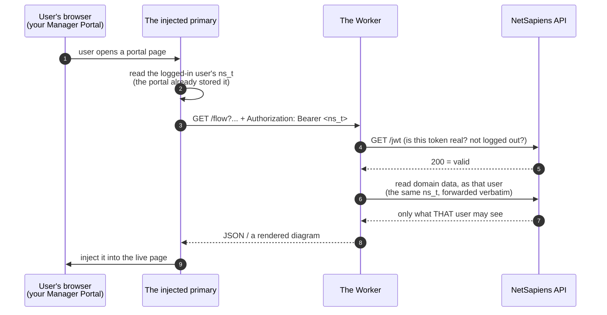

# Setup

This kit is a **backend for your NetSapiens Manager Portal**: a Cloudflare Worker that serves a small
JavaScript file your portal loads, and answers that script's calls using **the signed-in user's own portal
token**. Your users get extra features inside the portal they already use, and no NetSapiens credential is
stored anywhere for them to leak.

Getting it running is four things: set three values, deploy to Cloudflare, give your portal one URL, and
open the console it adds to your portal to decide what else you want on.

> ### 🤖 Recommended: let a coding agent drive this
>
> If you use Claude Code, Codex, Cursor, Copilot or similar, **point it at [AGENTS.md](./AGENTS.md)** and
> have it deploy this for you. That file is this page turned into an **ordered procedure**: it decides
> nothing on your behalf, asks the handful of questions that need your answer, and refuses the mistakes
> that cost money or expose data.
>
> ```
> Read AGENTS.md in this repo and deploy this project for me. Ask me the questions it says to ask.
> ```
>
> Prefer to do it yourself? Everything is here; carry on below.

---

## Contents

- [What you get](#what-you-get) — the features, one paragraph each
- [How it works](#portal-backend-mode) — the request path, and why it holds no credential
- [Before you start](#prerequisites) — what the deployment needs, and what each integration needs
- [Deploy it](#deploy) — Cloudflare, then your portal, then the console
- [A safe first deploy](#safe-first-deploy) — when your portal is already live for customers
- [The first five minutes](#first-five-minutes) — how to confirm it took
- [Cloudflare plan](#cloudflare-plan) — free or the $5 one
- [Getting updates later](#getting-updates)

**Every setting, in detail, is in [CONFIG.md](./CONFIG.md).** This page links into it rather than
repeating it, so you are never reading two versions of the same fact.

---

<a id="what-you-get"></a>

## What you get

Everything below is **off until you turn it on**, and each is independently gated to a role. The
descriptions are what the feature does; the *Why* is the problem it exists for.

### Call-flow diagrams

A **Call Flow** button appears on the portal pages where a routable entity lives — Inventory (a DID), Call
Queues, Auto Attendants, and Users, on both the list pages and the entity's own page. Clicking it resolves
that entity's **live** routing (DID → time-of-day → auto-attendant menu → queue → agents →
voicemail/external) from the API and renders it as a diagram, with pan/zoom and a theme picker.

**Why?** Because the answer to "where does this number actually go" is spread across six screens, and the
usual substitute is a hand-drawn diagram that was accurate the day someone made it. This one is generated
per click, so it cannot be stale.

*Feature key `callflow.view`, default `reseller`. Optional enrichment:
[`NS_DEVICE_DETAILS`](./CONFIG.md#NS_DEVICE_DETAILS) adds desk-phone model and registration to agent
lines.*

### Softphone app status, everywhere it is missing

With the app integration on, the portal grows an app-status banner for the domain you are managing, a
per-user column on the Users page, and a per-domain column on the Domains list.

**Why?** NetSapiens does not know your app platform exists. Without this, "does this user have the app"
is a question answered by logging into a second system, one user at a time.

*Feature keys `ringotel.orgStatus`, `ringotel.userStatus`, `ringotel.orgList`. Needs
[`RINGOTEL_API_KEY`](./CONFIG.md#RINGOTEL_API_KEY).*

### App activation and password reset, from the user's profile

Authorized roles can activate or deactivate a user's app account, and reset its password, without leaving
the NetSapiens user profile. There is also a **preview-and-apply** tool that pre-populates a whole domain's
directory with inactive entries.

**Why?** Because the alternative is a second admin console, a second set of credentials, and a
copy-and-paste step where extensions get transposed. These are writes, so they are gated harder than
anything else here and bounded by an explicit list of domains they may touch.

*Feature keys `ringotel.activate`, `ringotel.resetPassword`, `ringotel.prepop`. Needs
[`RINGOTEL_WRITE_DOMAINS`](./CONFIG.md#RINGOTEL_WRITE_DOMAINS) — **empty means every write is refused**.*

### Sign-in instructions, written for the person reading them

A user's Apps menu and home page tell **that specific person** how they sign in to the app: which app
domain, which username, and where the password comes from — their portal password under SSO, or the
credentials email otherwise. The same message is shown to a reseller or office manager on the user's
profile page, so support can read the user's own screen back to them.

**Why?** "How do I log in to the app" is the single most common support call after a rollout, and the
honest answer differs per user and per domain. A user who *cannot* sign in yet is told so, rather than
shown credentials that would not work.

*Feature keys `me.appAccess` and `ringotel.profileAppAccess`, both wired by
[three settings](./CONFIG.md#group-appaccess) that fail closed.*

### Menu customization

Add, hide and rename entries in the portal's Apps menu, the user's own account dropdown, and the
Management dropdown — targeted by domain, by NetSapiens scope, by account, or by whether your app is
actually active for that user. Added links can carry the signed-in user's own extension and domain into
the URL.

**Why?** So a support link can reach office managers and their users without cluttering an administrator's
menu, and so a stock entry for a product you do not sell stops generating tickets. Renaming is for selling
this portal as your own product: a stock entry can carry the name your documentation gives it, in place,
without losing the link or the icon behind it. The
[builder in the console](#first-five-minutes) composes the configuration against your portal's real
entries, which is much easier than typing labels and hoping they match.

*Feature key `me.menuConfig`, default `all`. See [`PORTAL_MENUS`](./CONFIG.md#PORTAL_MENUS).*

<a id="menu-handoff"></a>

### Hand the session to another tool

A menu entry can open one of your own tools **as the signed-in user**, with no second login: mark it
`"handoff": "ns_t"` and the click POSTs the user's portal session token to the entry's URL in a new tab.

**Why?** So a tool that acts on NetSapiens on the operator's behalf — a bulk editor, a diagram viewer —
can pick up exactly the permissions the operator already has, instead of holding a stored credential of
its own.

If you want an entry to do this, do two things, then redeploy:

1. Add the entry to `PORTAL_MENUS` with `"handoff": "ns_t"`:

   ```json
   {"management": {"add": {"scopes": {"Reseller": [
     { "label": "Bulk tool", "url": "https://tools.example.com/launch", "handoff": "ns_t" }
   ]}}}}
   ```

2. List the destination's origin in `PORTAL_HANDOFF_ORIGINS`:

   ```jsonc
   "PORTAL_HANDOFF_ORIGINS": "https://tools.example.com"
   ```

Three rules, each enforced at startup or by the receiver:

- **POST only.** The token travels in the body of one form submission, never in a URL. The entry's URL
  must be `https://`; `mailto:` is refused.
- **Exact origin, twice.** The URL's origin must appear in `PORTAL_HANDOFF_ORIGINS`, exactly as the
  browser would print it (`https://host[:port]`). Editing the menu alone cannot send the token anywhere
  new.
- **The receiver verifies the JWT.** This kit decides when the token leaves and where it may go; the
  tool you point at must check the token against your NetSapiens deployment and accept only your
  portal as its issuer, and it should compare the browser's `Origin` header against your portal's
  origin. Do not point a handoff at a tool that does not.

The entry is served only to signed-in users, and a click on a page with no session token sends nothing.

**If your portal's Content-Security-Policy sets `form-action`, add the receiver's origin to it.** The
same policy that has to allow your Worker in `script-src` ([above](#required-settings)) will otherwise
block this POST silently: the new tab opens blank or not at all, and nothing reaches the receiver's log.

*See [`PORTAL_HANDOFF_ORIGINS`](./CONFIG.md#PORTAL_HANDOFF_ORIGINS) and
[Handoff entries](./CONFIG.md#menu-handoff).*

### A status banner you control

A message across the top of the portal — maintenance notices, a welcome for a new customer, anything
time-bound. The kit renders it; the text comes from an endpoint you host, asked on each page load.

**Why?** A notice is time-bound and often per-customer. As a configuration value it would mean a redeploy
to post one and another to take it down; as an endpoint, your side changes the message as often as you
like and the kit stays stateless.

*Feature key `portal.statusBanner`. See [`STATUS_BANNER_WEBHOOK`](./CONFIG.md#STATUS_BANNER_WEBHOOK) —
including the warning about what that endpoint receives.*

### Change-event sync

NetSapiens pushes subscriber changes to this Worker, which re-reads the user and syncs their identity to
the app directory. A scheduled job keeps the subscriptions correct and reports their health.

**Why?** Without it, a user's name and email reach the app directory only as a side effect of an
activation, a reset, or an SSO login. Edit a user directly in NetSapiens and the directory keeps the old
values indefinitely — including a stale email address that can later receive an app password for an
extension that has since been reassigned.

*This is the one feature that holds a stored NetSapiens credential, because an event arrives with no
caller. It is inert until fully configured. See [Change events](./CONFIG.md#group-events).*

<a id="onebill-links"></a>

### Billing reconciliation against OneBill

An unofficial [OneBill](https://www.onebillsoftware.com/) integration on the Management menu, in two
layers. The **links page** lines up OneBill billing accounts against NetSapiens domains: each account's
current link or the absence of one, a proposed link where a usage subscription's identifier names the
domain, closed accounts whose domain is still live, and a one-account-at-a-time control to set, edit or
clear a link. A domain billed per site reads as `SPLIT BY SITE` rather than as unlinked.

Open a linked row and the **account panel** compares what that account is billed for against what
NetSapiens actually holds: seats, transcription, numbers split local, toll-free and fax, E911 addresses,
SMS numbers and devices by model. Every row expands into the actual items behind its count, and an
operator accepts them one at a time — so a gap that is normal is recorded once and stops being reported.

**Why?** Because the two systems drift, and nobody notices until a customer is billed for a seat they gave
back or uses one nobody billed. Counting both sides by hand is the job this replaces.

*Feature keys `onebill.view` (default `reseller`) and `onebill.write` (default `superadmin`). Off unless
all four `ONEBILL_*` credentials are set — see [Each integration, separately](#prerequisites) below.*

### The integration console

A bold **Super Portal Kit** entry in the portal opens a read-only page reporting how this deployment is
actually configured: eight tabs covering your identity and how you got in, every feature and whether it can
run, the external systems it talks to, a permissions matrix, your menu configuration plus a builder, every
setting with its current value and a copy-ready config line, the addresses this Worker serves and calls,
and live checks against NetSapiens and the app API.

**Why?** Because the alternative is reading your own configuration back to yourself and hoping you can tell
*allowed* from *actually working*. The console distinguishes them, and it is where the rest of setup
happens after the first deploy.

*Feature key `kit.status`, default `superadmin` — [and it is defended harder than the
rest](./CONFIG.md#kit-status-gate).*

### A version line in the footer

This kit's name and version in the portal footer, linked to that version's release notes for reseller
scope and above.

**Why?** So an operator looking at a portal can tell which version is behind it without opening a console
or a config file.

*Feature key `portal.versionLine`, default `all`.*

---

<a id="portal-backend-mode"></a>

## How it works

There is no SPA and no second login. The Worker serves a small **primary** script; your portal loads it;
it reads the `ns_t` the portal already stored for the signed-in user, and every call it makes carries that
token.


```mermaid
sequenceDiagram
    autonumber
    participant U as User's browser<br/>(your Manager Portal)
    participant JS as The injected primary
    participant W as The Worker
    participant NS as NetSapiens API

    U->>JS: user opens a portal page
    JS->>JS: read the logged-in user's ns_t<br/>(the portal already stored it)
    JS->>W: GET /flow?... + Authorization: Bearer <ns_t>
    W->>NS: GET /jwt (is this token real? not logged out?)
    NS-->>W: 200 = valid
    W->>NS: read domain data, as that user<br/>(the same ns_t, forwarded verbatim)
    NS-->>W: only what THAT user may see
    W-->>JS: JSON / a rendered diagram
    JS->>U: inject it into the live page
```

The parts worth understanding:

- **No credential is stored for user traffic.** The `ns_t` is forwarded to NetSapiens verbatim, so every
  read runs *as that user* and the platform enforces their scope. Two users hitting the same Worker see
  different data because NetSapiens says so, not because we filtered it. (Change events are the one path
  that holds a credential, because nobody is calling. They are off unless configured.)
- **A token is checked before it is trusted.** Structure, expiry, audience and issuer are checked locally
  and free; then a cached live call to NetSapiens confirms it is real and has not been logged out. Only a
  literal 200 counts.
- **Two bundles, two tiers.** The primary fetches whichever gated bundle the caller is entitled to: an
  **admin bundle** (`/kit/portal.js` — diagrams, columns, the console) and a minimal **self-service
  bundle** (`/kit/self.js` — own-account features). A basic user gets only the small one; an admin gets
  both.
- **It is per-call.** Nothing is stored between requests except a short-lived cache of "was this token
  valid".

---

<a id="prerequisites"></a>

## Before you start

<a id="required-settings"></a>

### The deployment itself — three values

| Setting | Where | Example |
|---|---|---|
| [`NS_SERVER`](./CONFIG.md#NS_SERVER) | `vars` in `wrangler.jsonc` | `api.yourprovider.com` |
| [`NS_PORTAL_ISS`](./CONFIG.md#NS_PORTAL_ISS) | `vars` | `manage.yourcompany.com` |
| [`PORTAL_HANDOFF_URL`](./CONFIG.md#PORTAL_HANDOFF_URL) | `vars` | `""` if you run no vendor add-on |

Plus two you will want immediately:

| Setting | Where | Why now |
|---|---|---|
| [`PORTAL_SUPERADMINS`](./CONFIG.md#PORTAL_SUPERADMINS) | secret | The console admits **only** these accounts by default. Name nobody and you deploy a console you cannot open. |
| [`ALLOWED_ORIGINS`](./CONFIG.md#ALLOWED_ORIGINS) | `vars` | Your portal's origin. Unset means every cross-origin browser call is denied, which is every call the injected script makes. |

⚠️ **`PORTAL_HANDOFF_URL` absent and `""` mean opposite things.** Absent is treated as "you have not
decided yet" and reported as unconfigured; `""` is a deliberate "this Worker chain-loads no vendor
bundle". Set it to `""` if you have no vendor add-on.

**Two things outside this repo** that are easy to miss because they are not settings here: your portal's
Content-Security-Policy `script-src` must allow your Worker's host, and somebody has to be able to set the
portal's injected-script slot — [which may not be you](#primary-url).

**Am I done?** `GET /health` reports `{"ok":true,"configured":true,...}`. `configured:false` means
something required is still missing. It reports only *whether* a value is set, never what it is.

### Each integration, separately

Each block below is independent. Nothing in one is needed by another, and every one of them is inert until
its own minimum is met.

| To turn on | You need | Notes |
|---|---|---|
| **App status** (banner, user column, domain column) | [`RINGOTEL_API_KEY`](./CONFIG.md#RINGOTEL_API_KEY) | That single key is the gate for everything app-related. Absent, the routes 404 and the kit behaves as if the integration did not exist. |
| **App activation / reset / pre-population** (writes) | `RINGOTEL_API_KEY` **+** [`RINGOTEL_WRITE_DOMAINS`](./CONFIG.md#RINGOTEL_WRITE_DOMAINS) | The write rail is **fail-closed**: empty refuses every write. Set it to the domains you mean, or `*`. |
| **Sign-in instructions** | `RINGOTEL_API_KEY`, then any of [`RINGOTEL_SSO_SERVICE`](./CONFIG.md#RINGOTEL_SSO_SERVICE), [`SSO_AUTO_ACTIVATE`](./CONFIG.md#SSO_AUTO_ACTIVATE), [`PORTAL_APP_DOWNLOADS`](./CONFIG.md#PORTAL_APP_DOWNLOADS) | All three fail closed. Unset means no SSO is claimed and no links are shown — never a wrong instruction. |
| **Menu customization** | [`PORTAL_MENUS`](./CONFIG.md#PORTAL_MENUS) alone | No other integration required. With no app configured, static add, hide and rename still work. |
| **Status banner** | [`STATUS_BANNER_WEBHOOK`](./CONFIG.md#STATUS_BANNER_WEBHOOK) — an `https` endpoint **you host** | ⚠️ It receives the signed-in user's live `ns_t` on every page load. Name only something you control. |
| **Change events** | [`NS_EVENTS_BASE_URL`](./CONFIG.md#NS_EVENTS_BASE_URL) + [`NS_EVENTS_DOMAINS`](./CONFIG.md#NS_EVENTS_DOMAINS) + [`NS_EVENTS_PATH_SECRET`](./CONFIG.md#NS_EVENTS_PATH_SECRET) + [`NS_API_KEY`](./CONFIG.md#NS_API_KEY) (or admin credentials) + a cron trigger | Also needs a NetSapiens release with the flat `/subscriptions` endpoints. Read [the depth notes](./CONFIG.md#events-reference) before enabling — retiring it has an order. |
| **OneBill links and the account panel** | [`ONEBILL_TENANT_ID`](./CONFIG.md#ONEBILL_TENANT_ID) + [`ONEBILL_CLIENT_SECRET`](./CONFIG.md#ONEBILL_CLIENT_SECRET) + [`ONEBILL_USERNAME`](./CONFIG.md#ONEBILL_USERNAME) + [`ONEBILL_PASSWORD`](./CONFIG.md#ONEBILL_PASSWORD) | All four are the gate: any one missing and there are no OneBill calls, no menu entry and no routes. The custom-field group named by [`ONEBILL_LINK_GROUP`](./CONFIG.md#ONEBILL_LINK_GROUP) must already exist in OneBill — [declare it first](#onebill-group), or the page shows a setup card instead of the table. |
| **The billing comparison** | the four above **+** [`ONEBILL_RECURRING_RULES`](./CONFIG.md#ONEBILL_RECURRING_RULES) | Unset, the panel is a fact sheet: it shows the inventory and lists every offer as unmapped. Add [`NS_FAX_SERVER_HOSTS`](./CONFIG.md#NS_FAX_SERVER_HOSTS) if you bill fax lines apart from DIDs. |
| **Accepting a gap** | the four above **+** the [`ONEBILL_DB`](./CONFIG.md#ONEBILL_DB) D1 binding, migrated | Apply `migrations/` **before** you deploy this version. Without the binding the panel still shows every gap; it just cannot record that one of them is normal. |
| **Your own gated scripts** | [`PORTAL_SECONDARIES`](./CONFIG.md#PORTAL_SECONDARIES), plus the [`ASSETS`](./CONFIG.md#ASSETS) R2 binding for `r2:` entries | The advanced path. Most deployments start with the built-in bundles and add these later. |
| **Rate limiting the token checks** | the [`JWT_RATE_LIMITER`](./CONFIG.md#JWT_RATE_LIMITER) binding | Optional and worth having. Without it an in-isolate limiter still applies, just per edge location. |

---

<a id="deploy"></a>

## Deploy it

### 1. Get it onto Cloudflare

**No bindings required to provision** — no KV or Durable Objects, and R2 only if you add your own `r2:`
secondaries. A D1 binding is optional, for the OneBill account panel's baseline store (below). Pick
whichever route suits you:

**The deploy button** (no terminal). It clones this repo into your own GitHub account, deploys to your own
Cloudflare, and asks for the values on a form. Fastest start.

**The dashboard** (no terminal). Deploy once with the button, then edit `wrangler.jsonc` on github.com;
committing triggers a build. If your repo is connected to Workers Builds, **editing variables in the
dashboard will not stick** — the next build overwrites `vars` from the file. Edit the file, not the
dashboard. (Secrets are not overwritten.)

**Wrangler** (a terminal, and one place to update):

```bash
git clone https://github.com/<your-account>/ns-portal-kit
cd ns-portal-kit
pnpm install          # or: npm install
npx wrangler login    # opens a browser; no API token to create

# put your values in wrangler.jsonc vars (including ONEBILL_TENANT_ID, if you use OneBill links), then:
npx wrangler secret put PORTAL_SUPERADMINS
npx wrangler secret put ONEBILL_CLIENT_SECRET   # optional — OneBill links
npx wrangler secret put ONEBILL_USERNAME        # optional — OneBill links
npx wrangler secret put ONEBILL_PASSWORD        # optional — OneBill links
npx wrangler deploy
```

The three `ONEBILL_*` secrets are optional and the deploy button does not prompt for them: without all
four OneBill settings the integration reports itself off and its routes do not exist, so a deployment
that does not use OneBill should leave them unset rather than be asked for them.

<a id="onebill-group"></a>

### Set up the OneBill custom-field group first

The links page reads and writes each account's NetSapiens link from a **custom-field group** on the
OneBill subscriber record. Setting [`ONEBILL_LINK_GROUP`](./CONFIG.md#ONEBILL_LINK_GROUP) does not create
that group — it only tells this deployment where to look — so declare it in OneBill before you open the
page. Until you do, the page shows a setup card headed **"OneBill needs a custom-field group before links
can be stored"** in place of the table, and refuses every write with the same message.

The default [`ONEBILL_LINK_GROUP`](./CONFIG.md#ONEBILL_LINK_GROUP) is
`{"group":"PBX","ns":"NS","valueField":"Domain","qualifierField":"Site"}`, which is what the names below
assume. If you use different names, substitute them everywhere — the page's setup card quotes your own
values back to you.

To declare the group in OneBill:

1. Sign in to OneBill as an administrator and open the custom-field (account attribute) configuration for
   the **subscriber** record. Custom fields are configured per record type, and an account-level group is
   the only kind this integration reads.
2. Create a group whose **key** is `PBX` — the value of `group` in `ONEBILL_LINK_GROUP`. The key is what is
   matched, not the display label, so a group labelled "Phone System" with the key `PBX` is correct.
3. Allow the group to hold **more than one instance**. One instance carries one link, and an account
   billing several sites of a domain — or sites across several domains — needs one instance per link. A
   single-instance group caps every account at one link.
4. Add a **text** field named `Domain` — the value of `valueField`. It holds the NetSapiens domain, and it
   is the only field the integration requires.
5. Add a second **text** field named `Site` — the value of `qualifierField` — if you bill any domain per
   site. Leave `Site` empty on an instance that bills the whole domain. If you never bill per site, drop
   `qualifierField` from `ONEBILL_LINK_GROUP` and do not create the field.
6. Save the group. **OneBill materialises a blank instance of every declared group onto every subscriber**,
   so the declaration alone is enough for the check below — no account needs a value in it yet.
7. Open the links page in the portal and choose **Refresh and fully verify**. The setup card disappears
   and the table renders. If it does not, the card names which of the three is missing — the group itself,
   the `Domain` field, or the `Site` field — and the integration console's OneBill probe reports the same
   thing as a failing check.

**Other fields on the group are yours.** A write names only `Domain` and `Site`, and OneBill merges child
updates rather than replacing them, so a `Description` or a link field somebody set by hand survives every
write this kit makes.

**Do not edit the derived identifier by hand.** The links an account holds are also encoded into the
subscriber's `externalId` under the namespace `ns` names (`NS` by default), which is how an account is
found by domain without reading every record. That field is derived from the group instances; edit the
instances and let the page rewrite it.

<a id="recurring-comparison"></a>

### The recurring comparison (optional)

`ONEBILL_RECURRING_RULES` says which OneBill subscription lines count toward which NetSapiens inventory
dimension. Unset, the account panel still shows the inventory and lists every recurring offer as
unmapped — a fact sheet with no comparison, which is a useful place to start while you work out your own
rules. This is our own production rulebook, real product names and all — there is no customer data in a
rulebook, only what we sell:

```json
[
  {"offer":"Standard Hosted Phone Seat","counts":"extensions.withAnyDevice","group":"Hosted Seats"},
  {"offer":"Annual Standard Hosted Phone Seat","counts":"extensions.withAnyDevice","group":"Hosted Seats"},
  {"offer":"Premium Hosted Phone Seat","counts":"extensions.withAnyDevice","group":"Hosted Seats",
   "entitles":{"transcriptionEnabled":1,"smsNumbers":1,"teamsConnected":1,"Fax Lines":1}},
  {"offer":"Call Center Hosted Phone Seat","counts":"extensions.withAnyDevice","group":"Hosted Seats",
   "alsoCounts":{"Call Center Seats":1}},
  {"group":"Call Center Seats",
   "counts":["extensions.byScope.Call Center Agent","extensions.byScope.Call Center Supervisor"]},
  {"offer":"General Extension","counts":"extensions.withAnyDevice","group":"Hosted Seats"},
  {"offer":"Classroom Hosted Extension","counts":"extensions.withAnyDevice","group":"Hosted Seats"},
  {"offer":"Restaurant Advanced Hosted Phone Seat","counts":"extensions.withAnyDevice","group":"Hosted Seats"},
  {"offer":"MS Teams Integration","counts":"teamsConnected"},
  {"productCode":"SVSEAT","counts":"extensions.withAnyDevice","group":"Hosted Seats"},

  {"offer":"Bundled Seat - 24M","counts":"extensions.withAnyDevice","group":"Hosted Seats"},
  {"offer":"Bundled Premium Seat","counts":"extensions.withAnyDevice","group":"Hosted Seats",
   "entitles":{"transcriptionEnabled":1,"smsNumbers":1,"teamsConnected":1,"Fax Lines":1}},
  {"offer":"Bundled Call Center Seat","counts":"extensions.withAnyDevice","group":"Hosted Seats",
   "alsoCounts":{"Call Center Seats":1}},

  {"offer":"E911 Physical Location and Phone Number","counts":["e911Endpoints","e911Legacy"],
   "group":"E911 and Number","alsoCounts":{"dids.total":1}},
  {"offer":"Single Voice Phone Number (DID)","counts":"dids.total","group":"Phone Number (DID)"},
  {"offer":"Toll Free Phone Number (DID)","counts":"dids.tollFree"},
  {"offer":"Phone Numbers - Pack of 10","counts":"dids.total","group":"Phone Number (DID)","perUnit":10},
  {"offer":"Block of 10 Voice Phone Numbers (DIDs)","counts":"dids.total","group":"Phone Number (DID)","perUnit":10},

  {"productCode":"e911","counts":["e911Endpoints","e911Legacy"],"group":"E911 and Number",
   "alsoCounts":{"dids.total":1}},
  {"productCode":"DID","counts":"dids.total","group":"Phone Number (DID)"},

  {"offer":"Native Fax - Analog (requires MP202B Fax ATA)","counts":"dids.fax","group":"Fax Lines"},
  {"offer":"Native Fax - Digital","counts":"dids.fax","group":"Fax Lines"},
  {"offer":"Native Fax - Toll Free","counts":"dids.fax","group":"Fax Lines"},
  {"offer":"Native Fax Line - Analog","counts":"dids.fax","group":"Fax Lines"},
  {"offer":"Native Fax Line - Digital Only Seat","counts":"dids.fax","group":"Fax Lines"},
  {"offer":"Webfax","counts":"dids.fax","group":"Fax Lines",
   "why":"retail name for the digital fax plan, same price as Native Fax - Digital"},

  {"offer":"MFAX","ignore":true,
   "why":"Documo fax, not a NetSapiens line; counted when the Documo integration lands"},
  {"offer":"MFAX Additional User","ignore":true,
   "why":"Documo fax, not a NetSapiens line; counted when the Documo integration lands"},
  {"offer":"MFAX User and DID w/Voice Services","ignore":true,
   "why":"Documo fax, not a NetSapiens line; counted when the Documo integration lands"},
  {"offer":"MFAX Line","ignore":true,
   "why":"Documo fax, not a NetSapiens line; counted when the Documo integration lands"},
  {"offer":"AudioCodes MP202B Fax ATA","ignore":true,
   "why":"hardware sold beside an analog fax line, not a line of its own"},
  {"offer":"AudioCodes MP202B FaxBridge ATA","ignore":true,
   "why":"hardware sold beside an analog fax line, not a line of its own"},

  {"productCode":"INTEG","ignore":true,"why":"integration fee, not a countable thing"}
]
```

**Rows sharing a `group` are summed**, both for the comparison's `billed` side and for the item list
underneath it. Every seat plan above pools into one `seats` row because the PBX cannot yet tell a Premium
extension from a Standard one — the tier is a billing decision, not a provisioning one. When seat type is
tagged into `service-code`, each plan's rule can move to its own `extensions.byServiceCode.<type>` bucket
and the bundle becomes checkable per extension; until then, one pooled row is the honest picture.

**A rule is keyed by exactly one of `offer`, `planCode` or `productCode` — or by none of the three**, in
which case it must name a `group` and is a comparison-only row: its `billed` comes entirely from other
rules' `alsoCounts` credits, never from a subscription line of its own. The `Call Center Seats` row above is
one — Call Center Agent and Call Center Supervisor are NetSapiens user *roles*, not seat types, so they
are counted directly by scope, and the seat rules that credit `alsoCounts: { "Call Center Seats": 1 }` are what
give that row something to compare against.

`offer` matches the price plan's **name**, the one thing every subscription line always carries.
`planCode` and `productCode` match OneBill's catalogue codes instead, resolved through a catalogue index
this Worker builds from `ProductService/v1/products` and `/products/{code}` and caches for 24 hours — a
rulebook that only uses `offer` never makes that catalogue call. **A price plan can carry a blank plan
code:** this rulebook's own retail-catalogue "Bundled Seat", "Bundled Premium Seat" and "Bundled Call
Center Seat" plans all do, so a `planCode` rule can never match one — key it by name or by `productCode`
instead. When a line matches more than one rule, `planCode` wins, then `offer`, then `productCode`: a
named plan always beats the product-level fallback under it.

**Fax lines are counted, not ignored** — but only if you tell the Worker where your fax server is. Set
[`NS_FAX_SERVER_HOSTS`](./CONFIG.md#NS_FAX_SERVER_HOSTS) and a number whose dial rule hands it to that host
leaves `dids.total` and lands in `dids.fax`, which is what the six `Fax Lines` rules above compare
against. Leave it unset and `dids.fax` is 0 while those numbers stay in `dids.total`, so the fax rows read
as a shortfall and the DID row as an excess — either configure the host or go back to `ignore: true` on
the fax offers, but do not do neither.

All six count the SAME dimension and pool into one `Fax Lines` row, because NetSapiens cannot tell one
fax line from another: there is no fax endpoint, the ATA is not a device on the user, and nothing on the
number says analog, digital or toll-free. Which product was sold is recorded by the billed-as tag on each
acceptance, not by the count.

**Give every `ignore` rule a `why`.** It is free text, at most 120 characters, and the comparison engine
never reads it — this setting is a JSON string inside a JSONC file, so a `//` comment cannot reach inside
it and the note has to be a field. An offer name alone does not say whether the offer is unbilled,
counted somewhere else, or not a line at all. The seven above are three different reasons: the `MFAX`
plans are Documo fax rather than NetSapiens lines, and will be counted when that integration lands; the
two `AudioCodes MP202B` ATAs are hardware sold beside an analog fax line, not a line of their own; and
`INTEG` is an integration fee, which is not a countable thing.

`counts` is one dotted path, or an array of several — an array sums them for the comparison and unions
their items, which is how the seat rules above stay one row even though a domain mixes Standard, Premium
and Call Center extensions. `ignore: true` takes the place of `counts` on a keyed rule: it marks an offer
as known and deliberately not compared (an unrouted integration) instead of leaving it to fall
through as unmapped, and it lists under "Ignored by rule" in the panel rather than the unmapped list.
Exactly one of `counts` or `ignore` is required on every rule that has a key.

`alsoCounts` keys are a dotted path, or another rule's `group` name — a Call Center seat crediting the
`Call Center Seats` group so the standalone row above has something to compare against, or an E911
product crediting the phone number that comes with it.

`entitles` takes the same keys and scales the same way, and says something different: each unit of the
line ENTITLES the customer to that many at no charge. A Premium seat entitles one transcription, one SMS
number and one Teams connector, so those rows read `billed 0, entitled <seats>` — anything up to the
entitlement is a `match`, and using none of it is not a finding. Use `alsoCounts` where the line PAYS for
the thing and fewer live than billed is a shortfall; use `entitles` where the line PERMITS it.

The paths available to `counts`, `alsoCounts` and `entitles`: `extensions.total`, `extensions.withAnyDevice`,
`extensions.withNoDevice`, `extensions.byScope.<scope>`, `extensions.byServiceCode.<code>`,
`extensions.byDeviceCount.<0|1|2|3+>`, `systemUsers.total`, `transcriptionEnabled`, `teamsConnected`,
`dids.total`, `dids.tollFree`, `dids.local`, `e911Endpoints`, `e911Legacy`, `e911Addresses`,
`smsNumbers`, `devices.total` and `devices.byModel.<model>`. Three of those deserve a callout. **`extensions.withAnyDevice`**, not
`extensions.total`, is what a seat rule should usually count: an extension carrying no device — no
handset, no softphone, no Teams connector — is not in service yet, and billing on `total` counts seats
nobody has picked up. **`extensions.byScope.<scope>`** is how a user *role* is counted rather than a
device, which is what makes the Call Center row above possible without any NetSapiens field dedicated to
"this is a Call Center seat." **`e911Endpoints`**, not `e911Addresses`, is what an E911 rule should
count: an Emergency Endpoint is the callback number the carrier routes a 911 call on and bills per, while
an address is a location responders are sent to and several of them can sit under one endpoint. A domain
still on the pre-endpoint model has no endpoint records at all — its users just carry an emergency caller
ID each — so `e911Legacy` counts the distinct numbers there, and an E911 rule counting BOTH pays for
either model with one line. `e911Addresses` remains a countable dimension, and it is the right one only
if you genuinely bill per dispatchable location.

**Retail (OIT-supplied) product fallbacks.** Six legacy retail products carry no plan code at all, and
their product codes are stable, so a `productCode` rule catches whatever their plans are named without
enumerating every one:

| retail product | code | rule |
|---|---|---|
| Hosted Seat | `SEAT` | `counts: extensions.withAnyDevice, group: seats` — a fallback; the JSON above instead names the three retail seat plans directly, so Premium's entitlements still apply |
| E911 | `e911` | `counts: [e911Endpoints, e911Legacy], group: e911, alsoCounts: { dids.total: 1 }` — one line pays for either E911 model, and it PAYS for the number, so a missing one is a shortfall |
| DID | `DID` | `counts: dids.total, group: numbers` |
| Fax | `FAX` | `ignore` — until a fax system is a count source |
| Integrations | `INTEG` | `ignore` — until its plans are mapped individually |
| Domain Usage | `PROD3102` | no rule — a usage charge, never a recurring line |

**What acceptance means.** Expanding a comparison row lists the actual NetSapiens items behind its
count and each is **Accept**ed or left unknown, one at a time, by whoever holds `onebill.write`. Each
item's own Accept sits at the left of its line, beside a checkbox; **Accept all** takes every listed item
in the group at once, and ticking boxes replaces that with **Accept selected (N)** for the ones you
chose. **Accept shortfall** is for a row with fewer live items than billed, or one with no item list at
all (`devices.*`), where there is nothing to click per item. Any acceptance can be **Clear**ed, one item
or the whole group, and the history keeps both the accept and the clear — nothing is overwritten. A group
reads `accepted` only once its very last item has been judged; "11 of 12 seats verified, one still
unreviewed" stays on screen until then.

**Billed as.** Where a row is billed under more than one plan, accepting shows a **Billed as** picker
listing that row's own plans, and the acceptance records which one — so each plan's line under the group
name can say how many items are tagged to it, and how many more than it bills. It is a note on the
decision, not an input to the verdict: the comparison counts things, and nine seats tagged to a tier that
bills eight is something for a person to act on rather than something this can adjudicate.

**What each line actually is.** An item's line says more than its number: a DID reads local or toll-free,
then where it routes (`to user 100 — Ann Lee`, `to queue 701 — Sales`), then the note the portal wrote on
it; an extension lists the devices actually on it, with a Teams connector marked. Under the inventory, a
closed **Extensions without a device (N)** block lists the extensions that count toward
`extensions.total` but not toward the `extensions.withAnyDevice` a seat rule usually counts — which is
the gap between those two numbers, explained on the page.

**Rows nothing bills.** A rule's `entitles` produces rows with a billed count of 0 and an entitlement
above it — a Premium seat's included transcription, SMS number and Teams connector. Those read
`optional, unused` while nobody is using them and take the engine's verdict once somebody is; the Billed
column carries a small `+N entitled`, and the line under the group name says what includes it. Nothing
there is ever a shortfall, which is the whole difference between `entitles` and `alsoCounts`.

**Accounts that hold several sites or domains.** The panel opens per OneBill *account*, not per domain:
a linked domain row, a site row, and a split-domain parent whose sites all bill to one account are all
clickable — only a split parent billed to several accounts, and a domain in `conflict`, are not. The
header names the account, then everything it holds (`branch.example / North · other.example (whole
domain)`), and an item's line names its own domain and site too, once the account spans more than one
domain. Every line opens with what KIND of thing it is — `extension`, `number`, `E911 address`,
`SMS number` — because a column of "100", "+15550100" and "North dock" reads as one list until something
says otherwise. Every item lands on exactly one account or on that domain's **Unassigned** list, each
with the reason it has nowhere to go (a site nobody has linked, a number routed to a
queue) and a picker naming that domain's holders to hand it to. An Unassigned line carries the same
detail an item line does, because "is this number billable or is it plumbing" is exactly the question
that row is asking — reassigning an already-accepted item
clears its acceptance on the account it leaves, since the judgement was made against the wrong scope. A
hand-assigned item carries a `manual` chip; **Clear assignment** returns it to the automatic rule. This
needs migration `0003_billing_item_assignment.sql` applied — see "Upgrading from an earlier version of
this kit?" below for what it does to existing acceptances.

**An E911 address can be on more than one account, and that is not a double-bill.** An address is a fact
about a *place*, not about a user: on a domain split by site, users at four sites can all reference one
address, and two of those sites' accounts can each legitimately buy an E911 bundle for it. So an address
is placed on **every** account holding one of the sites that reference it — each counting it once,
because the bundle is per place and not per user — and on the whole-domain account as well when one of
those sites is unlinked or the referencing users have no site at all. It is Unassigned only when nothing
holds any of its sites and there is no whole-domain link, and the reason then names every unlinked site
rather than the first.

A shared address's line says `also on <account> (<group> x<billed>)` for each of the other holders, read
from *their* subscriptions — so the duplicated count does not read as a mistake, and the case worth
finding, a co-holder billing nothing for a place it shares, is on the page. `(could not read)` there
means their subscription read failed, which is a different fact from a zero.

Assignment on an address is therefore **additive**: **Assign** adds an account to the set (the picker
offers only holders not already on it), and **Remove from this account** takes one out, in place of the
**Move** every other kind gets. Moving a shared address would take an E911 bundle off an account that
really does bill for the place. Remove appears only where *this* account was added by hand — an
automatic placement belongs to the site link, which would put it straight back. This needs migration
`0005_billing_item_assignment_multi.sql`.

**Accepting a gap needs a database.** Bind a D1 database as `ONEBILL_DB` and apply the migrations:

```bash
npx wrangler d1 create <your-db-name>
# add the d1_databases block to wrangler.jsonc, then:
npx wrangler d1 migrations apply <your-db-name> --remote
```

Without it the panel works and shows every gap; it just cannot record that one of them is normal.

**Five migrations ship in `migrations/`**, and `wrangler d1 migrations apply` runs whichever of them
your database has not seen. `0001_billing_baseline.sql` creates the store on a fresh database and is
all a first-time deployment needs to read; the four below matter if you ran an earlier version.

**Upgrading from an earlier version of this kit?** Migration `0002_billing_baseline_items.sql` replaces
the count-based baseline with per-item acceptance, and it **deletes every existing `billing_baseline`
row** to do it — an accepted count against twelve unknown items is not the same fact as twelve item
acceptances, so the two are not converted, they are retired. Run
`npx wrangler d1 migrations apply <your-db-name> --remote` again to pick it up, and expect to re-accept
anything you had accepted before, item by item. `0003_billing_item_assignment.sql` adds the manual
assignment tables and does the same thing again for the same reason: an account's comparison now spans
more than one domain, so item keys inside it became domain-qualified, and every existing
`billing_baseline`/`billing_baseline_item` row is deleted rather than reinterpreted. Apply it and
re-accept, item by item, once more.

`0004_billing_baseline_item_offer.sql` is the exception on data and the one to be careful about on
order. It is purely additive — `offer` on the two item tables, `entitled` on the two group tables — and
deletes nothing: existing acceptances read as untagged and existing group rows as "entitlement not
recorded", which keeps them on the pre-entitlement behaviour instead of invalidating every decision at
once. **Apply it before you deploy this version.** The baseline reads name the new columns by hand, so
against an unmigrated database they fail outright and the account panel answers an error rather than
degrading — which is the opposite order from the earlier migrations, where a late apply only meant the
Accept controls did nothing yet.

`0005_billing_item_assignment_multi.sql` rebuilds `billing_item_assignment` with the account in its
primary key, so one E911 address can be assigned to several accounts (above). It copies every existing
row across and deletes nothing — SQLite cannot alter a primary key, so the table is recreated rather
than altered, and existing assignments keep working exactly as they did.

**If you run more than one deployment** — a dev alongside prod, say — use a `wrangler.jsonc` `env` block
per Worker. Two rules bite everyone: **environments do not inherit top-level `vars`**, so each `env` needs
its own full block; and **secrets are per-environment** (`wrangler secret put NAME --env dev`). Give each
one a distinct [`CACHE_SCOPE`](./CONFIG.md#CACHE_SCOPE) while you are there.

<a id="primary-url"></a>

### 2. Point your Manager Portal at the primary

The one value NetSapiens needs is the **full URL of the primary script**:

```
https://<your-worker-host>/<PRIMARY_BASENAME>.js
```

- **`<your-worker-host>`** — your custom domain if you set a route (e.g. `svc.example.com`), otherwise the
  `*.workers.dev` URL.
- **`<PRIMARY_BASENAME>`** — the [`PRIMARY_BASENAME`](./CONFIG.md#PRIMARY_BASENAME) var, default `p`, so
  the default URL ends in `/p.js`.

**Confirm it before you hand it over.** Open that URL in a browser: a **200** returning JavaScript means
the primary is live at that exact path. `https://<your-worker-host>/health` should return
`{"ok":true, …}` alongside it.

**Who actually sets the injection depends on whether you run NetSapiens:**

- **You operate the platform**, or have Manager-Portal admin access to the injected-/custom-JS setting:
  point that slot at the URL above yourself.
- **You are a reseller or partner under another provider or carrier**: the portal-wide injected-script
  setting is an upstream control you most likely **cannot** change — so **give your provider the exact
  URL** and ask them to add it as the Manager Portal custom JavaScript for your reseller or domains. The
  URL is all they need; nothing about it is secret, and the Worker still only ever acts as the logged-in
  user.

**Already inject a script of your own?** Keep your file and load the primary from inside it — one line —
and leave your injected-script slot alone:

```html
<script src="https://<your-worker>/<PRIMARY_BASENAME>.js"></script>
```

The primary derives its base from its own URL, so it runs against your Worker wherever your file is hosted.

### 3. Open the console and finish there

Everything after this point is a decision, not a prerequisite — which features, which roles, which
domains — and the console is the place to make those decisions, because it shows you what your deployment
currently does rather than what you believe you configured.

In the Manager Portal, look for a bold **Super Portal Kit** entry:

- **In your own name dropdown**, at the top. This is where it lands on a **stock** NetSapiens portal, and
  it is the case to expect unless you know otherwise.
- **In the Management dropdown**, if your portal has one. That menu is not stock — a vendor add-on puts it
  there — and where it exists, the console prefers it.

Then read [the first five minutes](#first-five-minutes).

---

<a id="safe-first-deploy"></a>

## A safe first deploy

Most operators cannot experiment on production, and this kit injects into the portal every one of their
customers uses. So do not start by turning it on for everyone — start with **one domain and one account**,
which needs no extra tooling because both levers already exist.

**1. Restrict the deployment to a domain you can afford to break.**

```jsonc
"ALLOWED_DOMAINS": "yourtest.example"
```

Any other domain is refused outright. This is the outer boundary, and it bounds every mistake that follows.

**2. Gate the two delivery features to yourself.**

```jsonc
"PORTAL_FEATURES": "{\"portal.access\":{\"users\":[\"you@example.com\"]},\"portal.self\":{\"users\":[\"you@example.com\"]}}"
```

Those two are the entry points: with both named to your account, nobody else is served a feature bundle at
all. You do not need to list every key.

**3. Point the portal at the Worker**, and confirm from the console that the environment badge, your
identity and the gates read the way you expect.

**4. Widen deliberately**, one axis at a time: more domains in `ALLOWED_DOMAINS`, then a level instead of a
user list on one feature, then the rest.

**What your other users experience during step 2**, stated plainly rather than left to be discovered: they
still load the injected primary, because it is public and unauthenticated by design. It is a few
kilobytes, it requests the gated bundles, it is refused, and it injects nothing. So the honest description
is "everyone loads a small script that does nothing", not "nothing reaches them". If even that is
unacceptable, do not point the portal at the Worker yet.

---

<a id="first-five-minutes"></a>

## The first five minutes

In the order that finds problems fastest.

**1. Name a superadmin, before you deploy if you can.**

```bash
wrangler secret put PORTAL_SUPERADMINS    # you@yourdomain.example
wrangler secret put ONEBILL_CLIENT_SECRET # optional — OneBill links
wrangler secret put ONEBILL_USERNAME      # optional — OneBill links
wrangler secret put ONEBILL_PASSWORD      # optional — OneBill links
```

Setting a secret does not require a redeploy — but doing it first means you never have a console you
cannot open.

**2. Check it is running the code you think.**

```bash
curl https://your-worker-host/health
# {"ok":true,"configured":true,"version":"<the version you deployed>","scope":"..."}
```

`configured:false` means something required is still missing. `version` should match the release you
deployed — if it does not, the deploy did not land.

**3. Open the console**, and work down it:

- **The environment badge, first.** It reads PROD, DEV or LOCAL, derived from the hostname and cache
  namespace. If you run more than one deployment, this is what stops you making changes against the wrong
  one.
- **Overview** — anything the setup checklist still wants fixed, and why you personally can see the page.
- **Features** and **Integrations** — what is on, what is off, and what is *inert*: allowed but unable to
  run because a setting it needs is absent. Inert is the state worth hunting for; it looks like working
  configuration from every other angle.
- **Backend → Addresses** — the exact URL to load from your portal, and what this deployment calls.
- **Permissions** — which of your users get what, before any of them find out for you.
- **Menus** — what your menu configuration does now, and the builder that composes the next one from the
  real entries on your portal page.
- **Config** — every setting with the value yours has, its real default, and a copy-ready
  `wrangler.jsonc` line. Secrets by presence only, never a value.
- **Checks** — live calls against NetSapiens and your app platform, run once automatically the first time
  you open the tab. This is the only part that proves a credential actually works rather than merely being
  present.

**4. If the console refuses you**, the refusal says which of two things is wrong: no superadmin is named
(fix: step 1), or the feature has been switched off in `PORTAL_FEATURES`. It will not tell you *who is*
admitted — that would leak the account list to whoever asked.

**What the console cannot tell you.** It reports configuration and reachability, not whether your portal is
actually loading the script. Serving the primary and being loaded by a portal are different facts, and the
Addresses block marks which is which. The end-to-end check is still: open your portal and look.

**Give a settings-only change about three minutes before you judge it.** The injected client bundle is
cached per permission tier under a key that includes the kit's version, so upgrading replaces it at once —
but redeploying with the *same* version and a changed setting leaves that key identical, and the previous
bundle is served until it expires (60 seconds in the Worker, up to 120 more in a browser that already has
it). The console's Config tab is answered server-side and updates immediately, so it is the tiebreaker: new
value there and old behaviour in the portal means you are early, not broken.

---

<a id="cloudflare-plan"></a>

## Cloudflare plan: free or paid ($5)?

**The short answer: if you turn on the app integration with continual change-event sync, get the Paid
plan.** That one decision is the strongest reason on this page, and it is a $5/month decision against a
feature that runs continuously and unattended — the wrong place to be economising. Everything else here is
detail for deployments that have not enabled it.

Beyond that, the limit people expect to hit is not the one that bites. Requests are rarely the constraint;
two **per-request** ceilings are, and both fail on a single click rather than on volume.

**Subrequests — Free caps 50 per request, Paid 1,000.** Resolving a **large** domain's call-flow diagram
fans out into many NetSapiens API calls. A big domain can exceed 50 on Free and fail to render while every
smaller domain works perfectly — which presents as "this feature is broken for that customer", not as a
plan limit. This is the clearest single reason to move to Paid.

**CPU time — Free caps 10 ms per request, Paid 30 s.** A large diagram's resolve-and-render can exceed it,
with the same shape of failure: fine everywhere, broken on your biggest customer.

**Requests — Free is 100,000/day**, and that is a lot of portal here. A cold page load costs roughly half a
dozen Worker calls (the primary, the gated bundle(s), each feature's data fetch, plus a CORS preflight per
call type); a warm one costs about half that, because the primary is cached for 5 minutes and the bundles
for 2. That puts Free somewhere around **15,000 portal page loads a day** before requests matter — well
past the point where the two limits above will have decided it for you. Paid includes 10 million
requests/month, then $0.30 per additional million.

### Why change-event sync is the deciding factor

⚠️ **Continual sync is the number one reason to be on Paid, and it does not scale with your users.** With
[change-event sync](./CONFIG.md#group-events) on, every subscriber edit in NetSapiens becomes a request
here whether anyone has the portal open or not, so this traffic tracks the **size and churn of the domains
you subscribe**, not how many people log in. On a real fleet it is routinely the largest source of requests
by a wide margin.

What makes it the deciding factor is not the volume, though — it is that the work is **unattended and
per-delivery**. A page load that fails is a person who tries again and tells you. A change-event delivery
that exceeds a limit fails at three in the morning, and the only symptom is a directory that has quietly
stopped matching NetSapiens. You would find out from a user signing in with a name you changed weeks ago.

Three consequences worth sizing for:

- Adding domains to `NS_EVENTS_DOMAINS` raises your baseline permanently.
- [`NS_EVENTS_DEVICE_REPAIR`](./CONFIG.md#NS_EVENTS_DEVICE_REPAIR) set to `report` or `heal` does extra
  work per event, and a full batch at the default `NS_EVENTS_MAX_EVENTS` of 40 can reach the low hundreds
  of subrequests **in one delivery** — several times over Free's cap of 50. On Free this feature is
  effectively unusable at the default batch size; on Paid it is a non-issue.
- The hourly reconcile runs whether or not anything changed, so there is a floor under this traffic even
  on a quiet fleet.

**Overages on Paid are minor:** $0.30 per million requests and $0.02 per million CPU-ms — cents, not
dollars, for a moderately busy portal.

**Rule of thumb:** start on Free to try it. Move to the $5 plan **before you turn on change-event sync**,
and certainly before you enable device repair — and move anyway once you are diagramming large domains.
Both are cheaper decisions than diagnosing a directory that silently stopped syncing, or one customer's
diagram that will not draw.

### Check your own numbers rather than trusting this page

Everything above is shape, not your deployment. Cloudflare shows you the real thing in two places, and
both are worth a look before you decide:

- **Dashboard → Workers & Pages → your Worker → Metrics** — requests over time, plus CPU time per request.
  If the CPU graph has a tail approaching 10 ms, you are close to the Free ceiling on your slowest route,
  which will be a diagram render.
- **The same Worker → Logs**, with `"observability": { "enabled": true }` in your `wrangler.jsonc` (this
  repo ships it on). Group by request path and you can see the split directly: injection and feature
  fetches on one side, `POST /ns-events/…` on the other.

**What to look for, in order:**

1. **Is your traffic mostly `/ns-events/…`?** If so, your request count is telling you about NetSapiens
   churn, not about portal usage, and adding portal users will barely move it.
2. **Does any single request approach 50 subrequests?** That is your largest domain's diagram, and it is
   the thing that will break first. Render one on your biggest customer before you decide the plan.
3. **Only then look at the daily total.** For most operators it will be a rounding error against 100,000,
   and if it is not, the two limits above will already have made the decision.

A worked example from a real four-domain deployment with change events on: **~1,300 requests a day, of
which the large majority were change-event deliveries and the scheduled reconcile.** Actual human portal
use was a few hundred requests a *week* — about one percent of the Free allowance. The plan question there
is entirely about diagram size, not about traffic.

---

<a id="getting-updates"></a>

## Getting updates later

The deploy button **clones** this repo into your account rather than forking it, so your copy has no link
back here — there is no "Sync fork" button, whether or not you ticked *Create private Git repository*.

Point your copy at this one once, and pulling updates is two commands forever after:

```bash
git remote add upstream https://github.com/dszp/ns-portal-kit   # once
git fetch upstream
git merge upstream/main
git push        # if the repo is wired to Workers Builds, this deploys
```

Conflicts should be rare and boring: `wrangler.jsonc` is the file you edited, and it is the file most
likely to move here. Your `vars` are yours — keep them.

If you would rather not track this repo at all, that is fine too; nothing here phones home, and a
deployment that works will keep working.

---

## Where to look next

- **[CONFIG.md](./CONFIG.md)** — every setting, what it controls, and what happens when you leave it out.
- **[AGENTS.md](./AGENTS.md)** — the same deployment as an ordered procedure, for a coding agent.
- **[ARCHITECTURE.md](./ARCHITECTURE.md)** — how it fits together, and the `ns_t` design.
- **[CHANGELOG.md](./CHANGELOG.md)** — what changed, per version. `GET /health` reports which one you are
  running.
