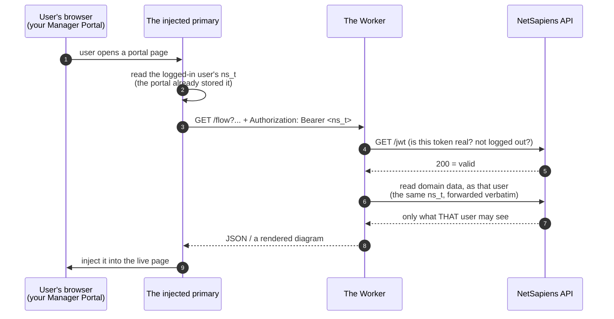

# Setup

This kit is a **backend for your NetSapiens Manager Portal**: a Cloudflare Worker that serves a small
JavaScript file your portal loads, and answers that script's calls using **the signed-in user's own portal
token**. Your users get extra features inside the portal they already use, and no NetSapiens credential is
stored anywhere for them to leak.

Getting it running is four things: set three values, deploy to Cloudflare, give your portal one URL, and
open the console it adds to your portal to decide what else you want on.

> ### 🤖 Recommended: let a coding agent drive this
>
> If you use Claude Code, Codex, Cursor, Copilot or similar, **point it at [AGENTS.md](./AGENTS.md)** and
> have it deploy this for you. That file is this page turned into an **ordered procedure**: it decides
> nothing on your behalf, asks the handful of questions that need your answer, and refuses the mistakes
> that cost money or expose data.
>
> ```
> Read AGENTS.md in this repo and deploy this project for me. Ask me the questions it says to ask.
> ```
>
> Prefer to do it yourself? Everything is here; carry on below.

---

## Contents

- [What you get](#what-you-get) — the features, one paragraph each
- [How it works](#portal-backend-mode) — the request path, and why it holds no credential
- [Before you start](#prerequisites) — what the deployment needs, and what each integration needs
- [Deploy it](#deploy) — Cloudflare, then your portal, then the console
- [A safe first deploy](#safe-first-deploy) — when your portal is already live for customers
- [The first five minutes](#first-five-minutes) — how to confirm it took
- [Cloudflare plan](#cloudflare-plan) — free or the $5 one
- [Getting updates later](#getting-updates)

**Every setting, in detail, is in [CONFIG.md](./CONFIG.md).** This page links into it rather than
repeating it, so you are never reading two versions of the same fact.

---

<a id="what-you-get"></a>

## What you get

Everything below is **off until you turn it on**, and each is independently gated to a role. The
descriptions are what the feature does; the *Why* is the problem it exists for.

### Call-flow diagrams

A **Call Flow** button appears on the portal pages where a routable entity lives — Inventory (a DID), Call
Queues, Auto Attendants, and Users, on both the list pages and the entity's own page. Clicking it resolves
that entity's **live** routing (DID → time-of-day → auto-attendant menu → queue → agents →
voicemail/external) from the API and renders it as a diagram, with pan/zoom and a theme picker.

**Why?** Because the answer to "where does this number actually go" is spread across six screens, and the
usual substitute is a hand-drawn diagram that was accurate the day someone made it. This one is generated
per click, so it cannot be stale.

*Feature key `callflow.view`, default `reseller`. Optional enrichment:
[`NS_DEVICE_DETAILS`](./CONFIG.md#NS_DEVICE_DETAILS) adds desk-phone model and registration to agent
lines.*

### Softphone app status, everywhere it is missing

With the app integration on, the portal grows an app-status banner for the domain you are managing, a
per-user column on the Users page, and a per-domain column on the Domains list.

**Why?** NetSapiens does not know your app platform exists. Without this, "does this user have the app"
is a question answered by logging into a second system, one user at a time.

*Feature keys `ringotel.orgStatus`, `ringotel.userStatus`, `ringotel.orgList`. Needs
[`RINGOTEL_API_KEY`](./CONFIG.md#RINGOTEL_API_KEY).*

### App activation and password reset, from the user's profile

Authorized roles can activate or deactivate a user's app account, and reset its password, without leaving
the NetSapiens user profile. There is also a **preview-and-apply** tool that pre-populates a whole domain's
directory with inactive entries.

**Why?** Because the alternative is a second admin console, a second set of credentials, and a
copy-and-paste step where extensions get transposed. These are writes, so they are gated harder than
anything else here and bounded by an explicit list of domains they may touch.

*Feature keys `ringotel.activate`, `ringotel.resetPassword`, `ringotel.prepop`. Needs
[`RINGOTEL_WRITE_DOMAINS`](./CONFIG.md#RINGOTEL_WRITE_DOMAINS) — **empty means every write is refused**.*

### Sign-in instructions, written for the person reading them

A user's Apps menu and home page tell **that specific person** how they sign in to the app: which app
domain, which username, and where the password comes from — their portal password under SSO, or the
credentials email otherwise. The same message is shown to a reseller or office manager on the user's
profile page, so support can read the user's own screen back to them.

**Why?** "How do I log in to the app" is the single most common support call after a rollout, and the
honest answer differs per user and per domain. A user who *cannot* sign in yet is told so, rather than
shown credentials that would not work.

*Feature keys `me.appAccess` and `ringotel.profileAppAccess`, both wired by
[three settings](./CONFIG.md#group-appaccess) that fail closed.*

### Menu customization

Add and hide entries in the portal's Apps menu, the user's own account dropdown, and the Management
dropdown — targeted by domain, by NetSapiens scope, by account, or by whether your app is actually active
for that user. Added links can carry the signed-in user's own extension and domain into the URL.

**Why?** So a support link can reach office managers and their users without cluttering an administrator's
menu, and so a stock entry for a product you do not sell stops generating tickets. The
[builder in the console](#first-five-minutes) composes the configuration against your portal's real
entries, which is much easier than typing labels and hoping they match.

*Feature key `me.menuConfig`, default `all`. See [`PORTAL_MENUS`](./CONFIG.md#PORTAL_MENUS).*

### A status banner you control

A message across the top of the portal — maintenance notices, a welcome for a new customer, anything
time-bound. The kit renders it; the text comes from an endpoint you host, asked on each page load.

**Why?** A notice is time-bound and often per-customer. As a configuration value it would mean a redeploy
to post one and another to take it down; as an endpoint, your side changes the message as often as you
like and the kit stays stateless.

*Feature key `portal.statusBanner`. See [`STATUS_BANNER_WEBHOOK`](./CONFIG.md#STATUS_BANNER_WEBHOOK) —
including the warning about what that endpoint receives.*

### Change-event sync

NetSapiens pushes subscriber changes to this Worker, which re-reads the user and syncs their identity to
the app directory. A scheduled job keeps the subscriptions correct and reports their health.

**Why?** Without it, a user's name and email reach the app directory only as a side effect of an
activation, a reset, or an SSO login. Edit a user directly in NetSapiens and the directory keeps the old
values indefinitely — including a stale email address that can later receive an app password for an
extension that has since been reassigned.

*This is the one feature that holds a stored NetSapiens credential, because an event arrives with no
caller. It is inert until fully configured. See [Change events](./CONFIG.md#group-events).*

### The integration console

A bold **Super Portal Kit** entry in the portal opens a read-only page reporting how this deployment is
actually configured: eight tabs covering your identity and how you got in, every feature and whether it can
run, the external systems it talks to, a permissions matrix, your menu configuration plus a builder, every
setting with its current value and a copy-ready config line, the addresses this Worker serves and calls,
and live checks against NetSapiens and the app API.

**Why?** Because the alternative is reading your own configuration back to yourself and hoping you can tell
*allowed* from *actually working*. The console distinguishes them, and it is where the rest of setup
happens after the first deploy.

*Feature key `kit.status`, default `superadmin` — [and it is defended harder than the
rest](./CONFIG.md#kit-status-gate).*

### A version line in the footer

This kit's name and version in the portal footer, linked to that version's release notes for reseller
scope and above.

**Why?** So an operator looking at a portal can tell which version is behind it without opening a console
or a config file.

*Feature key `portal.versionLine`, default `all`.*

---

<a id="portal-backend-mode"></a>

## How it works

There is no SPA and no second login. The Worker serves a small **primary** script; your portal loads it;
it reads the `ns_t` the portal already stored for the signed-in user, and every call it makes carries that
token.


```mermaid
sequenceDiagram
    autonumber
    participant U as User's browser<br/>(your Manager Portal)
    participant JS as The injected primary
    participant W as The Worker
    participant NS as NetSapiens API

    U->>JS: user opens a portal page
    JS->>JS: read the logged-in user's ns_t<br/>(the portal already stored it)
    JS->>W: GET /flow?... + Authorization: Bearer <ns_t>
    W->>NS: GET /jwt (is this token real? not logged out?)
    NS-->>W: 200 = valid
    W->>NS: read domain data, as that user<br/>(the same ns_t, forwarded verbatim)
    NS-->>W: only what THAT user may see
    W-->>JS: JSON / a rendered diagram
    JS->>U: inject it into the live page
```

The parts worth understanding:

- **No credential is stored for user traffic.** The `ns_t` is forwarded to NetSapiens verbatim, so every
  read runs *as that user* and the platform enforces their scope. Two users hitting the same Worker see
  different data because NetSapiens says so, not because we filtered it. (Change events are the one path
  that holds a credential, because nobody is calling. They are off unless configured.)
- **A token is checked before it is trusted.** Structure, expiry, audience and issuer are checked locally
  and free; then a cached live call to NetSapiens confirms it is real and has not been logged out. Only a
  literal 200 counts.
- **Two bundles, two tiers.** The primary fetches whichever gated bundle the caller is entitled to: an
  **admin bundle** (`/kit/portal.js` — diagrams, columns, the console) and a minimal **self-service
  bundle** (`/kit/self.js` — own-account features). A basic user gets only the small one; an admin gets
  both.
- **It is per-call.** Nothing is stored between requests except a short-lived cache of "was this token
  valid".

---

<a id="prerequisites"></a>

## Before you start

<a id="required-settings"></a>

### The deployment itself — three values

| Setting | Where | Example |
|---|---|---|
| [`NS_SERVER`](./CONFIG.md#NS_SERVER) | `vars` in `wrangler.jsonc` | `api.yourprovider.com` |
| [`NS_PORTAL_ISS`](./CONFIG.md#NS_PORTAL_ISS) | `vars` | `manage.yourcompany.com` |
| [`PORTAL_HANDOFF_URL`](./CONFIG.md#PORTAL_HANDOFF_URL) | `vars` | `""` if you run no vendor add-on |

Plus two you will want immediately:

| Setting | Where | Why now |
|---|---|---|
| [`PORTAL_SUPERADMINS`](./CONFIG.md#PORTAL_SUPERADMINS) | secret | The console admits **only** these accounts by default. Name nobody and you deploy a console you cannot open. |
| [`ALLOWED_ORIGINS`](./CONFIG.md#ALLOWED_ORIGINS) | `vars` | Your portal's origin. Unset means every cross-origin browser call is denied, which is every call the injected script makes. |

⚠️ **`PORTAL_HANDOFF_URL` absent and `""` mean opposite things.** Absent is treated as "you have not
decided yet" and reported as unconfigured; `""` is a deliberate "this Worker chain-loads no vendor
bundle". Set it to `""` if you have no vendor add-on.

**Two things outside this repo** that are easy to miss because they are not settings here: your portal's
Content-Security-Policy `script-src` must allow your Worker's host, and somebody has to be able to set the
portal's injected-script slot — [which may not be you](#primary-url).

**Am I done?** `GET /health` reports `{"ok":true,"configured":true,...}`. `configured:false` means
something required is still missing. It reports only *whether* a value is set, never what it is.

### Each integration, separately

Each block below is independent. Nothing in one is needed by another, and every one of them is inert until
its own minimum is met.

| To turn on | You need | Notes |
|---|---|---|
| **App status** (banner, user column, domain column) | [`RINGOTEL_API_KEY`](./CONFIG.md#RINGOTEL_API_KEY) | That single key is the gate for everything app-related. Absent, the routes 404 and the kit behaves as if the integration did not exist. |
| **App activation / reset / pre-population** (writes) | `RINGOTEL_API_KEY` **+** [`RINGOTEL_WRITE_DOMAINS`](./CONFIG.md#RINGOTEL_WRITE_DOMAINS) | The write rail is **fail-closed**: empty refuses every write. Set it to the domains you mean, or `*`. |
| **Sign-in instructions** | `RINGOTEL_API_KEY`, then any of [`RINGOTEL_SSO_SERVICE`](./CONFIG.md#RINGOTEL_SSO_SERVICE), [`SSO_AUTO_ACTIVATE`](./CONFIG.md#SSO_AUTO_ACTIVATE), [`PORTAL_APP_DOWNLOADS`](./CONFIG.md#PORTAL_APP_DOWNLOADS) | All three fail closed. Unset means no SSO is claimed and no links are shown — never a wrong instruction. |
| **Menu customization** | [`PORTAL_MENUS`](./CONFIG.md#PORTAL_MENUS) alone | No other integration required. With no app configured, static add and hide still work. |
| **Status banner** | [`STATUS_BANNER_WEBHOOK`](./CONFIG.md#STATUS_BANNER_WEBHOOK) — an `https` endpoint **you host** | ⚠️ It receives the signed-in user's live `ns_t` on every page load. Name only something you control. |
| **Change events** | [`NS_EVENTS_BASE_URL`](./CONFIG.md#NS_EVENTS_BASE_URL) + [`NS_EVENTS_DOMAINS`](./CONFIG.md#NS_EVENTS_DOMAINS) + [`NS_EVENTS_PATH_SECRET`](./CONFIG.md#NS_EVENTS_PATH_SECRET) + [`NS_API_KEY`](./CONFIG.md#NS_API_KEY) (or admin credentials) + a cron trigger | Also needs a NetSapiens release with the flat `/subscriptions` endpoints. Read [the depth notes](./CONFIG.md#events-reference) before enabling — retiring it has an order. |
| **Your own gated scripts** | [`PORTAL_SECONDARIES`](./CONFIG.md#PORTAL_SECONDARIES), plus the [`ASSETS`](./CONFIG.md#ASSETS) R2 binding for `r2:` entries | The advanced path. Most deployments start with the built-in bundles and add these later. |
| **Rate limiting the token checks** | the [`JWT_RATE_LIMITER`](./CONFIG.md#JWT_RATE_LIMITER) binding | Optional and worth having. Without it an in-isolate limiter still applies, just per edge location. |

---

<a id="deploy"></a>

## Deploy it

### 1. Get it onto Cloudflare

**No bindings to provision** — no KV, D1, or Durable Objects, and R2 only if you add your own `r2:`
secondaries. Pick whichever route suits you:

**The deploy button** (no terminal). It clones this repo into your own GitHub account, deploys to your own
Cloudflare, and asks for the values on a form. Fastest start.

**The dashboard** (no terminal). Deploy once with the button, then edit `wrangler.jsonc` on github.com;
committing triggers a build. If your repo is connected to Workers Builds, **editing variables in the
dashboard will not stick** — the next build overwrites `vars` from the file. Edit the file, not the
dashboard. (Secrets are not overwritten.)

**Wrangler** (a terminal, and one place to update):

```bash
git clone https://github.com/<your-account>/ns-portal-kit
cd ns-portal-kit
pnpm install          # or: npm install
npx wrangler login    # opens a browser; no API token to create

# put your values in wrangler.jsonc vars, then:
npx wrangler secret put PORTAL_SUPERADMINS
npx wrangler deploy
```

**If you run more than one deployment** — a dev alongside prod, say — use a `wrangler.jsonc` `env` block
per Worker. Two rules bite everyone: **environments do not inherit top-level `vars`**, so each `env` needs
its own full block; and **secrets are per-environment** (`wrangler secret put NAME --env dev`). Give each
one a distinct [`CACHE_SCOPE`](./CONFIG.md#CACHE_SCOPE) while you are there.

<a id="primary-url"></a>

### 2. Point your Manager Portal at the primary

The one value NetSapiens needs is the **full URL of the primary script**:

```
https://<your-worker-host>/<PRIMARY_BASENAME>.js
```

- **`<your-worker-host>`** — your custom domain if you set a route (e.g. `svc.example.com`), otherwise the
  `*.workers.dev` URL.
- **`<PRIMARY_BASENAME>`** — the [`PRIMARY_BASENAME`](./CONFIG.md#PRIMARY_BASENAME) var, default `p`, so
  the default URL ends in `/p.js`.

**Confirm it before you hand it over.** Open that URL in a browser: a **200** returning JavaScript means
the primary is live at that exact path. `https://<your-worker-host>/health` should return
`{"ok":true, …}` alongside it.

**Who actually sets the injection depends on whether you run NetSapiens:**

- **You operate the platform**, or have Manager-Portal admin access to the injected-/custom-JS setting:
  point that slot at the URL above yourself.
- **You are a reseller or partner under another provider or carrier**: the portal-wide injected-script
  setting is an upstream control you most likely **cannot** change — so **give your provider the exact
  URL** and ask them to add it as the Manager Portal custom JavaScript for your reseller or domains. The
  URL is all they need; nothing about it is secret, and the Worker still only ever acts as the logged-in
  user.

**Already inject a script of your own?** Keep your file and load the primary from inside it — one line —
and leave your injected-script slot alone:

```html
<script src="https://<your-worker>/<PRIMARY_BASENAME>.js"></script>
```

The primary derives its base from its own URL, so it runs against your Worker wherever your file is hosted.

### 3. Open the console and finish there

Everything after this point is a decision, not a prerequisite — which features, which roles, which
domains — and the console is the place to make those decisions, because it shows you what your deployment
currently does rather than what you believe you configured.

In the Manager Portal, look for a bold **Super Portal Kit** entry:

- **In your own name dropdown**, at the top. This is where it lands on a **stock** NetSapiens portal, and
  it is the case to expect unless you know otherwise.
- **In the Management dropdown**, if your portal has one. That menu is not stock — a vendor add-on puts it
  there — and where it exists, the console prefers it.

Then read [the first five minutes](#first-five-minutes).

---

<a id="safe-first-deploy"></a>

## A safe first deploy

Most operators cannot experiment on production, and this kit injects into the portal every one of their
customers uses. So do not start by turning it on for everyone — start with **one domain and one account**,
which needs no extra tooling because both levers already exist.

**1. Restrict the deployment to a domain you can afford to break.**

```jsonc
"ALLOWED_DOMAINS": "yourtest.example"
```

Any other domain is refused outright. This is the outer boundary, and it bounds every mistake that follows.

**2. Gate the two delivery features to yourself.**

```jsonc
"PORTAL_FEATURES": "{\"portal.access\":{\"users\":[\"you@example.com\"]},\"portal.self\":{\"users\":[\"you@example.com\"]}}"
```

Those two are the entry points: with both named to your account, nobody else is served a feature bundle at
all. You do not need to list every key.

**3. Point the portal at the Worker**, and confirm from the console that the environment badge, your
identity and the gates read the way you expect.

**4. Widen deliberately**, one axis at a time: more domains in `ALLOWED_DOMAINS`, then a level instead of a
user list on one feature, then the rest.

**What your other users experience during step 2**, stated plainly rather than left to be discovered: they
still load the injected primary, because it is public and unauthenticated by design. It is a few
kilobytes, it requests the gated bundles, it is refused, and it injects nothing. So the honest description
is "everyone loads a small script that does nothing", not "nothing reaches them". If even that is
unacceptable, do not point the portal at the Worker yet.

---

<a id="first-five-minutes"></a>

## The first five minutes

In the order that finds problems fastest.

**1. Name a superadmin, before you deploy if you can.**

```bash
wrangler secret put PORTAL_SUPERADMINS    # you@yourdomain.example
```

Setting a secret does not require a redeploy — but doing it first means you never have a console you
cannot open.

**2. Check it is running the code you think.**

```bash
curl https://your-worker-host/health
# {"ok":true,"configured":true,"version":"<the version you deployed>","scope":"..."}
```

`configured:false` means something required is still missing. `version` should match the release you
deployed — if it does not, the deploy did not land.

**3. Open the console**, and work down it:

- **The environment badge, first.** It reads PROD, DEV or LOCAL, derived from the hostname and cache
  namespace. If you run more than one deployment, this is what stops you making changes against the wrong
  one.
- **Overview** — anything the setup checklist still wants fixed, and why you personally can see the page.
- **Features** and **Integrations** — what is on, what is off, and what is *inert*: allowed but unable to
  run because a setting it needs is absent. Inert is the state worth hunting for; it looks like working
  configuration from every other angle.
- **Backend → Addresses** — the exact URL to load from your portal, and what this deployment calls.
- **Permissions** — which of your users get what, before any of them find out for you.
- **Menus** — what your menu configuration does now, and the builder that composes the next one from the
  real entries on your portal page.
- **Config** — every setting with the value yours has, its real default, and a copy-ready
  `wrangler.jsonc` line. Secrets by presence only, never a value.
- **Checks** — live calls against NetSapiens and your app platform, run once automatically the first time
  you open the tab. This is the only part that proves a credential actually works rather than merely being
  present.

**4. If the console refuses you**, the refusal says which of two things is wrong: no superadmin is named
(fix: step 1), or the feature has been switched off in `PORTAL_FEATURES`. It will not tell you *who is*
admitted — that would leak the account list to whoever asked.

**What the console cannot tell you.** It reports configuration and reachability, not whether your portal is
actually loading the script. Serving the primary and being loaded by a portal are different facts, and the
Addresses block marks which is which. The end-to-end check is still: open your portal and look.

---

<a id="cloudflare-plan"></a>

## Cloudflare plan: free or paid ($5)?

Most small deployments run fine on **Workers Free**. Two limits decide whether you will want **Workers
Paid**:

- **Requests — Free is 100,000/day.** Every portal page load makes several Worker calls (the primary, the
  gated bundles, each feature's data fetch). A handful of admins browsing stays well under; a busy portal
  with many active users can cross it → Paid includes 10 million requests/month, then $0.30 per additional
  million.
- **Subrequests — Free caps 50 per request, Paid 1,000.** Resolving a **large** domain's call-flow diagram
  fans out into many NetSapiens API calls, and a big domain can exceed 50 on Free and fail to render.
  That is the single clearest reason to move to Paid. (CPU time is capped tighter on Free too — 10 ms per
  request vs 30 s — which a large diagram render can also exceed.)

**Overages on Paid are minor:** $0.30 per million requests and $0.02 per million CPU-ms — cents, not
dollars, for a moderately busy portal. Rule of thumb: **start on Free; move to the $5 plan once the portal
gets busy or you diagram large domains.**

---

<a id="getting-updates"></a>

## Getting updates later

The deploy button **clones** this repo into your account rather than forking it, so your copy has no link
back here — there is no "Sync fork" button, whether or not you ticked *Create private Git repository*.

Point your copy at this one once, and pulling updates is two commands forever after:

```bash
git remote add upstream https://github.com/dszp/ns-portal-kit   # once
git fetch upstream
git merge upstream/main
git push        # if the repo is wired to Workers Builds, this deploys
```

Conflicts should be rare and boring: `wrangler.jsonc` is the file you edited, and it is the file most
likely to move here. Your `vars` are yours — keep them.

If you would rather not track this repo at all, that is fine too; nothing here phones home, and a
deployment that works will keep working.

---

## Where to look next

- **[CONFIG.md](./CONFIG.md)** — every setting, what it controls, and what happens when you leave it out.
- **[AGENTS.md](./AGENTS.md)** — the same deployment as an ordered procedure, for a coding agent.
- **[ARCHITECTURE.md](./ARCHITECTURE.md)** — how it fits together, and the `ns_t` design.
- **[CHANGELOG.md](./CHANGELOG.md)** — what changed, per version. `GET /health` reports which one you are
  running.
